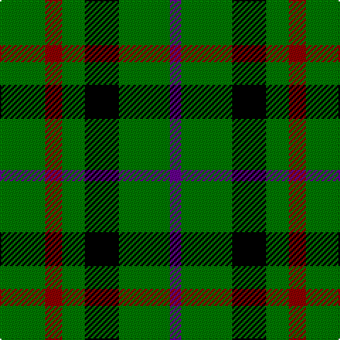

In pattern [BGKGRG](/patterns/bgkgrg/).

This was sourced from tartans-authority.  It is a [6 stripes tartan](/stripes/stripes6/).

Original link http://www.tartansauthority.com/tartan-ferret/display/4176/

## Thread count
G/32 DR12 G16 K24 G36 P/8

## Palette
Each colour and its ΔE from the base-6 reference it is a variant of.

| Colour | Shade | Base | ΔE (OKLab) |
|---|---|---|---|
| DR | <code style="background-color:#8C0000;">#8C0000</code> `#8C0000` | R <code style="background-color:#C80000;">#C80000</code> | 0.13 |
| G | <code style="background-color:#007800;">#007800</code> `#007800` | G <code style="background-color:#006400;">#006400</code> | 0.06 |
| K | <code style="background-color:#000000;">#000000</code> `#000000` | K <code style="background-color:#000000;">#000000</code> | 0.00 |
| P | <code style="background-color:#64008C;">#64008C</code> `#64008C` | B <code style="background-color:#2C4084;">#2C4084</code> | 0.13 |

# Sample pattern

ID: /setts/s6/b8g36k24g16r12g32-b64008c-g007800-k000000-r8c0000/
