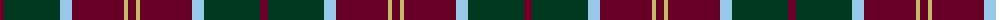
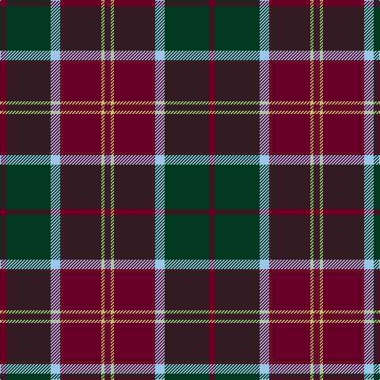

In pattern [BGWBYB](/patterns/bgwbyb/).

This was sourced from tartans-authority.  It is a [6 stripes tartan](/stripes/stripes6/).

Original link http://www.tartansauthority.com/tartan-ferret/display/8526/

## Thread count
DR/8 DG56 LB12 DR52 LG4 DR/8

## Palette
Each colour and its ΔE from the base-6 reference it is a variant of.

| Colour | Shade | Base | ΔE (OKLab) |
|---|---|---|---|
| DG | <code style="background-color:#003820;">#003820</code> `#003820` | G <code style="background-color:#006400;">#006400</code> | 0.16 |
| DR | <code style="background-color:#680028;">#680028</code> `#680028` | B <code style="background-color:#2C4084;">#2C4084</code> | 0.20 |
| LB | <code style="background-color:#98C8E8;">#98C8E8</code> `#98C8E8` | W <code style="background-color:#F4F4F0;">#F4F4F0</code> | 0.17 |
| LG | <code style="background-color:#C4BC68;">#C4BC68</code> `#C4BC68` | Y <code style="background-color:#E8C000;">#E8C000</code> | 0.07 |

# Sample pattern

ID: /setts/s6/b8g56w12b52y4b8-b680028-g003820-w98c8e8-yc4bc68/
