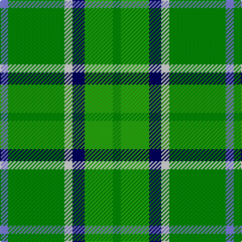

In pattern [BGWBGG](/patterns/bgwbgg/).

This was sourced from weddslist.  It is a [6 stripes tartan](/stripes/stripes6/).

Original link http://www.weddslist.com/cgi-bin/tartans/pg.pl?source=sts

## Thread count
B/8 Ga56 LN8 DB12 G28 Ga/8

## Palette
Each colour and its ΔE from the base-6 reference it is a variant of.

| Colour | Shade | Base | ΔE (OKLab) |
|---|---|---|---|
| B | <code style="background-color:#8080D0;">#8080D0</code> `#8080D0` | B <code style="background-color:#2C4084;">#2C4084</code> | 0.24 |
| DB | <code style="background-color:#000050;">#000050</code> `#000050` | B <code style="background-color:#2C4084;">#2C4084</code> | 0.20 |
| G | <code style="background-color:#30A010;">#30A010</code> `#30A010` | G <code style="background-color:#006400;">#006400</code> | 0.19 |
| Ga | <code style="background-color:#008000;">#008000</code> `#008000` | G <code style="background-color:#006400;">#006400</code> | 0.09 |
| LN | <code style="background-color:#E0E0E0;">#E0E0E0</code> `#E0E0E0` | W <code style="background-color:#F4F4F0;">#F4F4F0</code> | 0.06 |

# Sample pattern

## Nearest tartans

The nearest existing variants by ΔTartan distance.

1. [Forrester Hunting Clan Tartan Tartan Number: 2385. Earliest known date: 1997 A clan society that has been in existence since the 1980's. This hunting tartan was fully adopted in 1997. Can be worn with anyone with the name. Note from EBW "From the book "The Forresters" by Colin D.I.G.Forrester, 1988" See products available Copyright © Blair Urquhart, Comrie, 2015](/setts/s10/k6y4g36w6g36k6y8k6ga36w6-g006818-ga289c18-k101010-we0e0e0-ye8c000/) — ΔT 1.45
1. [Simple Technology](/setts/s5/r6g56b18ga36w6-b304080-g008000-ga003000-rc00000-we0e0e0/) — ΔT 1.46
1. [Ellan Vannin](/setts/s6/b8g52w8ba16ga32g8-b3c78c8-ba780078-g146400-ga007800-wc8c8c8/) — ΔT 1.54
1. [Pinder, Nigel (Personal)](/setts/s7/g48k16g48w4b24w4y16-b1474b4-g006818-k101010-we0e0e0-ye8c000/) — ΔT 1.58
1. [Duncan, or Leslie of Wardis](/setts/s6/k8g42w6g42b42r8-b304080-g008000-k000000-rc00000-we0e0e0/) — ΔT 1.62
1. [Boucherville](/setts/s9/g40y4r10w8g4r4g4r4b12-b1474b4-g289c18-r888888-wfcfcfc-ye8c000/) — ΔT 1.64
1. [Newfoundland](/setts/s7/r8g6ra16w6ra8g36y6-g008000-rc00000-ra806050-we0e0e0-yf0c000/) — ΔT 1.68
1. [Casey of West Virginia (Personal)](/setts/s9/g16y4b4y4b8g36r4b24w4-b14283c-g007800-rc80000-wf8f8f8-yc88c00/) — ΔT 1.71
1. [Boucherville (Tartan de..)](/setts/s9/g40y4ga10w8g4ga4g4ga4b12-b4000ff-g30a010-ga808080-we0e0e0-yf0c000/) — ΔT 1.72
1. [Taylor](/setts/s8/g16k4g26r8g24b44g10y6-b304080-g008000-k000000-rd03030-yf0c000/) — ΔT 1.73

## Neighbour map

Every grey dot is one of 15726 variants placed by the first two principal components of the ΔTartan feature space (44% of its variance). Red is this tartan; blue dots are its nearest — click one to open its page.

<svg viewBox="0 0 640 380" role="img" style="max-width:100%;height:auto;border:1px solid #e0e0e0;border-radius:4px;display:block" xmlns="http://www.w3.org/2000/svg"><image href="/nn/cloud.v1.png" width="640" height="380"/><a href="/setts/s10/k6y4g36w6g36k6y8k6ga36w6-g006818-ga289c18-k101010-we0e0e0-ye8c000/"><circle cx="193.2" cy="170.7" r="4" fill="#3465a4"><title>Forrester Hunting Clan Tartan Tartan Number: 2385. Earliest known date: 1997 A clan society that has been in existence since the 1980's. This hunting tartan was fully adopted in 1997. Can be worn with anyone with the name. Note from EBW &quot;From the book &quot;The Forresters&quot; by Colin D.I.G.Forrester, 1988&quot; See products available Copyright © Blair Urquhart, Comrie, 2015</title></circle></a><a href="/setts/s5/r6g56b18ga36w6-b304080-g008000-ga003000-rc00000-we0e0e0/"><circle cx="212.1" cy="218.0" r="4" fill="#3465a4"><title>Simple Technology</title></circle></a><a href="/setts/s6/b8g52w8ba16ga32g8-b3c78c8-ba780078-g146400-ga007800-wc8c8c8/"><circle cx="231.2" cy="234.0" r="4" fill="#3465a4"><title>Ellan Vannin</title></circle></a><a href="/setts/s7/g48k16g48w4b24w4y16-b1474b4-g006818-k101010-we0e0e0-ye8c000/"><circle cx="274.3" cy="194.0" r="4" fill="#3465a4"><title>Pinder, Nigel (Personal)</title></circle></a><a href="/setts/s6/k8g42w6g42b42r8-b304080-g008000-k000000-rc00000-we0e0e0/"><circle cx="246.0" cy="224.6" r="4" fill="#3465a4"><title>Duncan, or Leslie of Wardis</title></circle></a><a href="/setts/s9/g40y4r10w8g4r4g4r4b12-b1474b4-g289c18-r888888-wfcfcfc-ye8c000/"><circle cx="268.4" cy="166.7" r="4" fill="#3465a4"><title>Boucherville</title></circle></a><a href="/setts/s7/r8g6ra16w6ra8g36y6-g008000-rc00000-ra806050-we0e0e0-yf0c000/"><circle cx="223.2" cy="211.9" r="4" fill="#3465a4"><title>Newfoundland</title></circle></a><a href="/setts/s9/g16y4b4y4b8g36r4b24w4-b14283c-g007800-rc80000-wf8f8f8-yc88c00/"><circle cx="237.1" cy="178.1" r="4" fill="#3465a4"><title>Casey of West Virginia (Personal)</title></circle></a><a href="/setts/s9/g40y4ga10w8g4ga4g4ga4b12-b4000ff-g30a010-ga808080-we0e0e0-yf0c000/"><circle cx="243.6" cy="155.2" r="4" fill="#3465a4"><title>Boucherville (Tartan de..)</title></circle></a><a href="/setts/s8/g16k4g26r8g24b44g10y6-b304080-g008000-k000000-rd03030-yf0c000/"><circle cx="263.4" cy="197.0" r="4" fill="#3465a4"><title>Taylor</title></circle></a><circle cx="235.7" cy="213.4" r="5" fill="#c00000"/></svg>

ID: /setts/s6/b8g56w8ba12ga28g8-b8080d0-ba000050-g008000-ga30a010-we0e0e0/
