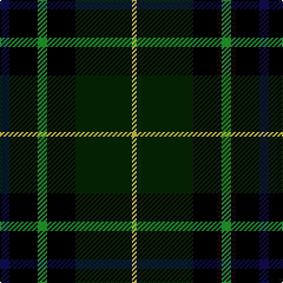

In pattern [BKGKGY](/patterns/bkgkgy/).

This was sourced from register-of-tartans.  It is a [6 stripes tartan](/stripes/stripes6/).

Original link https://www.tartanregister.gov.uk/tartanDetails.aspx?ref=10308

## Thread count
DB/8 K24 G8 K24 DG48 Y/4

## Palette
Each colour and its ΔE from the base-6 reference it is a variant of.

| Colour | Shade | Base | ΔE (OKLab) |
|---|---|---|---|
| DB | <code style="background-color:#0D0D4B;">#0D0D4B</code> `#0D0D4B` | B <code style="background-color:#2C4084;">#2C4084</code> | 0.18 |
| DG | <code style="background-color:#062706;">#062706</code> `#062706` | G <code style="background-color:#006400;">#006400</code> | 0.21 |
| G | <code style="background-color:#109920;">#109920</code> `#109920` | G <code style="background-color:#006400;">#006400</code> | 0.16 |
| K | <code style="background-color:#000000;">#000000</code> `#000000` | K <code style="background-color:#000000;">#000000</code> | 0.00 |
| Y | <code style="background-color:#D3C229;">#D3C229</code> `#D3C229` | Y <code style="background-color:#E8C000;">#E8C000</code> | 0.03 |

# Sample pattern

ID: /setts/s6/b8k24g8k24ga48y4-b0d0d4b-g109920-ga062706-k000000-yd3c229/
