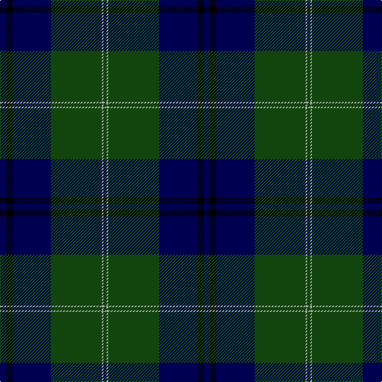

In pattern [BKBGYG](/patterns/bkbgyg/).

This was sourced from weddslist.  It is a [6 stripes tartan](/stripes/stripes6/).

Original link http://www.weddslist.com/cgi-bin/tartans/pg.pl?source=tinsel

## Attestations

This cloth appears in 2 source records; the oldest owns this page.

- undated — Oliphant (weddslist, [record](http://www.weddslist.com/cgi-bin/tartans/pg.pl?source=tinsel))
- undated — Oliphant (weddslist, [record](http://www.weddslist.com/cgi-bin/tartans/pg.pl?source=x))

## Thread count
DB/8 K8 DB48 DG64 N2 DG/4

## Palette
Each colour and its ΔE from the base-6 reference it is a variant of.

| Colour | Shade | Base | ΔE (OKLab) |
|---|---|---|---|
| DB | <code style="background-color:#000052;">#000052</code> `#000052` | B <code style="background-color:#2C4084;">#2C4084</code> | 0.20 |
| DG | <code style="background-color:#11450D;">#11450D</code> `#11450D` | G <code style="background-color:#006400;">#006400</code> | 0.10 |
| K | <code style="background-color:#000000;">#000000</code> `#000000` | K <code style="background-color:#000000;">#000000</code> | 0.00 |
| N | <code style="background-color:#AAAAAA;">#AAAAAA</code> `#AAAAAA` | Y <code style="background-color:#E8C000;">#E8C000</code> | 0.19 |

# Sample pattern

## Nearest tartans

The nearest existing variants by ΔTartan distance.

1. [Oliphant](/setts/s6/b8k8b48g64w2g4-b00004c-g004c00-k000000-wd0d0d0/) — ΔT 0.59
1. [Johnston](/setts/s8/y6g4k2g60b48k4b4k4-b000052-g11450d-k000000-yaaaa00/) — ΔT 1.11
1. [Oliphant Family Tartan Tartan Number: 242. Earliest known date: 1842 Also The Setts No: 210. W & A K Johnston, 1906. Often referred to as 'Oliphant and Melville'. There is a similar pattern listed under 'Melville' which is also worn by the Oliphants. There is no definitive provenance to distinguish one from the other, though the Vestiarium has proved unreliable in many cases. See MELVILLE. See products available Copyright © Blair Urquhart, Comrie, 2015](/setts/s6/b8k8b48g64w2g4-b2c2c80-g006818-k101010-we0e0e0/) — ΔT 1.13
1. [Oliphant (Clan)](/setts/s6/b16k16b96g128w4g8-b2c2c80-g006818-k101010-wfcfcfc/) — ΔT 1.17
1. [Koot Wedding (Personal)](/setts/s6/b96k64r2k16r6w6-b1b3357-k101010-rcc0000-wffffff/) — ΔT 1.31
1. [Peter of Lee](/setts/s8/r8g6k4g76b60k6b6k6-b000050-g003000-k000000-rc00000/) — ΔT 1.35
1. [Home or Hume (Vestiarium Scoticum)](/setts/s8/k56r2k4r2k16b48g4b6-b2c4084-g005020-k101010-rdc0000/) — ΔT 1.39
1. [Hutton](/setts/s6/k12g42b12g42b96r6-b00004c-g005030-k101010-rc80000/) — ΔT 1.40
1. [Casely of Mannerston (Personal)](/setts/s7/b100g8k44g46r2g2r4-b2c2c80-g006818-k101010-rc80000/) — ΔT 1.44
1. [Doral](/setts/s7/b104ba24b8ba68g16w4g16-b000064-ba0c5454-g343400-wfcfcfc/) — ΔT 1.45

## Neighbour map

Every grey dot is one of 15726 variants placed by the first two principal components of the ΔTartan feature space (44% of its variance). Red is this tartan; blue dots are its nearest — click one to open its page.

<svg viewBox="0 0 640 380" role="img" style="max-width:100%;height:auto;border:1px solid #e0e0e0;border-radius:4px;display:block" xmlns="http://www.w3.org/2000/svg"><image href="/nn/cloud.v1.png" width="640" height="380"/><a href="/setts/s6/b8k8b48g64w2g4-b00004c-g004c00-k000000-wd0d0d0/"><circle cx="368.8" cy="177.8" r="4" fill="#3465a4"><title>Oliphant</title></circle></a><a href="/setts/s8/y6g4k2g60b48k4b4k4-b000052-g11450d-k000000-yaaaa00/"><circle cx="349.2" cy="150.4" r="4" fill="#3465a4"><title>Johnston</title></circle></a><a href="/setts/s6/b8k8b48g64w2g4-b2c2c80-g006818-k101010-we0e0e0/"><circle cx="374.1" cy="174.6" r="4" fill="#3465a4"><title>Oliphant Family Tartan Tartan Number: 242. Earliest known date: 1842 Also The Setts No: 210. W &amp; A K Johnston, 1906. Often referred to as 'Oliphant and Melville'. There is a similar pattern listed under 'Melville' which is also worn by the Oliphants. There is no definitive provenance to distinguish one from the other, though the Vestiarium has proved unreliable in many cases. See MELVILLE. See products available Copyright © Blair Urquhart, Comrie, 2015</title></circle></a><a href="/setts/s6/b16k16b96g128w4g8-b2c2c80-g006818-k101010-wfcfcfc/"><circle cx="370.5" cy="173.0" r="4" fill="#3465a4"><title>Oliphant (Clan)</title></circle></a><a href="/setts/s6/b96k64r2k16r6w6-b1b3357-k101010-rcc0000-wffffff/"><circle cx="400.2" cy="160.4" r="4" fill="#3465a4"><title>Koot Wedding (Personal)</title></circle></a><a href="/setts/s8/r8g6k4g76b60k6b6k6-b000050-g003000-k000000-rc00000/"><circle cx="353.2" cy="183.2" r="4" fill="#3465a4"><title>Peter of Lee</title></circle></a><a href="/setts/s8/k56r2k4r2k16b48g4b6-b2c4084-g005020-k101010-rdc0000/"><circle cx="420.2" cy="171.0" r="4" fill="#3465a4"><title>Home or Hume (Vestiarium Scoticum)</title></circle></a><a href="/setts/s6/k12g42b12g42b96r6-b00004c-g005030-k101010-rc80000/"><circle cx="356.6" cy="227.5" r="4" fill="#3465a4"><title>Hutton</title></circle></a><a href="/setts/s7/b100g8k44g46r2g2r4-b2c2c80-g006818-k101010-rc80000/"><circle cx="362.0" cy="147.0" r="4" fill="#3465a4"><title>Casely of Mannerston (Personal)</title></circle></a><a href="/setts/s7/b104ba24b8ba68g16w4g16-b000064-ba0c5454-g343400-wfcfcfc/"><circle cx="343.4" cy="191.2" r="4" fill="#3465a4"><title>Doral</title></circle></a><circle cx="385.0" cy="184.2" r="5" fill="#c00000"/></svg>

ID: /setts/s6/b8k8b48g64y2g4-b000052-g11450d-k000000-yaaaaaa/
