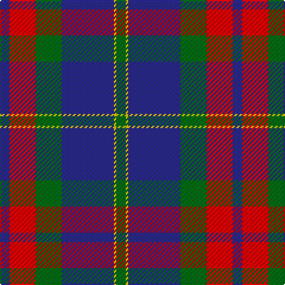

In pattern [BRGBYG](/patterns/brgbyg/).

This was sourced from register-of-tartans.  It is a [6 stripes tartan](/stripes/stripes6/).

Original link https://www.tartanregister.gov.uk/tartanDetails.aspx?ref=1622

## Attestations

This cloth appears in 2 source records; the oldest owns this page.

- 01/01/1985 — Harvey (register-of-tartans, [record](https://www.tartanregister.gov.uk/tartanDetails.aspx?ref=1622))
- pre 1985 — Harvey (Name) (tartans-authority, [record](http://www.tartansauthority.com/tartan-ferret/display/6848/))

## Thread count
DB/8 R22 G22 DB44 Y2 G/8

## Palette
Each colour and its ΔE from the base-6 reference it is a variant of.

| Colour | Shade | Base | ΔE (OKLab) |
|---|---|---|---|
| DB | <code style="background-color:#2C2C80;">#2C2C80</code> `#2C2C80` | B <code style="background-color:#2A418A;">#2A418A</code> | 0.06 |
| G | <code style="background-color:#006818;">#006818</code> `#006818` | G <code style="background-color:#006100;">#006100</code> | 0.02 |
| R | <code style="background-color:#C80000;">#C80000</code> `#C80000` | R <code style="background-color:#CC0000;">#CC0000</code> | 0.01 |
| Y | <code style="background-color:#E8C000;">#E8C000</code> `#E8C000` | Y <code style="background-color:#F2BF00;">#F2BF00</code> | 0.02 |

# Sample pattern

## Nearest tartans

The nearest existing variants by ΔTartan distance.

1. [Discover Islay (District)](/setts/s6/b24y4b80ba24g76b8-b780078-ba2c2c80-g006818-ye8c000/) — ΔT 0.91
1. [Wicks Personal Tartan Tartan Number: 5968. Earliest known date: 2003 A tartan for the occasion of the marriage of Christopher Wicks and Nicola Bundle, in Aberdeen 2003. See products available Copyright © Blair Urquhart, Comrie, 2015](/setts/s8/b60r40g16y6g16r40b60y4-b442450-g003820-r888888-ye8c000/) — ΔT 0.92
1. [Donnolly](/setts/s6/b6g42b6r42b70w6-b2c2c80-g00643c-rc04c08-wfcfcfc/) — ΔT 1.05
1. [British Judo Association](/setts/s6/r56ra2b36y4g12b36-b1870a4-g608c28-r780028-rac80000-ye8c000/) — ΔT 1.18
1. [Unnamed C20th - USA](/setts/s7/b4y2b36g14r14b2g2-b2c2c80-g006818-rc80000-ye8c000/) — ΔT 1.30
1. [Katsushika Scottish Country Dancers](/setts/s8/b44y4b2y4b20r4g22r12-b304080-g008000-rc00000-yf0c000/) — ΔT 1.31
1. [Finlaggan](/setts/s6/g14w2g36b12r36g4-b2c2c80-g003820-rc80000-we0e0e0/) — ΔT 1.31
1. [Highland Spring Dress (2004)](/setts/s8/r50g20b60w8b60g20r50w4-b2c2c80-g289c18-r880000-wfcfcfc/) — ΔT 1.32
1. [Katsushika Corporate Tartan Tartan Number: 2343. Earliest known date: 1997 Designed for Katsushika Scottish country dancers from Hiroshima. See products available Copyright © Blair Urquhart, Comrie, 2015](/setts/s8/b44y4b2y4b20r4g22r12-b2c2c80-g006818-rc80000-ye8c000/) — ΔT 1.32
1. [Fibonacci7](/setts/s7/b52g32r20b12g8r4y4-b141e46-g004c00-rb03000-yffe600/) — ΔT 1.32

## Neighbour map

Every grey dot is one of 15726 variants placed by the first two principal components of the ΔTartan feature space (44% of its variance). Red is this tartan; blue dots are its nearest — click one to open its page.

<svg viewBox="0 0 640 380" role="img" style="max-width:100%;height:auto;border:1px solid #e0e0e0;border-radius:4px;display:block" xmlns="http://www.w3.org/2000/svg"><image href="/nn/cloud.v1.png" width="640" height="380"/><a href="/setts/s6/b24y4b80ba24g76b8-b780078-ba2c2c80-g006818-ye8c000/"><circle cx="335.2" cy="192.5" r="4" fill="#3465a4"><title>Discover Islay (District)</title></circle></a><a href="/setts/s8/b60r40g16y6g16r40b60y4-b442450-g003820-r888888-ye8c000/"><circle cx="278.3" cy="200.9" r="4" fill="#3465a4"><title>Wicks Personal Tartan Tartan Number: 5968. Earliest known date: 2003 A tartan for the occasion of the marriage of Christopher Wicks and Nicola Bundle, in Aberdeen 2003. See products available Copyright © Blair Urquhart, Comrie, 2015</title></circle></a><a href="/setts/s6/b6g42b6r42b70w6-b2c2c80-g00643c-rc04c08-wfcfcfc/"><circle cx="262.5" cy="205.0" r="4" fill="#3465a4"><title>Donnolly</title></circle></a><a href="/setts/s6/r56ra2b36y4g12b36-b1870a4-g608c28-r780028-rac80000-ye8c000/"><circle cx="315.9" cy="169.0" r="4" fill="#3465a4"><title>British Judo Association</title></circle></a><a href="/setts/s7/b4y2b36g14r14b2g2-b2c2c80-g006818-rc80000-ye8c000/"><circle cx="347.6" cy="170.3" r="4" fill="#3465a4"><title>Unnamed C20th - USA</title></circle></a><a href="/setts/s8/b44y4b2y4b20r4g22r12-b304080-g008000-rc00000-yf0c000/"><circle cx="344.3" cy="164.0" r="4" fill="#3465a4"><title>Katsushika Scottish Country Dancers</title></circle></a><a href="/setts/s6/g14w2g36b12r36g4-b2c2c80-g003820-rc80000-we0e0e0/"><circle cx="316.3" cy="195.7" r="4" fill="#3465a4"><title>Finlaggan</title></circle></a><a href="/setts/s8/r50g20b60w8b60g20r50w4-b2c2c80-g289c18-r880000-wfcfcfc/"><circle cx="229.5" cy="196.2" r="4" fill="#3465a4"><title>Highland Spring Dress (2004)</title></circle></a><a href="/setts/s8/b44y4b2y4b20r4g22r12-b2c2c80-g006818-rc80000-ye8c000/"><circle cx="341.1" cy="162.7" r="4" fill="#3465a4"><title>Katsushika Corporate Tartan Tartan Number: 2343. Earliest known date: 1997 Designed for Katsushika Scottish country dancers from Hiroshima. See products available Copyright © Blair Urquhart, Comrie, 2015</title></circle></a><a href="/setts/s7/b52g32r20b12g8r4y4-b141e46-g004c00-rb03000-yffe600/"><circle cx="280.9" cy="203.8" r="4" fill="#3465a4"><title>Fibonacci7</title></circle></a><circle cx="296.1" cy="191.4" r="5" fill="#c00000"/></svg>

ID: /setts/s6/b8r22g22b44y2g8-b2c2c80-g006818-rc80000-ye8c000/
