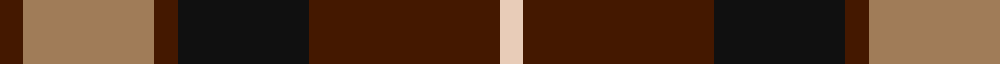

In pattern [BRBKBW](/patterns/brbkbw/).

This was sourced from register-of-tartans.  It is a [6 stripes tartan](/stripes/stripes6/).

Original link https://www.tartanregister.gov.uk/tartanDetails.aspx?ref=3360

## Thread count
DR/8 LT44 DR8 K44 DR64 LR/8

## Palette
Each colour and its ΔE from the base-6 reference it is a variant of.

| Colour | Shade | Base | ΔE (OKLab) |
|---|---|---|---|
| DR | <code style="background-color:#441800;">#441800</code> `#441800` | B <code style="background-color:#2C4084;">#2C4084</code> | 0.22 |
| K | <code style="background-color:#101010;">#101010</code> `#101010` | K <code style="background-color:#000000;">#000000</code> | 0.17 |
| LR | <code style="background-color:#E8CCB8;">#E8CCB8</code> `#E8CCB8` | W <code style="background-color:#F4F4F0;">#F4F4F0</code> | 0.11 |
| LT | <code style="background-color:#A07C58;">#A07C58</code> `#A07C58` | R <code style="background-color:#C80000;">#C80000</code> | 0.19 |

# Sample pattern

## Nearest tartans

The nearest existing variants by ΔTartan distance.

1. [Lindsay Htg (Clan?)](/setts/s6/g12k60r32g8ra32k8-g006818-k101010-r880000-ra888888/) — ΔT 0.59
1. [Thompson Black (Fashion)](/setts/s6/g12k60r32g8ra32k8-g006818-k101010-rc80000-ra888888/) — ΔT 0.62
1. [MacMillan - 2002 (Black - Unofficial](/setts/s6/g6k62r34g12y36k6-g004810-k101010-r880000-ybc8c00/) — ΔT 0.67
1. [Denny Hunting](/setts/s6/k8g10k4g10r34b4-b00008c-g004c00-k000000-r8c0000/) — ΔT 0.71
1. [Eyre (Personal)](/setts/s6/r6b24r8g36r12k4-b202060-g006818-k101010-rc80000/) — ΔT 0.88
1. [Canadian Autumn](/setts/s6/g8r56b12g20k20g6-b1c0070-g006818-k101010-r880000/) — ΔT 0.92
1. [British Hills](/setts/s5/r8g68r32b32y8-b2c4084-g003c14-rff0000-ye8c000/) — ΔT 0.96
1. [Fraser Green](/setts/s6/w8b48g24b4ba24b4-b4c0000-ba5c5c5c-g447438-wc0c0c0/) — ΔT 1.01
1. [Manson Family Tartan Tartan Number: 987. Earliest known date: 1983 The official recording of the sett shows the letter G for the dark green stripe. In heraldic terms this means 'Gules' - red. The designer, Hugh Kirkwood Rankine, clearly intended dark green and this is reproduced here. See products available Copyright © Blair Urquhart, Comrie, 2015](/setts/s8/g2r18g6k6g6r2k18w2-g006818-k101010-rc80000-we0e0e0/) — ΔT 1.02
1. [O'Neill (District)](/setts/s9/w4r24k8r4k4r4k12g10w4-g006818-k101010-r880000-wc0c0c0/) — ΔT 1.05

## Neighbour map

Every grey dot is one of 15726 variants placed by the first two principal components of the ΔTartan feature space (44% of its variance). Red is this tartan; blue dots are its nearest — click one to open its page.

<svg viewBox="0 0 640 380" role="img" style="max-width:100%;height:auto;border:1px solid #e0e0e0;border-radius:4px;display:block" xmlns="http://www.w3.org/2000/svg"><image href="/nn/cloud.v1.png" width="640" height="380"/><a href="/setts/s6/g12k60r32g8ra32k8-g006818-k101010-r880000-ra888888/"><circle cx="210.8" cy="230.7" r="4" fill="#3465a4"><title>Lindsay Htg (Clan?)</title></circle></a><a href="/setts/s6/g12k60r32g8ra32k8-g006818-k101010-rc80000-ra888888/"><circle cx="199.7" cy="222.8" r="4" fill="#3465a4"><title>Thompson Black (Fashion)</title></circle></a><a href="/setts/s6/g6k62r34g12y36k6-g004810-k101010-r880000-ybc8c00/"><circle cx="216.4" cy="209.9" r="4" fill="#3465a4"><title>MacMillan - 2002 (Black - Unofficial</title></circle></a><a href="/setts/s6/k8g10k4g10r34b4-b00008c-g004c00-k000000-r8c0000/"><circle cx="265.3" cy="214.7" r="4" fill="#3465a4"><title>Denny Hunting</title></circle></a><a href="/setts/s6/r6b24r8g36r12k4-b202060-g006818-k101010-rc80000/"><circle cx="213.7" cy="221.9" r="4" fill="#3465a4"><title>Eyre (Personal)</title></circle></a><a href="/setts/s6/g8r56b12g20k20g6-b1c0070-g006818-k101010-r880000/"><circle cx="266.2" cy="223.4" r="4" fill="#3465a4"><title>Canadian Autumn</title></circle></a><a href="/setts/s5/r8g68r32b32y8-b2c4084-g003c14-rff0000-ye8c000/"><circle cx="219.7" cy="221.6" r="4" fill="#3465a4"><title>British Hills</title></circle></a><a href="/setts/s6/w8b48g24b4ba24b4-b4c0000-ba5c5c5c-g447438-wc0c0c0/"><circle cx="287.0" cy="209.8" r="4" fill="#3465a4"><title>Fraser Green</title></circle></a><a href="/setts/s8/g2r18g6k6g6r2k18w2-g006818-k101010-rc80000-we0e0e0/"><circle cx="201.4" cy="192.4" r="4" fill="#3465a4"><title>Manson Family Tartan Tartan Number: 987. Earliest known date: 1983 The official recording of the sett shows the letter G for the dark green stripe. In heraldic terms this means 'Gules' - red. The designer, Hugh Kirkwood Rankine, clearly intended dark green and this is reproduced here. See products available Copyright © Blair Urquhart, Comrie, 2015</title></circle></a><a href="/setts/s9/w4r24k8r4k4r4k12g10w4-g006818-k101010-r880000-wc0c0c0/"><circle cx="195.6" cy="211.2" r="4" fill="#3465a4"><title>O'Neill (District)</title></circle></a><circle cx="231.5" cy="224.8" r="5" fill="#c00000"/></svg>

ID: /setts/s6/b8r44b8k44b64w8-b441800-k101010-ra07c58-we8ccb8/
