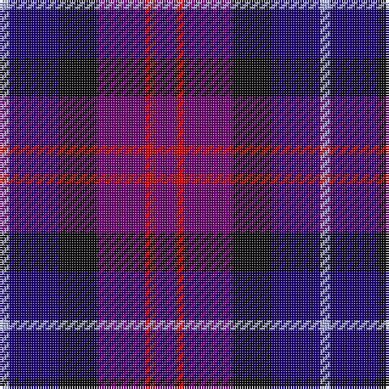

In pattern [BRBKBW](/patterns/brbkbw/).

This was sourced from tartans-authority.  It is a [6 stripes tartan](/stripes/stripes6/).

Original link http://www.tartansauthority.com/tartan-ferret/display/5364/

## Thread count
LP/4 DB20 K16 P20 R4 P/8

## Palette
Each colour and its ΔE from the base-6 reference it is a variant of.

| Colour | Shade | Base | ΔE (OKLab) |
|---|---|---|---|
| DB | <code style="background-color:#1C0070;">#1C0070</code> `#1C0070` | B <code style="background-color:#2A418A;">#2A418A</code> | 0.14 |
| K | <code style="background-color:#101010;">#101010</code> `#101010` | K <code style="background-color:#000000;">#000000</code> | 0.17 |
| LP | <code style="background-color:#A8ACE8;">#A8ACE8</code> `#A8ACE8` | W <code style="background-color:#F7F7F7;">#F7F7F7</code> | 0.23 |
| P | <code style="background-color:#6C0070;">#6C0070</code> `#6C0070` | B <code style="background-color:#2A418A;">#2A418A</code> | 0.16 |
| R | <code style="background-color:#C80000;">#C80000</code> `#C80000` | R <code style="background-color:#CC0000;">#CC0000</code> | 0.01 |

# Sample pattern

## Nearest tartans

The nearest existing variants by ΔTartan distance.

1. [Benreay Medical Centre (Corporate)](/setts/s6/b16r4ba20b16k24w4-b780078-ba1474b4-k101010-rc80000-wa8ace8/) — ΔT 1.10
1. [Kintore](/setts/s10/b8r4b20k16ba20w4ba20k16b20r4-b6c0070-ba1c0070-k101010-rc80000-wa8ace8/) — ΔT 1.15
1. [Blue Family Tartan Tartan Number: 1420. Earliest known date: 1985 Blue is a Sept name of MacMillan. See products available Copyright © Blair Urquhart, Comrie, 2015](/setts/s7/r4b22r6b22ba24bb20w4-b2c2c80-ba5c8ca8-bb202060-rc80000-we0e0e0/) — ΔT 1.61
1. [Heritage of Scotland](/setts/s7/b12w6b42k32ba12k6ba12-b2c2c80-ba780078-k101010-wf8f8f8/) — ΔT 1.64
1. [Blue](/setts/s7/r4b22r6b22ba24bb20w4-b304080-ba5480b0-bb000050-rc00000-we0e0e0/) — ΔT 1.77
1. [Scottish N. A. Business Council (Co](/setts/s10/r8b24ba24b8r8b16ba24r8b8w4-b1c0070-ba003c64-rc80000-we0e0e0/) — ΔT 1.81
1. [Brodie Countryfare (Corporate)](/setts/s7/b6k26b26ba26w4ba26w6-b2c2c80-ba1c0070-k101010-we0e0e0/) — ΔT 1.84
1. [Hamilton (Personal)](/setts/s10/b6g6b36r28b10r28b10r28b42g6-b000088-g004c00-r880000/) — ΔT 1.84
1. [St. Andrew Society](/setts/s7/b32k32ba32w6ba32k4bb6-b2c2c80-ba1c0070-bb2888c4-k101010-we0e0e0/) — ΔT 1.85
1. [Clerk Family Tartan Tartan Number: 326. Earliest known date: 1847 Also referred to as Clark. See products available Copyright © Blair Urquhart, Comrie, 2015](/setts/s6/b20k4g4k4r12k4-b2c2c80-g006818-k101010-rc80000/) — ΔT 1.88

## Neighbour map

Every grey dot is one of 15726 variants placed by the first two principal components of the ΔTartan feature space (44% of its variance). Red is this tartan; blue dots are its nearest — click one to open its page.

<svg viewBox="0 0 640 380" role="img" style="max-width:100%;height:auto;border:1px solid #e0e0e0;border-radius:4px;display:block" xmlns="http://www.w3.org/2000/svg"><image href="/nn/cloud.v1.png" width="640" height="380"/><a href="/setts/s6/b16r4ba20b16k24w4-b780078-ba1474b4-k101010-rc80000-wa8ace8/"><circle cx="140.3" cy="239.2" r="4" fill="#3465a4"><title>Benreay Medical Centre (Corporate)</title></circle></a><a href="/setts/s10/b8r4b20k16ba20w4ba20k16b20r4-b6c0070-ba1c0070-k101010-rc80000-wa8ace8/"><circle cx="149.3" cy="243.4" r="4" fill="#3465a4"><title>Kintore</title></circle></a><a href="/setts/s7/r4b22r6b22ba24bb20w4-b2c2c80-ba5c8ca8-bb202060-rc80000-we0e0e0/"><circle cx="165.2" cy="235.2" r="4" fill="#3465a4"><title>Blue Family Tartan Tartan Number: 1420. Earliest known date: 1985 Blue is a Sept name of MacMillan. See products available Copyright © Blair Urquhart, Comrie, 2015</title></circle></a><a href="/setts/s7/b12w6b42k32ba12k6ba12-b2c2c80-ba780078-k101010-wf8f8f8/"><circle cx="223.2" cy="233.1" r="4" fill="#3465a4"><title>Heritage of Scotland</title></circle></a><a href="/setts/s7/r4b22r6b22ba24bb20w4-b304080-ba5480b0-bb000050-rc00000-we0e0e0/"><circle cx="159.7" cy="234.4" r="4" fill="#3465a4"><title>Blue</title></circle></a><a href="/setts/s10/r8b24ba24b8r8b16ba24r8b8w4-b1c0070-ba003c64-rc80000-we0e0e0/"><circle cx="196.4" cy="243.1" r="4" fill="#3465a4"><title>Scottish N. A. Business Council (Co</title></circle></a><a href="/setts/s7/b6k26b26ba26w4ba26w6-b2c2c80-ba1c0070-k101010-we0e0e0/"><circle cx="191.5" cy="254.8" r="4" fill="#3465a4"><title>Brodie Countryfare (Corporate)</title></circle></a><a href="/setts/s10/b6g6b36r28b10r28b10r28b42g6-b000088-g004c00-r880000/"><circle cx="227.0" cy="231.8" r="4" fill="#3465a4"><title>Hamilton (Personal)</title></circle></a><a href="/setts/s7/b32k32ba32w6ba32k4bb6-b2c2c80-ba1c0070-bb2888c4-k101010-we0e0e0/"><circle cx="211.1" cy="238.3" r="4" fill="#3465a4"><title>St. Andrew Society</title></circle></a><a href="/setts/s6/b20k4g4k4r12k4-b2c2c80-g006818-k101010-rc80000/"><circle cx="198.3" cy="243.3" r="4" fill="#3465a4"><title>Clerk Family Tartan Tartan Number: 326. Earliest known date: 1847 Also referred to as Clark. See products available Copyright © Blair Urquhart, Comrie, 2015</title></circle></a><circle cx="162.6" cy="253.0" r="5" fill="#c00000"/></svg>

ID: /setts/s6/b8r4b20k16ba20w4-b6c0070-ba1c0070-k101010-rc80000-wa8ace8/
