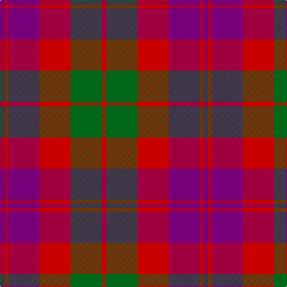

In pattern [BRBRGR](/patterns/brbrgr/).

This was sourced from house-of-tartan.  It is a [6 stripes tartan](/stripes/stripes6/).

Original link http://www.house-of-tartan.scotland.net/house/TartanViewjs.asp?colr=Def&tnam=463

## Thread count
P/8 R6 P52 R52 G52 R/8

## Palette
Each colour and its ΔE from the base-6 reference it is a variant of.

| Colour | Shade | Base | ΔE (OKLab) |
|---|---|---|---|
| G | <code style="background-color:#006818;">#006818</code> `#006818` | G <code style="background-color:#006100;">#006100</code> | 0.02 |
| P | <code style="background-color:#780078;">#780078</code> `#780078` | B <code style="background-color:#2A418A;">#2A418A</code> | 0.17 |
| R | <code style="background-color:#C80000;">#C80000</code> `#C80000` | R <code style="background-color:#CC0000;">#CC0000</code> | 0.01 |

# Sample pattern

## Nearest tartans

The nearest existing variants by ΔTartan distance.

1. [Unidentified 16](/setts/s6/b8r6b52r52g52r8-b800080-g008000-rc00000/) — ΔT 0.36
1. [Unidentified #21](/setts/s6/b8r6b52r52g52r8-b5a008c-g005020-rdc0000/) — ΔT 0.79
1. [MacNab (Macgregor - Hastie)](/setts/s6/b6r38b36g38b6g6-b500050-g005020-rdc0000/) — ΔT 0.84
1. [Scottish Netball Association](/setts/s7/b6g28r4b20g4r28b6-b800080-g008000-r900030/) — ΔT 0.86
1. [Scottish Netball (1986) (Corporate)](/setts/s7/b6g28r4b20g4r28b6-b780078-g006818-ra00048/) — ΔT 1.08
1. [MacFadyan (MacGregor Hastie)](/setts/s7/b6r50b34r10g44r18b6-b2c2c80-g006818-rc80000/) — ΔT 1.09
1. [MacNab #2](/setts/s6/g4r4g28r16ra28r4-g006818-ra00048-rac80000/) — ΔT 1.19
1. [Moray of Abercairney #2](/setts/s5/r16ra2g8ra2b8-b2c4084-g005020-rdc0000-rac82828/) — ΔT 1.21
1. [MacNab 1](/setts/s6/b6r38b36g38b6g6-b500060-g008000-rc00000/) — ΔT 1.22
1. [MacTavish Clan Tartan Tartan Number: 230. Earliest known date: pre 2003 D.C. Stewart writes, " This tartan has recently (1950) come into use as being that appropriate to the Thomsons; Thomson is the anglicised form of the name MacTavish. It is not recorded in any of the early illustrated books. Many MacTavishes wear the Campbell of Argyll." Stewart may not have considered Johnston's publication in 1906 as 'early' and this may have been the source for the sett he recorded in the 'Setts of the Scottish Tartans' in 1950. Some versions show black in place of the mid blue stripe in this illustration. There is also the personal tartan of Lord Thomson of Fleet and a sett recorded in the 'Baronage of Angus and Mearns'. See products available Copyright © Blair Urquhart, Comrie, 2015](/setts/s6/b8r60k12b26k26b6-b2c2c80-k101010-rc80000/) — ΔT 1.28

## Neighbour map

Every grey dot is one of 15726 variants placed by the first two principal components of the ΔTartan feature space (44% of its variance). Red is this tartan; blue dots are its nearest — click one to open its page.

<svg viewBox="0 0 640 380" role="img" style="max-width:100%;height:auto;border:1px solid #e0e0e0;border-radius:4px;display:block" xmlns="http://www.w3.org/2000/svg"><image href="/nn/cloud.v1.png" width="640" height="380"/><a href="/setts/s6/b8r6b52r52g52r8-b800080-g008000-rc00000/"><circle cx="240.2" cy="231.0" r="4" fill="#3465a4"><title>Unidentified 16</title></circle></a><a href="/setts/s6/b8r6b52r52g52r8-b5a008c-g005020-rdc0000/"><circle cx="232.1" cy="229.2" r="4" fill="#3465a4"><title>Unidentified #21</title></circle></a><a href="/setts/s6/b6r38b36g38b6g6-b500050-g005020-rdc0000/"><circle cx="225.8" cy="250.1" r="4" fill="#3465a4"><title>MacNab (Macgregor - Hastie)</title></circle></a><a href="/setts/s7/b6g28r4b20g4r28b6-b800080-g008000-r900030/"><circle cx="219.0" cy="238.6" r="4" fill="#3465a4"><title>Scottish Netball Association</title></circle></a><a href="/setts/s7/b6g28r4b20g4r28b6-b780078-g006818-ra00048/"><circle cx="238.5" cy="246.8" r="4" fill="#3465a4"><title>Scottish Netball (1986) (Corporate)</title></circle></a><a href="/setts/s7/b6r50b34r10g44r18b6-b2c2c80-g006818-rc80000/"><circle cx="266.0" cy="232.8" r="4" fill="#3465a4"><title>MacFadyan (MacGregor Hastie)</title></circle></a><a href="/setts/s6/g4r4g28r16ra28r4-g006818-ra00048-rac80000/"><circle cx="261.7" cy="249.2" r="4" fill="#3465a4"><title>MacNab #2</title></circle></a><a href="/setts/s5/r16ra2g8ra2b8-b2c4084-g005020-rdc0000-rac82828/"><circle cx="240.0" cy="230.6" r="4" fill="#3465a4"><title>Moray of Abercairney #2</title></circle></a><a href="/setts/s6/b6r38b36g38b6g6-b500060-g008000-rc00000/"><circle cx="210.0" cy="245.4" r="4" fill="#3465a4"><title>MacNab 1</title></circle></a><a href="/setts/s6/b8r60k12b26k26b6-b2c2c80-k101010-rc80000/"><circle cx="264.3" cy="222.5" r="4" fill="#3465a4"><title>MacTavish Clan Tartan Tartan Number: 230. Earliest known date: pre 2003 D.C. Stewart writes, &quot; This tartan has recently (1950) come into use as being that appropriate to the Thomsons; Thomson is the anglicised form of the name MacTavish. It is not recorded in any of the early illustrated books. Many MacTavishes wear the Campbell of Argyll.&quot; Stewart may not have considered Johnston's publication in 1906 as 'early' and this may have been the source for the sett he recorded in the 'Setts of the Scottish Tartans' in 1950. Some versions show black in place of the mid blue stripe in this illustration. There is also the personal tartan of Lord Thomson of Fleet and a sett recorded in the 'Baronage of Angus and Mearns'. See products available Copyright © Blair Urquhart, Comrie, 2015</title></circle></a><circle cx="249.5" cy="235.0" r="5" fill="#c00000"/></svg>

ID: /setts/s6/b8r6b52r52g52r8-b780078-g006818-rc80000/
