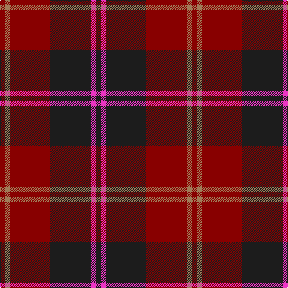

In pattern [BRBRRR](/patterns/brbrrr/).

This was sourced from register-of-tartans.  It is a [6 stripes tartan](/stripes/stripes6/).

Original link https://www.tartanregister.gov.uk/tartanDetails.aspx?ref=1089

## Thread count
DR/8 LT8 DR68 K68 LR8 K/8

## Palette
Each colour and its ΔE from the base-6 reference it is a variant of.

| Colour | Shade | Base | ΔE (OKLab) |
|---|---|---|---|
| DR | <code style="background-color:#880000;">#880000</code> `#880000` | R <code style="background-color:#C80000;">#C80000</code> | 0.14 |
| K | <code style="background-color:#1C1C1C;">#1C1C1C</code> `#1C1C1C` | B <code style="background-color:#2C4084;">#2C4084</code> | 0.20 |
| LR | <code style="background-color:#EC34C4;">#EC34C4</code> `#EC34C4` | R <code style="background-color:#C80000;">#C80000</code> | 0.24 |
| LT | <code style="background-color:#A07C58;">#A07C58</code> `#A07C58` | R <code style="background-color:#C80000;">#C80000</code> | 0.19 |

# Sample pattern

## Nearest tartans

The nearest existing variants by ΔTartan distance.

1. [MacArthur-Fox Dress Personal Tartan Tartan Number: 459. Earliest known date: 1986 This is the older of the two MacArthur setts, which links the clan with the Campbells. See products available Copyright © Blair Urquhart, Comrie, 2015](/setts/s6/b8r64ba12r12ba52ra8-b5c8ca8-ba2c2c80-r880000-rac80000/) — ΔT 1.28
1. [Menzies of Culdares](/setts/s7/k8r4k44r44k6r8w4-k101010-r880000-wa8ace8/) — ΔT 1.29
1. [MacNab VS](/setts/s7/g12r4b4g8b4r24k2-b59110d-g11450d-k000000-raa0000/) — ΔT 1.30
1. [Daks, Blue Loden](/setts/s8/r5b13ba4ra4ba27b3ba4r5-b5480b0-ba401000-r906030-ra900030/) — ΔT 1.40
1. [Canadian Autumn](/setts/s6/g8r56b12g20k20g6-b1c0070-g006818-k101010-r880000/) — ΔT 1.40
1. [Fraser VS](/setts/s6/r2b12r2g12r24y2-b000052-g11450d-raa0000-yaaaaaa/) — ΔT 1.44
1. [Wounded Warriors Canada](/setts/s7/r18k8r18k50ra6b36k8-b780078-k101010-ra00000-raa07c00/) — ΔT 1.45
1. [Hungerford RFC](/setts/s6/k100b6y6r100y6b6-b003c64-k101010-r880000-ye8c000/) — ΔT 1.46
1. [Dunbar (District)](/setts/s6/k16r98k16w6k40y6-k101010-r880000-wc0c0c0-yd09800/) — ΔT 1.48
1. [Montgomrie/Montgomery of Eglinton](/setts/s7/k8g10k8b56k8r10k8-b440044-g006818-k101010-rc80000/) — ΔT 1.51

## Neighbour map

Every grey dot is one of 15726 variants placed by the first two principal components of the ΔTartan feature space (44% of its variance). Red is this tartan; blue dots are its nearest — click one to open its page.

<svg viewBox="0 0 640 380" role="img" style="max-width:100%;height:auto;border:1px solid #e0e0e0;border-radius:4px;display:block" xmlns="http://www.w3.org/2000/svg"><image href="/nn/cloud.v1.png" width="640" height="380"/><a href="/setts/s6/b8r64ba12r12ba52ra8-b5c8ca8-ba2c2c80-r880000-rac80000/"><circle cx="329.9" cy="230.6" r="4" fill="#3465a4"><title>MacArthur-Fox Dress Personal Tartan Tartan Number: 459. Earliest known date: 1986 This is the older of the two MacArthur setts, which links the clan with the Campbells. See products available Copyright © Blair Urquhart, Comrie, 2015</title></circle></a><a href="/setts/s7/k8r4k44r44k6r8w4-k101010-r880000-wa8ace8/"><circle cx="370.3" cy="215.9" r="4" fill="#3465a4"><title>Menzies of Culdares</title></circle></a><a href="/setts/s7/g12r4b4g8b4r24k2-b59110d-g11450d-k000000-raa0000/"><circle cx="319.1" cy="208.4" r="4" fill="#3465a4"><title>MacNab VS</title></circle></a><a href="/setts/s8/r5b13ba4ra4ba27b3ba4r5-b5480b0-ba401000-r906030-ra900030/"><circle cx="306.0" cy="199.8" r="4" fill="#3465a4"><title>Daks, Blue Loden</title></circle></a><a href="/setts/s6/g8r56b12g20k20g6-b1c0070-g006818-k101010-r880000/"><circle cx="266.2" cy="223.4" r="4" fill="#3465a4"><title>Canadian Autumn</title></circle></a><a href="/setts/s6/r2b12r2g12r24y2-b000052-g11450d-raa0000-yaaaaaa/"><circle cx="298.0" cy="196.3" r="4" fill="#3465a4"><title>Fraser VS</title></circle></a><a href="/setts/s7/r18k8r18k50ra6b36k8-b780078-k101010-ra00000-raa07c00/"><circle cx="254.8" cy="223.9" r="4" fill="#3465a4"><title>Wounded Warriors Canada</title></circle></a><a href="/setts/s6/k100b6y6r100y6b6-b003c64-k101010-r880000-ye8c000/"><circle cx="326.6" cy="173.2" r="4" fill="#3465a4"><title>Hungerford RFC</title></circle></a><a href="/setts/s6/k16r98k16w6k40y6-k101010-r880000-wc0c0c0-yd09800/"><circle cx="370.9" cy="181.7" r="4" fill="#3465a4"><title>Dunbar (District)</title></circle></a><a href="/setts/s7/k8g10k8b56k8r10k8-b440044-g006818-k101010-rc80000/"><circle cx="330.4" cy="222.2" r="4" fill="#3465a4"><title>Montgomrie/Montgomery of Eglinton</title></circle></a><circle cx="322.8" cy="216.5" r="5" fill="#c00000"/></svg>

ID: /setts/s6/b8r8b68ra68rb8ra8-b1c1c1c-rec34c4-ra880000-rba07c58/
