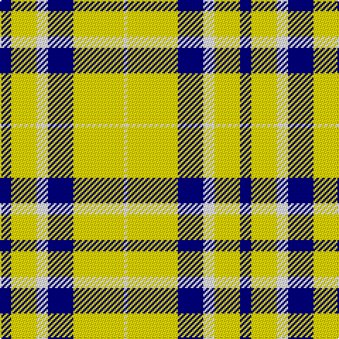

In pattern [BYWBYW](/patterns/bywbyw/).

This was sourced from register-of-tartans.  It is a [6 stripes tartan](/stripes/stripes6/).

Original link https://www.tartanregister.gov.uk/tartanDetails.aspx?ref=10567

## Thread count
DB/8 Y18 W8 DB18 Y36 W/2

## Palette
Each colour and its ΔE from the base-6 reference it is a variant of.

| Colour | Shade | Base | ΔE (OKLab) |
|---|---|---|---|
| DB | <code style="background-color:#000080;">#000080</code> `#000080` | B <code style="background-color:#2A418A;">#2A418A</code> | 0.14 |
| W | <code style="background-color:#FFFFFF;">#FFFFFF</code> `#FFFFFF` | W <code style="background-color:#F7F7F7;">#F7F7F7</code> | 0.02 |
| Y | <code style="background-color:#FFE700;">#FFE700</code> `#FFE700` | Y <code style="background-color:#F2BF00;">#F2BF00</code> | 0.10 |

# Sample pattern

## Nearest tartans

The nearest existing variants by ΔTartan distance.

1. [WVU Mountaineer (Corporate)](/setts/s6/b8y18w8b18y36w2-b003c64-wfcfcfc-yfccc00/) — ΔT 0.73
1. [Burns (Fashion)](/setts/s6/w60b24w4b12r12w4-b3c3c3c-rb0781c-wf8f4d0/) — ΔT 1.23
1. [Wallace Green Dress Fashion Tartan Tartan Number: 2212. Earliest known date: pre 2004 A dancers tartan based on the Wallace See products available Copyright © Blair Urquhart, Comrie, 2015](/setts/s6/w48g48w4g48w48y4-g006818-we0e0e0-ya08858/) — ΔT 1.59
1. [Erskine, Green (Dance)](/setts/s6/g12w4g58w58g4w12-g006818-wfcfcfc/) — ΔT 1.69
1. [Lewis, Green (Dance)](/setts/s4/g8w70ga62w8-g003820-ga006818-wf0e0c8/) — ΔT 1.73
1. [McPartlin (Personal)](/setts/s5/k54w58k10w28r4-k101010-rc80000-wf8e8d8/) — ΔT 1.77
1. [Erskine Green Clan Tartan Tartan Number: 941. Earliest known date: pre 2003 A sample of this tartan was recorded by the Scottish Tartans Society during the period 1970 to 1990. See products available Copyright © Blair Urquhart, Comrie, 2015](/setts/s6/g12w4g58w58g4w12-g006818-we0e0e0/) — ΔT 1.88
1. [MacDiarmid, dress](/setts/s9/w38r12w37g32k3w4k3g32r4-g008000-k000000-rc00000-we0e0e0/) — ΔT 1.90
1. [Erskine Green](/setts/s6/g12w4g58w58g4w12-g005020-we0e0e0/) — ΔT 1.91
1. [O'Neill](/setts/s9/w4g2w4r12w20g12w4r2w4-g008000-r806050-we0e0e0/) — ΔT 1.92

## Neighbour map

Every grey dot is one of 15726 variants placed by the first two principal components of the ΔTartan feature space (44% of its variance). Red is this tartan; blue dots are its nearest — click one to open its page.

<svg viewBox="0 0 640 380" role="img" style="max-width:100%;height:auto;border:1px solid #e0e0e0;border-radius:4px;display:block" xmlns="http://www.w3.org/2000/svg"><image href="/nn/cloud.v1.png" width="640" height="380"/><a href="/setts/s6/b8y18w8b18y36w2-b003c64-wfcfcfc-yfccc00/"><circle cx="317.1" cy="186.7" r="4" fill="#3465a4"><title>WVU Mountaineer (Corporate)</title></circle></a><a href="/setts/s6/w60b24w4b12r12w4-b3c3c3c-rb0781c-wf8f4d0/"><circle cx="323.2" cy="169.7" r="4" fill="#3465a4"><title>Burns (Fashion)</title></circle></a><a href="/setts/s6/w48g48w4g48w48y4-g006818-we0e0e0-ya08858/"><circle cx="273.3" cy="225.4" r="4" fill="#3465a4"><title>Wallace Green Dress Fashion Tartan Tartan Number: 2212. Earliest known date: pre 2004 A dancers tartan based on the Wallace See products available Copyright © Blair Urquhart, Comrie, 2015</title></circle></a><a href="/setts/s6/g12w4g58w58g4w12-g006818-wfcfcfc/"><circle cx="319.6" cy="197.5" r="4" fill="#3465a4"><title>Erskine, Green (Dance)</title></circle></a><a href="/setts/s4/g8w70ga62w8-g003820-ga006818-wf0e0c8/"><circle cx="282.4" cy="233.4" r="4" fill="#3465a4"><title>Lewis, Green (Dance)</title></circle></a><a href="/setts/s5/k54w58k10w28r4-k101010-rc80000-wf8e8d8/"><circle cx="300.4" cy="204.9" r="4" fill="#3465a4"><title>McPartlin (Personal)</title></circle></a><a href="/setts/s6/g12w4g58w58g4w12-g006818-we0e0e0/"><circle cx="332.4" cy="204.3" r="4" fill="#3465a4"><title>Erskine Green Clan Tartan Tartan Number: 941. Earliest known date: pre 2003 A sample of this tartan was recorded by the Scottish Tartans Society during the period 1970 to 1990. See products available Copyright © Blair Urquhart, Comrie, 2015</title></circle></a><a href="/setts/s9/w38r12w37g32k3w4k3g32r4-g008000-k000000-rc00000-we0e0e0/"><circle cx="223.0" cy="163.9" r="4" fill="#3465a4"><title>MacDiarmid, dress</title></circle></a><a href="/setts/s6/g12w4g58w58g4w12-g005020-we0e0e0/"><circle cx="326.4" cy="201.9" r="4" fill="#3465a4"><title>Erskine Green</title></circle></a><a href="/setts/s9/w4g2w4r12w20g12w4r2w4-g008000-r806050-we0e0e0/"><circle cx="286.0" cy="192.9" r="4" fill="#3465a4"><title>O'Neill</title></circle></a><circle cx="301.3" cy="183.5" r="5" fill="#c00000"/></svg>

ID: /setts/s6/b8y18w8b18y36w2-b000080-wffffff-yffe700/
