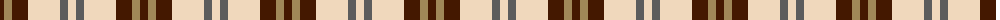

In pattern [BYBWBW](/patterns/bybwbw/).

This was sourced from tartans-authority.  It is a [6 stripes tartan](/stripes/stripes6/).

Original link http://www.tartansauthority.com/tartan-ferret/display/8008/

## Thread count
DR/8 LT8 DR16 W32 N8 W/8

## Palette
Each colour and its ΔE from the base-6 reference it is a variant of.

| Colour | Shade | Base | ΔE (OKLab) |
|---|---|---|---|
| DR | <code style="background-color:#441800;">#441800</code> `#441800` | B <code style="background-color:#2C4084;">#2C4084</code> | 0.22 |
| LT | <code style="background-color:#A08858;">#A08858</code> `#A08858` | Y <code style="background-color:#E8C000;">#E8C000</code> | 0.21 |
| N | <code style="background-color:#5C5C5C;">#5C5C5C</code> `#5C5C5C` | B <code style="background-color:#2C4084;">#2C4084</code> | 0.14 |
| W | <code style="background-color:#F0D8BC;">#F0D8BC</code> `#F0D8BC` | W <code style="background-color:#F4F4F0;">#F4F4F0</code> | 0.08 |

# Sample pattern

ID: /setts/s6/b8y8b16w32ba8w8-b441800-ba5c5c5c-wf0d8bc-ya08858/
