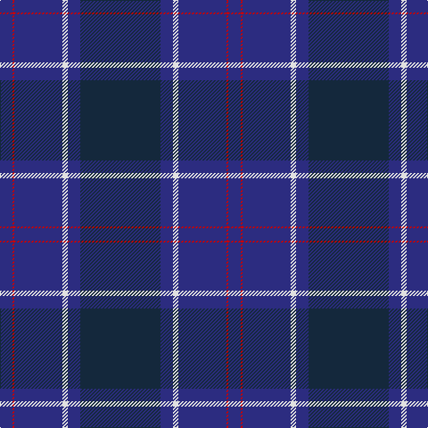

In pattern [BBWBRB](/patterns/bbwbrb/).

This was sourced from tartans-authority.  It is a [6 stripes tartan](/stripes/stripes6/).

Original link http://www.tartansauthority.com/tartan-ferret/display/80/

## Thread count
DB/14 R2 DB54 LN6 DB14 DN/90

## Palette
Each colour and its ΔE from the base-6 reference it is a variant of.

| Colour | Shade | Base | ΔE (OKLab) |
|---|---|---|---|
| DB | <code style="background-color:#2C2C80;">#2C2C80</code> `#2C2C80` | B <code style="background-color:#2A418A;">#2A418A</code> | 0.06 |
| DN | <code style="background-color:#14283C;">#14283C</code> `#14283C` | B <code style="background-color:#2A418A;">#2A418A</code> | 0.15 |
| LN | <code style="background-color:#E0E0E0;">#E0E0E0</code> `#E0E0E0` | W <code style="background-color:#F7F7F7;">#F7F7F7</code> | 0.07 |
| R | <code style="background-color:#C80000;">#C80000</code> `#C80000` | R <code style="background-color:#CC0000;">#CC0000</code> | 0.01 |

# Sample pattern

## Nearest tartans

The nearest existing variants by ΔTartan distance.

1. [Scottish Canals (Corporate)](/setts/s7/g4b2ba58b4g18b52y4-b202060-ba2c2c80-g006818-ye8c000/) — ΔT 1.44
1. [Potts (Personal)](/setts/s6/g2b72ba56b6g6k2-b202060-ba441800-g74846c-k000000/) — ΔT 1.45
1. [Dalziel Rugby Club (Corporate)](/setts/s7/b112k8w2b12k40w4k40-b202060-k101010-we0e0e0/) — ΔT 1.48
1. [Potts (Personal)](/setts/s6/g2b72ba56b6g6y2-b202060-ba441800-g74846c-yfccc00/) — ΔT 1.54
1. [Earl Blue Marl](/setts/s6/b160k56ba18k6r10k24-b2c2c80-ba780078-k101010-r9c68a4/) — ΔT 1.58
1. [Finnie (Personal)](/setts/s8/b8g8b74k40g2ba10g2k8-b141e46-ba280032-g808080-k101010/) — ΔT 1.68
1. [US Navy Edzell](/setts/s6/b104ba16w8ba66r3ba16-b003c64-ba2c2c80-rc80000-we0e0e0/) — ΔT 1.68
1. [Blue Spirit Fashion Tartan Tartan Number: 7001. Earliest known date: 01/08/2006 Designed by Kirsty Anderson of The House of Edgar for ACS Clothing of Glasgow. See products available Copyright © Blair Urquhart, Comrie, 2015](/setts/s8/b6k24b6k34b80k4b4w2-b1b056a-k1e1a10-we0e0e0/) — ΔT 1.75
1. [Monarchs](/setts/s6/b76k16ba4k16g36ba4-b2c2c80-ba680028-g005448-k101010/) — ΔT 1.76
1. [Caledonian Canals (Corporate)](/setts/s7/g4k2b58k4g18k54y4-b141e46-g005020-k000028-yc89600/) — ΔT 1.82

## Neighbour map

Every grey dot is one of 15726 variants placed by the first two principal components of the ΔTartan feature space (44% of its variance). Red is this tartan; blue dots are its nearest — click one to open its page.

<svg viewBox="0 0 640 380" role="img" style="max-width:100%;height:auto;border:1px solid #e0e0e0;border-radius:4px;display:block" xmlns="http://www.w3.org/2000/svg"><image href="/nn/cloud.v1.png" width="640" height="380"/><a href="/setts/s7/g4b2ba58b4g18b52y4-b202060-ba2c2c80-g006818-ye8c000/"><circle cx="353.2" cy="188.8" r="4" fill="#3465a4"><title>Scottish Canals (Corporate)</title></circle></a><a href="/setts/s6/g2b72ba56b6g6k2-b202060-ba441800-g74846c-k000000/"><circle cx="468.8" cy="187.9" r="4" fill="#3465a4"><title>Potts (Personal)</title></circle></a><a href="/setts/s7/b112k8w2b12k40w4k40-b202060-k101010-we0e0e0/"><circle cx="495.5" cy="186.2" r="4" fill="#3465a4"><title>Dalziel Rugby Club (Corporate)</title></circle></a><a href="/setts/s6/g2b72ba56b6g6y2-b202060-ba441800-g74846c-yfccc00/"><circle cx="449.4" cy="178.8" r="4" fill="#3465a4"><title>Potts (Personal)</title></circle></a><a href="/setts/s6/b160k56ba18k6r10k24-b2c2c80-ba780078-k101010-r9c68a4/"><circle cx="449.1" cy="192.2" r="4" fill="#3465a4"><title>Earl Blue Marl</title></circle></a><a href="/setts/s8/b8g8b74k40g2ba10g2k8-b141e46-ba280032-g808080-k101010/"><circle cx="461.1" cy="185.0" r="4" fill="#3465a4"><title>Finnie (Personal)</title></circle></a><a href="/setts/s6/b104ba16w8ba66r3ba16-b003c64-ba2c2c80-rc80000-we0e0e0/"><circle cx="453.2" cy="215.5" r="4" fill="#3465a4"><title>US Navy Edzell</title></circle></a><a href="/setts/s8/b6k24b6k34b80k4b4w2-b1b056a-k1e1a10-we0e0e0/"><circle cx="532.9" cy="194.7" r="4" fill="#3465a4"><title>Blue Spirit Fashion Tartan Tartan Number: 7001. Earliest known date: 01/08/2006 Designed by Kirsty Anderson of The House of Edgar for ACS Clothing of Glasgow. See products available Copyright © Blair Urquhart, Comrie, 2015</title></circle></a><a href="/setts/s6/b76k16ba4k16g36ba4-b2c2c80-ba680028-g005448-k101010/"><circle cx="376.4" cy="222.4" r="4" fill="#3465a4"><title>Monarchs</title></circle></a><a href="/setts/s7/g4k2b58k4g18k54y4-b141e46-g005020-k000028-yc89600/"><circle cx="354.5" cy="191.6" r="4" fill="#3465a4"><title>Caledonian Canals (Corporate)</title></circle></a><circle cx="445.5" cy="190.1" r="5" fill="#c00000"/></svg>

ID: /setts/s6/b90ba14w6ba54r2ba14-b14283c-ba2c2c80-rc80000-we0e0e0/
