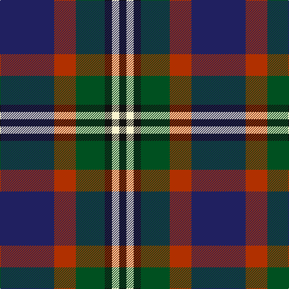

In pattern [BRGKWK](/patterns/brgkwk/).

This was sourced from register-of-tartans.  It is a [6 stripes tartan](/stripes/stripes6/).

Original link https://www.tartanregister.gov.uk/tartanDetails.aspx?ref=11348

## Thread count
DB/90 R36 G48 K12 LY12 K/12

## Palette
Each colour and its ΔE from the base-6 reference it is a variant of.

| Colour | Shade | Base | ΔE (OKLab) |
|---|---|---|---|
| DB | <code style="background-color:#202060;">#202060</code> `#202060` | B <code style="background-color:#2A418A;">#2A418A</code> | 0.11 |
| G | <code style="background-color:#005020;">#005020</code> `#005020` | G <code style="background-color:#006100;">#006100</code> | 0.07 |
| K | <code style="background-color:#101010;">#101010</code> `#101010` | K <code style="background-color:#000000;">#000000</code> | 0.17 |
| LY | <code style="background-color:#F8F4D0;">#F8F4D0</code> `#F8F4D0` | W <code style="background-color:#F7F7F7;">#F7F7F7</code> | 0.05 |
| R | <code style="background-color:#B03000;">#B03000</code> `#B03000` | R <code style="background-color:#CC0000;">#CC0000</code> | 0.06 |

# Sample pattern

## Nearest tartans

The nearest existing variants by ΔTartan distance.

1. [MacPhail Hunting #2](/setts/s6/r8b48k24g28k8w6-b2c2c80-g006818-k101010-rc80000-wc0c0c0/) — ΔT 0.65
1. [Teylu Coleman (Cornwall)](/setts/s5/w6k50b18ba34y6-b3d3134-ba433a5a-k1c1714-wf9f5ef-ye1f231/) — ΔT 0.70
1. [Teylu Coleman (Name)](/setts/s5/w6k50b18ba34y6-b5c5c5c-ba003c64-k101010-we8ccb8-yfccc00/) — ΔT 0.73
1. [Swankie (Personal)](/setts/s7/k8b42g20ga8k40r12b6-b1474b4-g604000-ga8c7038-k101010-rc80000/) — ΔT 0.78
1. [Wellington No 229](/setts/s5/k8b6ba22g28w4-b3c82af-ba5a008c-g005020-k101010-we0e0e0/) — ΔT 0.82
1. [MacLeod of Assynt Clan Tartan Tartan Number: 1582. Earliest known date: 1906 In a portrait of the 24th chief, John Norman, painted posthumously (perhaps by Julius Jacobson, born 1811) in 1835, John Norman is shown in the costume worn for the visit of George IV to Edinburgh in 1822. The snuff-box may be evidence that the Vestiarium 'loud' design, which is very similar to that of the snuff box, had particular significance for John Norman or his wife, Ann Stephenson. (Ruairidh MacLeod, Tartans of Clan MacLeod, 1990.) See products available Copyright © Blair Urquhart, Comrie, 2015](/setts/s6/r6k4g30k20b40y4-b2c2c80-g006818-k101010-rc80000-ye8c000/) — ΔT 0.83
1. [Paterson Blue (Personal)](/setts/s6/b44w4k20g22r6g8-b2c2c80-g006818-k101010-rc80000-we0e0e0/) — ΔT 0.88
1. [Dunbog, Primary School](/setts/s6/r24b6g10ba32y4g4-b304080-ba000050-g008000-rc00000-yf0c000/) — ΔT 0.91
1. [Syme (Clan)](/setts/s6/k4g32w4k32b32r4-b1c1c50-g408060-k101010-rc80000-wf8f8f8/) — ΔT 0.91
1. [Royal College of Physicians (Corp)](/setts/s6/b36r6k18r6g46y6-b2c2c80-g006818-k101010-rc80000-ye8c000/) — ΔT 0.93

## Neighbour map

Every grey dot is one of 15726 variants placed by the first two principal components of the ΔTartan feature space (44% of its variance). Red is this tartan; blue dots are its nearest — click one to open its page.

<svg viewBox="0 0 640 380" role="img" style="max-width:100%;height:auto;border:1px solid #e0e0e0;border-radius:4px;display:block" xmlns="http://www.w3.org/2000/svg"><image href="/nn/cloud.v1.png" width="640" height="380"/><a href="/setts/s6/r8b48k24g28k8w6-b2c2c80-g006818-k101010-rc80000-wc0c0c0/"><circle cx="168.7" cy="217.5" r="4" fill="#3465a4"><title>MacPhail Hunting #2</title></circle></a><a href="/setts/s5/w6k50b18ba34y6-b3d3134-ba433a5a-k1c1714-wf9f5ef-ye1f231/"><circle cx="195.7" cy="219.6" r="4" fill="#3465a4"><title>Teylu Coleman (Cornwall)</title></circle></a><a href="/setts/s5/w6k50b18ba34y6-b5c5c5c-ba003c64-k101010-we8ccb8-yfccc00/"><circle cx="189.0" cy="219.6" r="4" fill="#3465a4"><title>Teylu Coleman (Name)</title></circle></a><a href="/setts/s7/k8b42g20ga8k40r12b6-b1474b4-g604000-ga8c7038-k101010-rc80000/"><circle cx="143.7" cy="210.9" r="4" fill="#3465a4"><title>Swankie (Personal)</title></circle></a><a href="/setts/s5/k8b6ba22g28w4-b3c82af-ba5a008c-g005020-k101010-we0e0e0/"><circle cx="169.9" cy="228.7" r="4" fill="#3465a4"><title>Wellington No 229</title></circle></a><a href="/setts/s6/r6k4g30k20b40y4-b2c2c80-g006818-k101010-rc80000-ye8c000/"><circle cx="182.0" cy="204.6" r="4" fill="#3465a4"><title>MacLeod of Assynt Clan Tartan Tartan Number: 1582. Earliest known date: 1906 In a portrait of the 24th chief, John Norman, painted posthumously (perhaps by Julius Jacobson, born 1811) in 1835, John Norman is shown in the costume worn for the visit of George IV to Edinburgh in 1822. The snuff-box may be evidence that the Vestiarium 'loud' design, which is very similar to that of the snuff box, had particular significance for John Norman or his wife, Ann Stephenson. (Ruairidh MacLeod, Tartans of Clan MacLeod, 1990.) See products available Copyright © Blair Urquhart, Comrie, 2015</title></circle></a><a href="/setts/s6/b44w4k20g22r6g8-b2c2c80-g006818-k101010-rc80000-we0e0e0/"><circle cx="200.0" cy="201.5" r="4" fill="#3465a4"><title>Paterson Blue (Personal)</title></circle></a><a href="/setts/s6/r24b6g10ba32y4g4-b304080-ba000050-g008000-rc00000-yf0c000/"><circle cx="157.1" cy="193.2" r="4" fill="#3465a4"><title>Dunbog, Primary School</title></circle></a><a href="/setts/s6/k4g32w4k32b32r4-b1c1c50-g408060-k101010-rc80000-wf8f8f8/"><circle cx="144.2" cy="209.9" r="4" fill="#3465a4"><title>Syme (Clan)</title></circle></a><a href="/setts/s6/b36r6k18r6g46y6-b2c2c80-g006818-k101010-rc80000-ye8c000/"><circle cx="165.1" cy="208.4" r="4" fill="#3465a4"><title>Royal College of Physicians (Corp)</title></circle></a><circle cx="178.9" cy="208.3" r="5" fill="#c00000"/></svg>

ID: /setts/s6/b90r36g48k12w12k12-b202060-g005020-k101010-rb03000-wf8f4d0/
