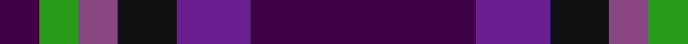
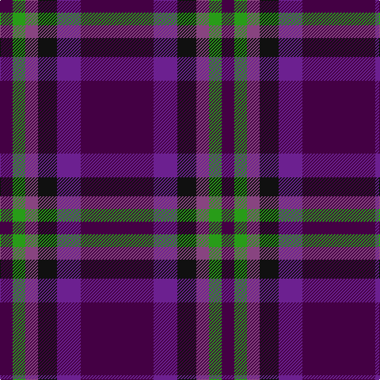

In pattern [BBKBGB](/patterns/bbkbgb/).

This was sourced from house-of-tartan.  It is a [6 stripes tartan](/stripes/stripes6/).

Original link http://www.house-of-tartan.scotland.net/house/TartanViewjs.asp?colr=Def&tnam=10389

## Thread count
DP/16 G16 LP16 K24 Pa30 DP/92

## Palette
Each colour and its ΔE from the base-6 reference it is a variant of.

| Colour | Shade | Base | ΔE (OKLab) |
|---|---|---|---|
| DP | <code style="background-color:#440044;">#440044</code> `#440044` | B <code style="background-color:#2A418A;">#2A418A</code> | 0.18 |
| G | <code style="background-color:#289C18;">#289C18</code> `#289C18` | G <code style="background-color:#006100;">#006100</code> | 0.19 |
| K | <code style="background-color:#101010;">#101010</code> `#101010` | K <code style="background-color:#000000;">#000000</code> | 0.17 |
| LP | <code style="background-color:#884480;">#884480</code> `#884480` | B <code style="background-color:#2A418A;">#2A418A</code> | 0.16 |
| N | <code style="background-color:#5C5C5C;">#5C5C5C</code> `#5C5C5C` | B <code style="background-color:#2A418A;">#2A418A</code> | 0.15 |
| P | <code style="background-color:#780078;">#780078</code> `#780078` | B <code style="background-color:#2A418A;">#2A418A</code> | 0.17 |
| Pa | <code style="background-color:#6C2090;">#6C2090</code> `#6C2090` | B <code style="background-color:#2A418A;">#2A418A</code> | 0.13 |

# Sample pattern

## Nearest tartans

The nearest existing variants by ΔTartan distance.

1. [Haut (Personal)](/setts/s6/b92ba30k24r16g16b16-b440044-ba9058d8-g289c18-k101010-rb468ac/) — ΔT 1.31
1. [Komissarov, Dmitry (Personal)](/setts/s7/b60ba60g8ba8g8ba10r12-b640044-ba000048-g808080-r880000/) — ΔT 1.45
1. [Montgomrie/Montgomery of Eglinton](/setts/s7/k8g10k8b56k8r10k8-b440044-g006818-k101010-rc80000/) — ΔT 1.51
1. [MacArthur-Fox Dress Personal Tartan Tartan Number: 459. Earliest known date: 1986 This is the older of the two MacArthur setts, which links the clan with the Campbells. See products available Copyright © Blair Urquhart, Comrie, 2015](/setts/s6/b8r64ba12r12ba52ra8-b5c8ca8-ba2c2c80-r880000-rac80000/) — ΔT 1.60
1. [Charleston Police Department](/setts/s7/b22y10b6ya18b50ba71k6-b440044-ba202060-k101010-ybc8c00-yaa0a0a0/) — ΔT 1.66
1. [Montgomerie of Eglinton Family Tartan Tartan Number: 1082. Earliest known date: 1893 D W Stewart, author of Old and Rare Scottish Tartans (1893), was of the opinion that this sett could be traced back to 1707 when it was adopted by the Montgomeries Earls of Eglinton. See Eglinton District. See products available Copyright © Blair Urquhart, Comrie, 2015](/setts/s7/k8g10k8b56k8r10k8-b2c2c80-g006818-k101010-rc80000/) — ΔT 1.82
1. [Woodcock (2014)](/setts/s7/b60ba18g12ba18r8b34w10-b2c2c80-ba780078-g006818-rc80000-wfcfcfc/) — ΔT 1.82
1. [MacArthur-Fox, dress](/setts/s6/b8r64ba12r12ba52ra8-b5480b0-ba304080-r800000-rac00000/) — ΔT 1.86
1. [Heritage of Scotland](/setts/s7/b12w6b42k32ba12k6ba12-b2c2c80-ba780078-k101010-wf8f8f8/) — ΔT 1.93
1. [Eglinton](/setts/s7/k8g8k8b56k8r8k8-b1c0070-g006818-k101010-rc80000/) — ΔT 1.94

## Neighbour map

Every grey dot is one of 15726 variants placed by the first two principal components of the ΔTartan feature space (44% of its variance). Red is this tartan; blue dots are its nearest — click one to open its page.

<svg viewBox="0 0 640 380" role="img" style="max-width:100%;height:auto;border:1px solid #e0e0e0;border-radius:4px;display:block" xmlns="http://www.w3.org/2000/svg"><image href="/nn/cloud.v1.png" width="640" height="380"/><a href="/setts/s6/b92ba30k24r16g16b16-b440044-ba9058d8-g289c18-k101010-rb468ac/"><circle cx="256.6" cy="213.8" r="4" fill="#3465a4"><title>Haut (Personal)</title></circle></a><a href="/setts/s7/b60ba60g8ba8g8ba10r12-b640044-ba000048-g808080-r880000/"><circle cx="289.2" cy="221.4" r="4" fill="#3465a4"><title>Komissarov, Dmitry (Personal)</title></circle></a><a href="/setts/s7/k8g10k8b56k8r10k8-b440044-g006818-k101010-rc80000/"><circle cx="330.4" cy="222.2" r="4" fill="#3465a4"><title>Montgomrie/Montgomery of Eglinton</title></circle></a><a href="/setts/s6/b8r64ba12r12ba52ra8-b5c8ca8-ba2c2c80-r880000-rac80000/"><circle cx="329.9" cy="230.6" r="4" fill="#3465a4"><title>MacArthur-Fox Dress Personal Tartan Tartan Number: 459. Earliest known date: 1986 This is the older of the two MacArthur setts, which links the clan with the Campbells. See products available Copyright © Blair Urquhart, Comrie, 2015</title></circle></a><a href="/setts/s7/b22y10b6ya18b50ba71k6-b440044-ba202060-k101010-ybc8c00-yaa0a0a0/"><circle cx="258.3" cy="194.9" r="4" fill="#3465a4"><title>Charleston Police Department</title></circle></a><a href="/setts/s7/k8g10k8b56k8r10k8-b2c2c80-g006818-k101010-rc80000/"><circle cx="306.0" cy="218.7" r="4" fill="#3465a4"><title>Montgomerie of Eglinton Family Tartan Tartan Number: 1082. Earliest known date: 1893 D W Stewart, author of Old and Rare Scottish Tartans (1893), was of the opinion that this sett could be traced back to 1707 when it was adopted by the Montgomeries Earls of Eglinton. See Eglinton District. See products available Copyright © Blair Urquhart, Comrie, 2015</title></circle></a><a href="/setts/s7/b60ba18g12ba18r8b34w10-b2c2c80-ba780078-g006818-rc80000-wfcfcfc/"><circle cx="280.0" cy="211.0" r="4" fill="#3465a4"><title>Woodcock (2014)</title></circle></a><a href="/setts/s6/b8r64ba12r12ba52ra8-b5480b0-ba304080-r800000-rac00000/"><circle cx="346.9" cy="239.5" r="4" fill="#3465a4"><title>MacArthur-Fox, dress</title></circle></a><a href="/setts/s7/b12w6b42k32ba12k6ba12-b2c2c80-ba780078-k101010-wf8f8f8/"><circle cx="223.2" cy="233.1" r="4" fill="#3465a4"><title>Heritage of Scotland</title></circle></a><a href="/setts/s7/k8g8k8b56k8r8k8-b1c0070-g006818-k101010-rc80000/"><circle cx="330.3" cy="221.7" r="4" fill="#3465a4"><title>Eglinton</title></circle></a><circle cx="293.0" cy="231.8" r="5" fill="#c00000"/></svg>

ID: /setts/s6/b92ba30k24bb16g16b16-b440044-ba6c2090-bb884480-g289c18-k101010/
