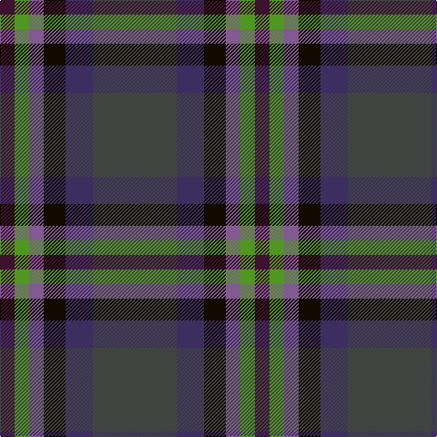

In pattern [BBKBGB](/patterns/bbkbgb/).

This was sourced from register-of-tartans.  It is a [6 stripes tartan](/stripes/stripes6/).

Original link https://www.tartanregister.gov.uk/tartanDetails.aspx?ref=10389

## Thread count
DP/16 G16 LP16 K24 DB30 N/92

## Palette
Each colour and its ΔE from the base-6 reference it is a variant of.

| Colour | Shade | Base | ΔE (OKLab) |
|---|---|---|---|
| DB | <code style="background-color:#3D2E60;">#3D2E60</code> `#3D2E60` | B <code style="background-color:#2C4084;">#2C4084</code> | 0.08 |
| DP | <code style="background-color:#3D1130;">#3D1130</code> `#3D1130` | B <code style="background-color:#2C4084;">#2C4084</code> | 0.18 |
| G | <code style="background-color:#509721;">#509721</code> `#509721` | G <code style="background-color:#006400;">#006400</code> | 0.17 |
| K | <code style="background-color:#120A01;">#120A01</code> `#120A01` | K <code style="background-color:#000000;">#000000</code> | 0.15 |
| LP | <code style="background-color:#805A90;">#805A90</code> `#805A90` | B <code style="background-color:#2C4084;">#2C4084</code> | 0.16 |
| N | <code style="background-color:#3F4441;">#3F4441</code> `#3F4441` | B <code style="background-color:#2C4084;">#2C4084</code> | 0.12 |

# Sample pattern

ID: /setts/s6/b92ba30k24bb16g16bc16-b3f4441-ba3d2e60-bb805a90-bc3d1130-g509721-k120a01/
