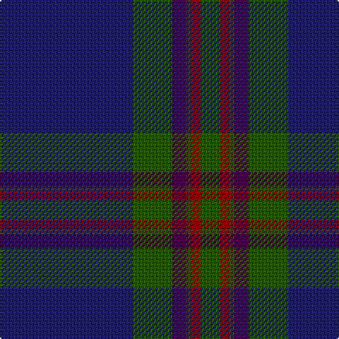

In pattern [BGBBRG](/patterns/bgbbrg/).

This was sourced from register-of-tartans.  It is a [6 stripes tartan](/stripes/stripes6/).

Original link https://www.tartanregister.gov.uk/tartanDetails.aspx?ref=3579

## Attestations

This cloth appears in 2 source records; the oldest owns this page.

- 01/06/1997 — Round Table (1997) (register-of-tartans, [record](https://www.tartanregister.gov.uk/tartanDetails.aspx?ref=3579))
- 1997 — Round Table (1997) (Corporate) (tartans-authority, [record](http://www.tartansauthority.com/tartan-ferret/display/2365/))

## Thread count
DB/94 G28 DP10 T4 DR6 G/14

## Palette
Each colour and its ΔE from the base-6 reference it is a variant of.

| Colour | Shade | Base | ΔE (OKLab) |
|---|---|---|---|
| DB | <code style="background-color:#202060;">#202060</code> `#202060` | B <code style="background-color:#2C4084;">#2C4084</code> | 0.11 |
| DP | <code style="background-color:#440044;">#440044</code> `#440044` | B <code style="background-color:#2C4084;">#2C4084</code> | 0.17 |
| DR | <code style="background-color:#880000;">#880000</code> `#880000` | R <code style="background-color:#C80000;">#C80000</code> | 0.14 |
| G | <code style="background-color:#285800;">#285800</code> `#285800` | G <code style="background-color:#006400;">#006400</code> | 0.04 |
| T | <code style="background-color:#4C3428;">#4C3428</code> `#4C3428` | B <code style="background-color:#2C4084;">#2C4084</code> | 0.16 |

# Sample pattern

## Nearest tartans

The nearest existing variants by ΔTartan distance.

1. [Barrance, Paul and Kelly (Personal)](/setts/s7/b6ba84k4g34ba18b6w4-b64008c-ba14283c-g005448-k101010-wffffff/) — ΔT 0.95
1. [Silver Thistle (Fashion)](/setts/s7/g8b6k12ba40k92r4k8-b2c2c80-ba303070-g006818-k101010-r888888/) — ΔT 1.11
1. [Vonarb, Alfred (Personal)](/setts/s7/b12ba6bb20bc4ba4bd90y4-b5c8ca8-ba1c1c1c-bb5c5c5c-bc1c1c50-bd14283c-ya0a0a0/) — ΔT 1.21
1. [Raymond of Doune](/setts/s8/r8g20y2w2b8w2b50r4-b14283c-g003820-r880000-wc0c0c0-yd09800/) — ΔT 1.27
1. [Potts (Personal)](/setts/s6/g2b72ba56b6g6y2-b202060-ba441800-g74846c-yfccc00/) — ΔT 1.38
1. [Potts (Personal)](/setts/s6/g2b72ba56b6g6k2-b202060-ba441800-g74846c-k000000/) — ΔT 1.40
1. [Earl Blue Marl](/setts/s6/b160k56ba18k6r10k24-b2c2c80-ba780078-k101010-r9c68a4/) — ΔT 1.42
1. [Green Swamp Youth Campers](/setts/s6/k16r4k26y4g96b12-b2c2c80-g003820-k101010-rc80000-ye8c000/) — ΔT 1.44
1. [Monarchs Corporate Sport Tartan Tartan Number: 2222. Earliest known date: 2002 Designed by Enid Brown of Lyle & Scott Ltd for Gleneagles Golf Developments. To be used for golf clothing and accessories. The Monarch's Course, created in the early 1990's by Jack Nicklaus, was renamed The PGA Centenary Course in February 2001 to celebrate the centenary year of The Professional Golfer's Association and is the selected venue for the 2014 Ryder Cup. See products available Copyright © Blair Urquhart, Comrie, 2015](/setts/s6/b76k16ba4k16g36ka4-b2c2c80-ba680028-g005448-k101010-ka000000/) — ΔT 1.45
1. [Home or Hume Clan Tartan Tartan Number: 127. Earliest known date: 1842 D.W.Stewart says, "The tartan of the ancient and notable family of Home, though differing in colour, has the same scheme as the Grey Douglas. Both first appear in the Vestiarium Scoticum." Border 'Clans' are mentioned in an Act of the Scottish Parliament in 1587, but no evidence of a Clan tartan exists before the earliest date given here. See products available Copyright © Blair Urquhart, Comrie, 2015](/setts/s8/k56r2k4r2k16b48g4b6-b2c2c80-g006818-k101010-rc80000/) — ΔT 1.45

## Neighbour map

Every grey dot is one of 15726 variants placed by the first two principal components of the ΔTartan feature space (44% of its variance). Red is this tartan; blue dots are its nearest — click one to open its page.

<svg viewBox="0 0 640 380" role="img" style="max-width:100%;height:auto;border:1px solid #e0e0e0;border-radius:4px;display:block" xmlns="http://www.w3.org/2000/svg"><image href="/nn/cloud.v1.png" width="640" height="380"/><a href="/setts/s7/b6ba84k4g34ba18b6w4-b64008c-ba14283c-g005448-k101010-wffffff/"><circle cx="446.5" cy="177.8" r="4" fill="#3465a4"><title>Barrance, Paul and Kelly (Personal)</title></circle></a><a href="/setts/s7/g8b6k12ba40k92r4k8-b2c2c80-ba303070-g006818-k101010-r888888/"><circle cx="471.0" cy="178.8" r="4" fill="#3465a4"><title>Silver Thistle (Fashion)</title></circle></a><a href="/setts/s7/b12ba6bb20bc4ba4bd90y4-b5c8ca8-ba1c1c1c-bb5c5c5c-bc1c1c50-bd14283c-ya0a0a0/"><circle cx="429.8" cy="145.8" r="4" fill="#3465a4"><title>Vonarb, Alfred (Personal)</title></circle></a><a href="/setts/s8/r8g20y2w2b8w2b50r4-b14283c-g003820-r880000-wc0c0c0-yd09800/"><circle cx="411.9" cy="155.0" r="4" fill="#3465a4"><title>Raymond of Doune</title></circle></a><a href="/setts/s6/g2b72ba56b6g6y2-b202060-ba441800-g74846c-yfccc00/"><circle cx="449.4" cy="178.8" r="4" fill="#3465a4"><title>Potts (Personal)</title></circle></a><a href="/setts/s6/g2b72ba56b6g6k2-b202060-ba441800-g74846c-k000000/"><circle cx="468.8" cy="187.9" r="4" fill="#3465a4"><title>Potts (Personal)</title></circle></a><a href="/setts/s6/b160k56ba18k6r10k24-b2c2c80-ba780078-k101010-r9c68a4/"><circle cx="449.1" cy="192.2" r="4" fill="#3465a4"><title>Earl Blue Marl</title></circle></a><a href="/setts/s6/k16r4k26y4g96b12-b2c2c80-g003820-k101010-rc80000-ye8c000/"><circle cx="434.0" cy="183.8" r="4" fill="#3465a4"><title>Green Swamp Youth Campers</title></circle></a><a href="/setts/s6/b76k16ba4k16g36ka4-b2c2c80-ba680028-g005448-k101010-ka000000/"><circle cx="346.1" cy="202.4" r="4" fill="#3465a4"><title>Monarchs Corporate Sport Tartan Tartan Number: 2222. Earliest known date: 2002 Designed by Enid Brown of Lyle &amp; Scott Ltd for Gleneagles Golf Developments. To be used for golf clothing and accessories. The Monarch's Course, created in the early 1990's by Jack Nicklaus, was renamed The PGA Centenary Course in February 2001 to celebrate the centenary year of The Professional Golfer's Association and is the selected venue for the 2014 Ryder Cup. See products available Copyright © Blair Urquhart, Comrie, 2015</title></circle></a><a href="/setts/s8/k56r2k4r2k16b48g4b6-b2c2c80-g006818-k101010-rc80000/"><circle cx="431.4" cy="176.1" r="4" fill="#3465a4"><title>Home or Hume Clan Tartan Tartan Number: 127. Earliest known date: 1842 D.W.Stewart says, &quot;The tartan of the ancient and notable family of Home, though differing in colour, has the same scheme as the Grey Douglas. Both first appear in the Vestiarium Scoticum.&quot; Border 'Clans' are mentioned in an Act of the Scottish Parliament in 1587, but no evidence of a Clan tartan exists before the earliest date given here. See products available Copyright © Blair Urquhart, Comrie, 2015</title></circle></a><circle cx="438.1" cy="183.1" r="5" fill="#c00000"/></svg>

ID: /setts/s6/b94g28ba10bb4r6g14-b202060-ba440044-bb4c3428-g285800-r880000/
