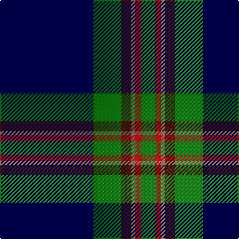

In pattern [BGBRRG](/patterns/bgbrrg/).

This was sourced from weddslist.  It is a [6 stripes tartan](/stripes/stripes6/).

Original link http://www.weddslist.com/cgi-bin/tartans/pg.pl?source=sts

## Thread count
DB/94 G28 DR10 LT4 R6 G/14

## Palette
Each colour and its ΔE from the base-6 reference it is a variant of.

| Colour | Shade | Base | ΔE (OKLab) |
|---|---|---|---|
| DB | <code style="background-color:#000050;">#000050</code> `#000050` | B <code style="background-color:#2C4084;">#2C4084</code> | 0.20 |
| DR | <code style="background-color:#401000;">#401000</code> `#401000` | B <code style="background-color:#2C4084;">#2C4084</code> | 0.23 |
| G | <code style="background-color:#008000;">#008000</code> `#008000` | G <code style="background-color:#006400;">#006400</code> | 0.09 |
| LT | <code style="background-color:#806050;">#806050</code> `#806050` | R <code style="background-color:#C80000;">#C80000</code> | 0.17 |
| R | <code style="background-color:#C00000;">#C00000</code> `#C00000` | R <code style="background-color:#C80000;">#C80000</code> | 0.02 |

# Sample pattern

## Nearest tartans

The nearest existing variants by ΔTartan distance.

1. [Chestico](/setts/s7/b40g2b2g2ga16k2w6-b202060-g603800-ga003820-k101010-wfcfcfc/) — ΔT 1.04
1. [MacLaurin, of Brioch](/setts/s7/b72k20g6r6g12k2y4-b304080-g008000-k000000-rc00000-yf0c000/) — ΔT 1.11
1. [Genet, Edmond Charles 'Citizen' (Personal)](/setts/s7/r8k18g18ka80r4ka4w4-g285800-k101010-ka000028-rdc0000-wf8f8f8/) — ΔT 1.16
1. [Leblant-Macqueron (Personal)](/setts/s7/y10k12w4g14w4b88w4-b003c64-g23321b-k000000-wf9f5ef-yccbaaf/) — ΔT 1.22
1. [Roxburgh, Green (District)](/setts/s8/b92w4b4w4b32g88r4b12-b1c0070-g006818-rc80000-wf8f8f8/) — ΔT 1.24
1. [MacRobart](/setts/s6/b144k42g32ba6g34ba6-b304080-ba5480b0-g008000-k000000/) — ΔT 1.28
1. [Tartan Day SA](/setts/s8/w4k80g44y6g4r6g4w4-g004600-k000037-rbd0000-wffffff-yffa000/) — ΔT 1.29
1. [Fife Flyers](/setts/s8/b4w4b86ba10bb8k16bb4w4-b003c64-ba1474b4-bb202060-k000000-wfcfcfc/) — ΔT 1.30
1. [State Seal of Massachusetts Fash)](/setts/s10/k124b8k14ba58k6y8k6w8k22b32-b1474b4-ba2c2c80-k101010-we8ccb8-ybc8c00/) — ΔT 1.33
1. [Schöbitz (2016)](/setts/s8/r2b46y6ba32y6b44r2w2-b1c1c1c-ba3850c8-rc8002c-wf8f8f8-ye0a126/) — ΔT 1.33

## Neighbour map

Every grey dot is one of 15726 variants placed by the first two principal components of the ΔTartan feature space (44% of its variance). Red is this tartan; blue dots are its nearest — click one to open its page.

<svg viewBox="0 0 640 380" role="img" style="max-width:100%;height:auto;border:1px solid #e0e0e0;border-radius:4px;display:block" xmlns="http://www.w3.org/2000/svg"><image href="/nn/cloud.v1.png" width="640" height="380"/><a href="/setts/s7/b40g2b2g2ga16k2w6-b202060-g603800-ga003820-k101010-wfcfcfc/"><circle cx="348.7" cy="141.5" r="4" fill="#3465a4"><title>Chestico</title></circle></a><a href="/setts/s7/b72k20g6r6g12k2y4-b304080-g008000-k000000-rc00000-yf0c000/"><circle cx="348.6" cy="113.5" r="4" fill="#3465a4"><title>MacLaurin, of Brioch</title></circle></a><a href="/setts/s7/r8k18g18ka80r4ka4w4-g285800-k101010-ka000028-rdc0000-wf8f8f8/"><circle cx="354.2" cy="143.9" r="4" fill="#3465a4"><title>Genet, Edmond Charles 'Citizen' (Personal)</title></circle></a><a href="/setts/s7/y10k12w4g14w4b88w4-b003c64-g23321b-k000000-wf9f5ef-yccbaaf/"><circle cx="360.2" cy="122.0" r="4" fill="#3465a4"><title>Leblant-Macqueron (Personal)</title></circle></a><a href="/setts/s8/b92w4b4w4b32g88r4b12-b1c0070-g006818-rc80000-wf8f8f8/"><circle cx="370.8" cy="155.0" r="4" fill="#3465a4"><title>Roxburgh, Green (District)</title></circle></a><a href="/setts/s6/b144k42g32ba6g34ba6-b304080-ba5480b0-g008000-k000000/"><circle cx="323.8" cy="169.9" r="4" fill="#3465a4"><title>MacRobart</title></circle></a><a href="/setts/s8/w4k80g44y6g4r6g4w4-g004600-k000037-rbd0000-wffffff-yffa000/"><circle cx="297.5" cy="126.2" r="4" fill="#3465a4"><title>Tartan Day SA</title></circle></a><a href="/setts/s8/b4w4b86ba10bb8k16bb4w4-b003c64-ba1474b4-bb202060-k000000-wfcfcfc/"><circle cx="391.0" cy="125.1" r="4" fill="#3465a4"><title>Fife Flyers</title></circle></a><a href="/setts/s10/k124b8k14ba58k6y8k6w8k22b32-b1474b4-ba2c2c80-k101010-we8ccb8-ybc8c00/"><circle cx="349.4" cy="134.4" r="4" fill="#3465a4"><title>State Seal of Massachusetts Fash)</title></circle></a><a href="/setts/s8/r2b46y6ba32y6b44r2w2-b1c1c1c-ba3850c8-rc8002c-wf8f8f8-ye0a126/"><circle cx="365.0" cy="142.0" r="4" fill="#3465a4"><title>Schöbitz (2016)</title></circle></a><circle cx="355.5" cy="151.8" r="5" fill="#c00000"/></svg>

ID: /setts/s6/b94g28ba10r4ra6g14-b000050-ba401000-g008000-r806050-rac00000/
