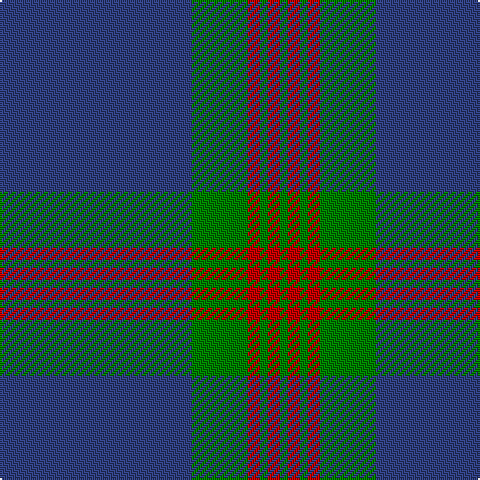

In pattern [BGRGRG](/patterns/bgrgrg/).

This was sourced from weddslist.  It is a [6 stripes tartan](/stripes/stripes6/).

Original link http://www.weddslist.com/cgi-bin/tartans/pg.pl?source=sts

## Thread count
B/96 G28 R6 G4 R6 G/4

## Palette
Each colour and its ΔE from the base-6 reference it is a variant of.

| Colour | Shade | Base | ΔE (OKLab) |
|---|---|---|---|
| B | <code style="background-color:#304080;">#304080</code> `#304080` | B <code style="background-color:#2C4084;">#2C4084</code> | 0.01 |
| G | <code style="background-color:#008000;">#008000</code> `#008000` | G <code style="background-color:#006400;">#006400</code> | 0.09 |
| R | <code style="background-color:#C00000;">#C00000</code> `#C00000` | R <code style="background-color:#C80000;">#C80000</code> | 0.02 |

# Sample pattern

## Nearest tartans

The nearest existing variants by ΔTartan distance.

1. [Wilson](/setts/s6/b64g20r4g3r4g3-b304080-g008000-rc00000/) — ΔT 0.25
1. [Wilson #2](/setts/s6/b96g28r6g4r6g4-b2c4084-g005020-rdc0000/) — ΔT 1.15
1. [Wilson](/setts/s6/b64g20r4g3r4g3-b2c4084-g005020-rdc0000/) — ΔT 1.18
1. [Royal Conservatoire of Scotland](/setts/s8/b11ba13g11ba7b11g3b90ba11-b3c82af-ba440044-g604000/) — ΔT 1.23
1. [Salvation Army, Hunting](/setts/s7/b160g32k4y8k4g32b20-b304080-g008000-k000000-yf0c000/) — ΔT 1.43
1. [Edinburgh, The University of](/setts/s7/k8r26k22b110w4k5w4-b145064-k101010-r781c38-we0e0e0/) — ΔT 1.43
1. [Salvation Army Hunting Corporate Tartan Tartan Number: 150. Earliest known date: 1983 Designed to be ready for the Perth Citadel Corps Centenary. The hunting version replaces red with green. See products available Copyright © Blair Urquhart, Comrie, 2015](/setts/s7/b160g32k4y8k4g32b20-b2c2c80-g006818-k101010-ye8c000/) — ΔT 1.47
1. [Murray of Elibank](/setts/s7/b128k6g28k8b8k24y8-b1474b4-g006818-k101010-yd09800/) — ΔT 1.52
1. [Federal Bureaux (FBI) Corporate Tartan Tartan Number: 83. Earliest known date: 1989 Discovered (in 1991) to be the same as a previously accredited tartan, "S.C.O.T.S." designed by Kinloch Anderson in 1988. Twenty kilts have been produced for the F.B.I. pipe band. See products available Copyright © Blair Urquhart, Comrie, 2015](/setts/s6/b120ba38w6ba4r4ba14-b5c8ca8-ba2c2c80-rc80000-we0e0e0/) — ΔT 1.52
1. [Danzas](/setts/s7/y8b6y2b34ba80b4ba6-b102040-ba304080-yf0c000/) — ΔT 1.54

## Neighbour map

Every grey dot is one of 15726 variants placed by the first two principal components of the ΔTartan feature space (44% of its variance). Red is this tartan; blue dots are its nearest — click one to open its page.

<svg viewBox="0 0 640 380" role="img" style="max-width:100%;height:auto;border:1px solid #e0e0e0;border-radius:4px;display:block" xmlns="http://www.w3.org/2000/svg"><image href="/nn/cloud.v1.png" width="640" height="380"/><a href="/setts/s6/b64g20r4g3r4g3-b304080-g008000-rc00000/"><circle cx="472.2" cy="188.5" r="4" fill="#3465a4"><title>Wilson</title></circle></a><a href="/setts/s6/b96g28r6g4r6g4-b2c4084-g005020-rdc0000/"><circle cx="517.9" cy="197.9" r="4" fill="#3465a4"><title>Wilson #2</title></circle></a><a href="/setts/s6/b64g20r4g3r4g3-b2c4084-g005020-rdc0000/"><circle cx="503.9" cy="203.5" r="4" fill="#3465a4"><title>Wilson</title></circle></a><a href="/setts/s8/b11ba13g11ba7b11g3b90ba11-b3c82af-ba440044-g604000/"><circle cx="511.8" cy="160.0" r="4" fill="#3465a4"><title>Royal Conservatoire of Scotland</title></circle></a><a href="/setts/s7/b160g32k4y8k4g32b20-b304080-g008000-k000000-yf0c000/"><circle cx="483.7" cy="139.2" r="4" fill="#3465a4"><title>Salvation Army, Hunting</title></circle></a><a href="/setts/s7/k8r26k22b110w4k5w4-b145064-k101010-r781c38-we0e0e0/"><circle cx="423.6" cy="154.6" r="4" fill="#3465a4"><title>Edinburgh, The University of</title></circle></a><a href="/setts/s7/b160g32k4y8k4g32b20-b2c2c80-g006818-k101010-ye8c000/"><circle cx="499.7" cy="146.3" r="4" fill="#3465a4"><title>Salvation Army Hunting Corporate Tartan Tartan Number: 150. Earliest known date: 1983 Designed to be ready for the Perth Citadel Corps Centenary. The hunting version replaces red with green. See products available Copyright © Blair Urquhart, Comrie, 2015</title></circle></a><a href="/setts/s7/b128k6g28k8b8k24y8-b1474b4-g006818-k101010-yd09800/"><circle cx="409.7" cy="157.8" r="4" fill="#3465a4"><title>Murray of Elibank</title></circle></a><a href="/setts/s6/b120ba38w6ba4r4ba14-b5c8ca8-ba2c2c80-rc80000-we0e0e0/"><circle cx="456.7" cy="154.7" r="4" fill="#3465a4"><title>Federal Bureaux (FBI) Corporate Tartan Tartan Number: 83. Earliest known date: 1989 Discovered (in 1991) to be the same as a previously accredited tartan, &quot;S.C.O.T.S.&quot; designed by Kinloch Anderson in 1988. Twenty kilts have been produced for the F.B.I. pipe band. See products available Copyright © Blair Urquhart, Comrie, 2015</title></circle></a><a href="/setts/s7/y8b6y2b34ba80b4ba6-b102040-ba304080-yf0c000/"><circle cx="472.5" cy="165.1" r="4" fill="#3465a4"><title>Danzas</title></circle></a><circle cx="487.7" cy="183.6" r="5" fill="#c00000"/></svg>

ID: /setts/s6/b96g28r6g4r6g4-b304080-g008000-rc00000/
