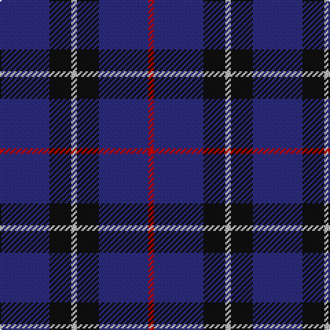

In pattern [BKWKBR](/patterns/bkwkbr/).

This was sourced from register-of-tartans.  It is a [6 stripes tartan](/stripes/stripes6/).

Original link https://www.tartanregister.gov.uk/tartanDetails.aspx?ref=3736

## Thread count
DB/36 K16 N4 K16 DB36 R/4

## Palette
Each colour and its ΔE from the base-6 reference it is a variant of.

| Colour | Shade | Base | ΔE (OKLab) |
|---|---|---|---|
| DB | <code style="background-color:#2C2C80;">#2C2C80</code> `#2C2C80` | B <code style="background-color:#2A418A;">#2A418A</code> | 0.06 |
| DBa | <code style="background-color:#1C0070;">#1C0070</code> `#1C0070` | B <code style="background-color:#2A418A;">#2A418A</code> | 0.14 |
| DR | <code style="background-color:#880000;">#880000</code> `#880000` | R <code style="background-color:#CC0000;">#CC0000</code> | 0.15 |
| K | <code style="background-color:#101010;">#101010</code> `#101010` | K <code style="background-color:#000000;">#000000</code> | 0.17 |
| N | <code style="background-color:#C0C0C0;">#C0C0C0</code> `#C0C0C0` | W <code style="background-color:#F7F7F7;">#F7F7F7</code> | 0.17 |
| R | <code style="background-color:#C80000;">#C80000</code> `#C80000` | R <code style="background-color:#CC0000;">#CC0000</code> | 0.01 |

# Sample pattern

## Nearest tartans

The nearest existing variants by ΔTartan distance.

1. [Van Loo Tartan Tartan Number: 6717. Earliest known date: pre 2005 Nothing See products available Copyright © Blair Urquhart, Comrie, 2015](/setts/s7/b5ba30k25b5ba30bb3b5~b2888c4-ba2c2c80-bb780078-k101010~x2/) — ΔT 1.16
1. [Brash](/setts/s9/b60r5b60ba40b36r10b36ba40w5~b202060-ba1870a4-rc80000-wfcfcfc/) — ΔT 1.17
1. [Davidson of Tulloch Clan Tartan Tartan Number: 1360. Earliest known date: 1984 The Davidsons or Clan Dhai maintained a constant battle for precedence within Clan Chattan. The Davidsons of Tulloch in Ross-shire are one of the main branches of the Davidson family. See products available Copyright © Blair Urquhart, Comrie, 2015](/setts/s5/r6b35k36b36w6~b2c2c80-k101010-rc80000-we0e0e0/) — ΔT 1.30
1. [Bank of Scotland Corporate Tartan Tartan Number: 2462. Earliest known date: 1994 Commemorating the founding of the bank in 1695 See products available Copyright © Blair Urquhart, Comrie, 2015](/setts/s5/w4b30k23b24y4~b202060-k101010-we0e0e0-ye8c000~x2/) — ΔT 1.31
1. [St. Georges, Edgbaston](/setts/s7/r4k21w2k20b21k2b2~b304080-k000030-rc00000-we0e0e0~x2/) — ΔT 1.34
1. [Van Loo (Personal)](/setts/s7/b5ba30k25b5ba30bb2b5~b2888c4-ba2c2c80-bb780078-k101010~x2/) — ΔT 1.35
1. [Morgan (MacKay Blue) Clan Tartan Tartan Number: 264. Earliest known date: 1842 The design comes from the Vestiarium Scoticum (1842). The authors, the Sobieski Stuart brothers, enjoyed a popular following among the Scottish gentry in the early Victorian era, and in the spirit of the times, added mystery, romance and some spurious historical documentation to the subject of tartan. Of the better known tartans, the book offers some minor variation, but in other cases it provides the only recorded version of many tartans in use today. See products available Copyright © Blair Urquhart, Comrie, 2015](/setts/s6/b1k3b1k3b8r1~b2c2c80-k101010-rc80000~x4/) — ΔT 1.38
1. [Open Championship, The](/setts/s5/g1b2ba5b11y1~b141e46-ba2c4084-g005020-ye8c000~x4/) — ΔT 1.39
1. [Royal Scotsman Train (Corporate)](/setts/s6/b5k2b14k14b2y2~b2c2c80-k101010-yb8b4b8~x2/) — ΔT 1.40
1. [Oban](/setts/s8/b6k10b1k1b1k10ba10k6~b3850c8-ba2c2c80-k101010~x4/) — ΔT 1.41

## Neighbour map

Every grey dot is one of 15726 variants placed by the first two principal components of the ΔTartan feature space (44% of its variance). Red is this tartan; blue dots are its nearest — click one to open its page.

<svg viewBox="0 0 640 380" role="img" style="max-width:100%;height:auto;border:1px solid #e0e0e0;border-radius:4px;display:block" xmlns="http://www.w3.org/2000/svg"><image href="/nn/cloud.v1.png" width="640" height="380"/><a href="/setts/s7/b5ba30k25b5ba30bb3b5~b2888c4-ba2c2c80-bb780078-k101010~x2/"><circle cx="346.5" cy="235.2" r="4" fill="#3465a4"><title>Van Loo Tartan Tartan Number: 6717. Earliest known date: pre 2005 Nothing See products available Copyright © Blair Urquhart, Comrie, 2015</title></circle></a><a href="/setts/s9/b60r5b60ba40b36r10b36ba40w5~b202060-ba1870a4-rc80000-wfcfcfc/"><circle cx="377.1" cy="234.1" r="4" fill="#3465a4"><title>Brash</title></circle></a><a href="/setts/s5/r6b35k36b36w6~b2c2c80-k101010-rc80000-we0e0e0/"><circle cx="303.2" cy="273.9" r="4" fill="#3465a4"><title>Davidson of Tulloch Clan Tartan Tartan Number: 1360. Earliest known date: 1984 The Davidsons or Clan Dhai maintained a constant battle for precedence within Clan Chattan. The Davidsons of Tulloch in Ross-shire are one of the main branches of the Davidson family. See products available Copyright © Blair Urquhart, Comrie, 2015</title></circle></a><a href="/setts/s5/w4b30k23b24y4~b202060-k101010-we0e0e0-ye8c000~x2/"><circle cx="330.4" cy="264.2" r="4" fill="#3465a4"><title>Bank of Scotland Corporate Tartan Tartan Number: 2462. Earliest known date: 1994 Commemorating the founding of the bank in 1695 See products available Copyright © Blair Urquhart, Comrie, 2015</title></circle></a><a href="/setts/s7/r4k21w2k20b21k2b2~b304080-k000030-rc00000-we0e0e0~x2/"><circle cx="344.7" cy="221.0" r="4" fill="#3465a4"><title>St. Georges, Edgbaston</title></circle></a><a href="/setts/s7/b5ba30k25b5ba30bb2b5~b2888c4-ba2c2c80-bb780078-k101010~x2/"><circle cx="367.4" cy="219.9" r="4" fill="#3465a4"><title>Van Loo (Personal)</title></circle></a><a href="/setts/s6/b1k3b1k3b8r1~b2c2c80-k101010-rc80000~x4/"><circle cx="402.2" cy="267.4" r="4" fill="#3465a4"><title>Morgan (MacKay Blue) Clan Tartan Tartan Number: 264. Earliest known date: 1842 The design comes from the Vestiarium Scoticum (1842). The authors, the Sobieski Stuart brothers, enjoyed a popular following among the Scottish gentry in the early Victorian era, and in the spirit of the times, added mystery, romance and some spurious historical documentation to the subject of tartan. Of the better known tartans, the book offers some minor variation, but in other cases it provides the only recorded version of many tartans in use today. See products available Copyright © Blair Urquhart, Comrie, 2015</title></circle></a><a href="/setts/s5/g1b2ba5b11y1~b141e46-ba2c4084-g005020-ye8c000~x4/"><circle cx="422.2" cy="244.0" r="4" fill="#3465a4"><title>Open Championship, The</title></circle></a><a href="/setts/s6/b5k2b14k14b2y2~b2c2c80-k101010-yb8b4b8~x2/"><circle cx="350.4" cy="267.7" r="4" fill="#3465a4"><title>Royal Scotsman Train (Corporate)</title></circle></a><a href="/setts/s8/b6k10b1k1b1k10ba10k6~b3850c8-ba2c2c80-k101010~x4/"><circle cx="365.2" cy="259.6" r="4" fill="#3465a4"><title>Oban</title></circle></a><circle cx="380.1" cy="254.8" r="5" fill="#c00000"/></svg>

ID: /setts/s6/b9k4w1k4b9r1~b2c2c80-k101010-rc80000-wc0c0c0~x4/
