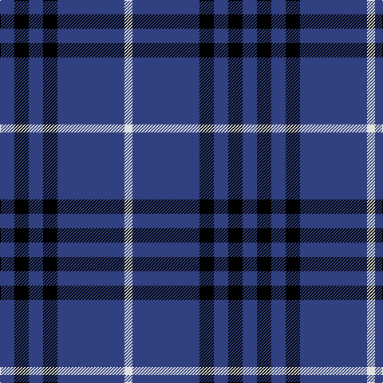

In pattern [BKBKBW](/patterns/bkbkbw/).

This was sourced from weddslist.  It is a [6 stripes tartan](/stripes/stripes6/).

Original link http://www.weddslist.com/cgi-bin/tartans/pg.pl?source=sts

## Thread count
B/18 K18 B18 K18 B84 LN/10

## Palette
Each colour and its ΔE from the base-6 reference it is a variant of.

| Colour | Shade | Base | ΔE (OKLab) |
|---|---|---|---|
| B | <code style="background-color:#304080;">#304080</code> `#304080` | B <code style="background-color:#2A418A;">#2A418A</code> | 0.02 |
| K | <code style="background-color:#000000;">#000000</code> `#000000` | K <code style="background-color:#000000;">#000000</code> | 0.00 |
| LN | <code style="background-color:#E0E0E0;">#E0E0E0</code> `#E0E0E0` | W <code style="background-color:#F7F7F7;">#F7F7F7</code> | 0.07 |

# Sample pattern

## Nearest tartans

The nearest existing variants by ΔTartan distance.

1. [Scottish Qualifications Auth. (Corp)](/setts/s7/b36y5b8w3b8w10b3x2~b202060-wc0c0c0-yd87c00/) — ΔT 1.04
1. [Ochterlonie](/setts/s6/b35y8b21y13b6ya4x2~b1c0070-yb8b8b8-yabc8c00/) — ΔT 1.12
1. [Dollar Academy (1930s) (Corporate)](/setts/s6/b9k9b9k9b42w5x2~b2c2c80-k101010-we0e0e0/) — ΔT 1.19
1. [Burberry Blue](/setts/s5/y3k3y3k10r1x6~k000034-r8c0000-yb0b0b0/) — ΔT 1.27
1. [BC Corps of Commissionaires](/setts/s7/b12w1r3w1r3w1b6x4~b141e46-r800028-we0e0e0/) — ΔT 1.46
1. [Ochterlonie](/setts/s6/b30w7b18w11b6y3x2~b102040-we0e0e0-yf0c000/) — ΔT 1.51
1. [St. Eloi](/setts/s6/r3y2k10w1k10y2x6~k00002c-r880000-we0e0e0-yd09800/) — ΔT 1.53
1. [Glen Moy](/setts/s5/b37w9b3r9w3x2~b000050-rc00000-we0e0e0/) — ΔT 1.53
1. [South Australian Pipes & Drums (Corp](/setts/s6/b60y6b11r25b11y6x2~b2c2c80-rc80000-ye8c000/) — ΔT 1.55
1. [Gadsden (Artefact)](/setts/s5/r3k16g2k2g2x2~g285800-k00002c-rc80000/) — ΔT 1.56

## Neighbour map

Every grey dot is one of 15726 variants placed by the first two principal components of the ΔTartan feature space (44% of its variance). Red is this tartan; blue dots are its nearest — click one to open its page.

<svg viewBox="0 0 640 380" role="img" style="max-width:100%;height:auto;border:1px solid #e0e0e0;border-radius:4px;display:block" xmlns="http://www.w3.org/2000/svg"><image href="/nn/cloud.v1.png" width="640" height="380"/><a href="/setts/s7/b36y5b8w3b8w10b3x2~b202060-wc0c0c0-yd87c00/"><circle cx="451.9" cy="207.7" r="4" fill="#3465a4"><title>Scottish Qualifications Auth. (Corp)</title></circle></a><a href="/setts/s6/b35y8b21y13b6ya4x2~b1c0070-yb8b8b8-yabc8c00/"><circle cx="385.3" cy="244.8" r="4" fill="#3465a4"><title>Ochterlonie</title></circle></a><a href="/setts/s6/b9k9b9k9b42w5x2~b2c2c80-k101010-we0e0e0/"><circle cx="446.1" cy="251.1" r="4" fill="#3465a4"><title>Dollar Academy (1930s) (Corporate)</title></circle></a><a href="/setts/s5/y3k3y3k10r1x6~k000034-r8c0000-yb0b0b0/"><circle cx="348.7" cy="242.4" r="4" fill="#3465a4"><title>Burberry Blue</title></circle></a><a href="/setts/s7/b12w1r3w1r3w1b6x4~b141e46-r800028-we0e0e0/"><circle cx="393.7" cy="210.4" r="4" fill="#3465a4"><title>BC Corps of Commissionaires</title></circle></a><a href="/setts/s6/b30w7b18w11b6y3x2~b102040-we0e0e0-yf0c000/"><circle cx="381.6" cy="236.0" r="4" fill="#3465a4"><title>Ochterlonie</title></circle></a><a href="/setts/s6/r3y2k10w1k10y2x6~k00002c-r880000-we0e0e0-yd09800/"><circle cx="374.1" cy="221.2" r="4" fill="#3465a4"><title>St. Eloi</title></circle></a><a href="/setts/s5/b37w9b3r9w3x2~b000050-rc00000-we0e0e0/"><circle cx="366.2" cy="208.3" r="4" fill="#3465a4"><title>Glen Moy</title></circle></a><a href="/setts/s6/b60y6b11r25b11y6x2~b2c2c80-rc80000-ye8c000/"><circle cx="408.9" cy="220.0" r="4" fill="#3465a4"><title>South Australian Pipes &amp; Drums (Corp</title></circle></a><a href="/setts/s5/r3k16g2k2g2x2~g285800-k00002c-rc80000/"><circle cx="445.9" cy="247.7" r="4" fill="#3465a4"><title>Gadsden (Artefact)</title></circle></a><circle cx="413.8" cy="239.5" r="5" fill="#c00000"/></svg>

ID: /setts/s6/b9k9b9k9b42w5x2~b304080-k000000-we0e0e0/
