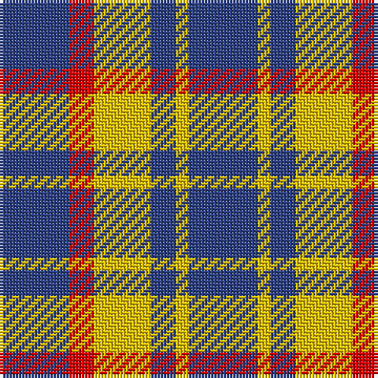

This page is one **sett** — a single exact thread-count. It belongs to the [tartan](/tartans/b11r4y9b4y2b11/)
(the same proportion at any scale), whose colour order is pattern [BRYBYB](/stripes/brybyb/).

Sourced from register-of-tartans.  It is a [6 stripe tartan](/stripes/stripes6/).

Original link https://www.tartanregister.gov.uk/tartanDetails.aspx?ref=4363

## Also known as

This cloth is also recorded under:

- Unidentified, Sample

2 attestations — the source records this cloth was collapsed from (oldest owns this page)

<ul>
<li>undated — Unidentified Sample (register-of-tartans, <a href="https://www.tartanregister.gov.uk/tartanDetails.aspx?ref=4363">record</a>)</li>
<li>undated — Unidentified, Sample (weddslist, <a href="http://www.weddslist.com/cgi-bin/tartans/pg.pl?source=sts">record</a>)</li>
</ul>

## Register references

External register numbers recorded for this tartan.

- Scottish Register of Tartans: [4363](https://www.tartanregister.gov.uk/tartanDetails.aspx?ref=4363)
- Scottish Tartans World Register: 587

## Thread count
B/22 R8 Y18 B8 Y4 B/22

## Palette
Each colour and the base-6 reference it is a variant of.

| Colour | Shade | Base |
|---|---|---|
| B | <code style="background-color:#2C4084;">#2C4084</code> `oklch(39.4% 0.117 268.3)` <small>#2C4084</small> | B <code style="background-color:#2A418A;">#2A418A</code> |
| R | <code style="background-color:#DC0000;">#DC0000</code> `oklch(56.2% 0.230 29.2)` <small>#DC0000</small> | R <code style="background-color:#CC0000;">#CC0000</code> |
| Y | <code style="background-color:#E8C000;">#E8C000</code> `oklch(81.9% 0.168 93.7)` <small>#E8C000</small> | Y <code style="background-color:#F2BF00;">#F2BF00</code> |

# Sample pattern

## Nearest tartans

The nearest existing variants by ΔTartan distance, with this tartan at the top so the swatches line up against it.

ΔTartan

Tartan

Sett

—

<a href="/ttd/edit/#slug=db11r4ly9db4ly2db11~x2">Unidentified Sample</a> <a class="nn-out" href="/setts/s6/db11r4ly9db4ly2db11~x2/" title="open its dictionary page">↗</a>

1.40

<a href="/ttd/edit/#slug=o8k3o17k13o6k3o4~x2">Scott Black &amp; Grey (Corporate)</a> <a class="nn-out" href="/setts/s7/o8k3o17k13o6k3o4~x2/" title="open its dictionary page">↗</a>

1.41

<a href="/ttd/edit/#slug=db3lo9db3lo9db20r3~x2">Latin</a> <a class="nn-out" href="/setts/s6/db3lo9db3lo9db20r3~x2/" title="open its dictionary page">↗</a>

1.44

<a href="/ttd/edit/#slug=lr2dr4lr2dr4lr9k1~x2">Buchanan VS</a> <a class="nn-out" href="/setts/s6/lr2dr4lr2dr4lr9k1~x2/" title="open its dictionary page">↗</a>

1.47

<a href="/ttd/edit/#slug=db20k5db18lo26k6~x2">Johore Regiment (Military)</a> <a class="nn-out" href="/setts/s5/db20k5db18lo26k6~x2/" title="open its dictionary page">↗</a>

1.50

<a href="/ttd/edit/#slug=db7w1r7db4r2db4w2~x2">Coronation</a> <a class="nn-out" href="/setts/s7/db7w1r7db4r2db4w2~x2/" title="open its dictionary page">↗</a>

1.50

<a href="/ttd/edit/#slug=y8k3y17k13y6k3y4~x2">Scott Black and Grey</a> <a class="nn-out" href="/setts/s7/y8k3y17k13y6k3y4~x2/" title="open its dictionary page">↗</a>

1.52

<a href="/ttd/edit/#slug=dt5r2lp2r2dt5ly1r1ly1dt5~x8">Millar (Kirkcaldy) (Personal)</a> <a class="nn-out" href="/setts/s9/dt5r2lp2r2dt5ly1r1ly1dt5~x8/" title="open its dictionary page">↗</a>

1.56

<a href="/ttd/edit/#slug=db1lo5db1lo5db2w1~x4">Tokharion</a> <a class="nn-out" href="/setts/s6/db1lo5db1lo5db2w1~x4/" title="open its dictionary page">↗</a>

1.60

<a href="/ttd/edit/#slug=db20k5db18ly26k6~x2">Jahore</a> <a class="nn-out" href="/setts/s5/db20k5db18ly26k6~x2/" title="open its dictionary page">↗</a>

1.68

<a href="/ttd/edit/#slug=r5k3t22k17t22k3ly5~x2">MacCrimmon from Skye</a> <a class="nn-out" href="/setts/s7/r5k3t22k17t22k3ly5~x2/" title="open its dictionary page">↗</a>

## Neighbour map

Every grey dot is one of 14299 variants placed by the first two principal components of the ΔTartan feature space (44% of its variance). Red is this tartan; blue dots are its nearest — click one to open its page.

<svg viewBox="0 0 640 380" role="img" style="max-width:100%;height:auto;border:1px solid #e0e0e0;border-radius:4px;display:block" xmlns="http://www.w3.org/2000/svg"><image href="/nn/cloud.v1.png" width="640" height="380"/><a href="/setts/s7/o8k3o17k13o6k3o4~x2/"><circle cx="356.0" cy="269.5" r="4" fill="#3465a4"><title>Scott Black &amp; Grey (Corporate)</title></circle></a><a href="/setts/s6/db3lo9db3lo9db20r3~x2/"><circle cx="305.7" cy="239.7" r="4" fill="#3465a4"><title>Latin</title></circle></a><a href="/setts/s6/lr2dr4lr2dr4lr9k1~x2/"><circle cx="317.3" cy="221.8" r="4" fill="#3465a4"><title>Buchanan VS</title></circle></a><a href="/setts/s5/db20k5db18lo26k6~x2/"><circle cx="227.3" cy="274.6" r="4" fill="#3465a4"><title>Johore Regiment (Military)</title></circle></a><a href="/setts/s7/db7w1r7db4r2db4w2~x2/"><circle cx="276.7" cy="242.7" r="4" fill="#3465a4"><title>Coronation</title></circle></a><a href="/setts/s7/y8k3y17k13y6k3y4~x2/"><circle cx="362.7" cy="273.5" r="4" fill="#3465a4"><title>Scott Black and Grey</title></circle></a><a href="/setts/s9/dt5r2lp2r2dt5ly1r1ly1dt5~x8/"><circle cx="275.9" cy="232.8" r="4" fill="#3465a4"><title>Millar (Kirkcaldy) (Personal)</title></circle></a><a href="/setts/s6/db1lo5db1lo5db2w1~x4/"><circle cx="360.6" cy="259.5" r="4" fill="#3465a4"><title>Tokharion</title></circle></a><a href="/setts/s5/db20k5db18ly26k6~x2/"><circle cx="206.4" cy="264.7" r="4" fill="#3465a4"><title>Jahore</title></circle></a><a href="/setts/s7/r5k3t22k17t22k3ly5~x2/"><circle cx="264.7" cy="214.5" r="4" fill="#3465a4"><title>MacCrimmon from Skye</title></circle></a><circle cx="293.6" cy="265.2" r="5" fill="#c00000"/></svg>

ID: /setts/s6/db11r4ly9db4ly2db11~x2/
