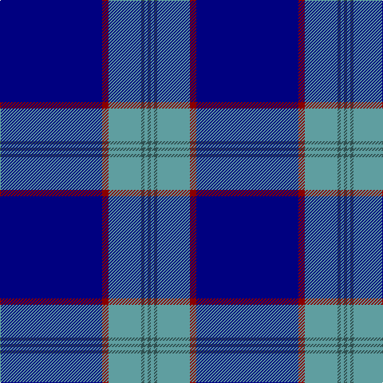

**Bands:** [BGBGRB](/stripes/bgbgrb/) · **Stripes:** [N G N G R DB](/stripes/stripes6/) N G N G R DB

This was sourced from register-of-tartans.  It is a [6 band tartan](/bands/bands6/).

Original link https://www.tartanregister.gov.uk/tartanDetails.aspx?ref=10557

## Register references

External register numbers recorded for this tartan.

- Scottish Register of Tartans: [10557](https://www.tartanregister.gov.uk/tartanDetails.aspx?ref=10557)

## Thread count
DB/128 DR8 B41 N4 B4 N/4

## Palette
Each colour and its ΔE from the base-6 reference it is a variant of.

| Colour | Shade | Base | ΔE (OKLab) |
|---|---|---|---|
| B | <code style="background-color:#5F9EA0;">#5F9EA0</code> `#5F9EA0` | G <code style="background-color:#006100;">#006100</code> | 0.26 |
| DB | <code style="background-color:#000080;">#000080</code> `#000080` | B <code style="background-color:#2A418A;">#2A418A</code> | 0.14 |
| DR | <code style="background-color:#8B0000;">#8B0000</code> `#8B0000` | R <code style="background-color:#CC0000;">#CC0000</code> | 0.14 |
| N | <code style="background-color:#2F4F4F;">#2F4F4F</code> `#2F4F4F` | B <code style="background-color:#2A418A;">#2A418A</code> | 0.12 |

# Sample pattern

## Nearest tartans

The nearest existing variants by ΔTartan distance.

1. [French Freemasons' Pride (Fashion)](/setts/s6/db128r8t41n4t4n4/) — ΔT 0.97
1. [S.C.O.T.S](/setts/s6/b136db45w7db4r4db16/) — ΔT 1.10
1. [Tyneside Blue, North Tyneside Pipe Band](/setts/s7/db62k22w3k2w2k3r1~x2/) — ΔT 1.21
1. [Hoosier (Fashion)](/setts/s8/b15db65ly7b4ly3db30b15w3~x2/) — ΔT 1.25
1. [Waugh](/setts/s5/db100y10k5y10r8/) — ΔT 1.34
1. [Marist School, The](/setts/s8/db29db2db1db1db1db1t8lo1~x4/) — ΔT 1.40
1. [RAAF](/setts/s9/db66w2db10w2db10w2db12r3t24~x2/) — ΔT 1.48
1. [Royal Agricultural Winter Fair](/setts/s8/db32lb1db1lo2db1r1db4dg16~x4/) — ΔT 1.51
1. [North Carolina](/setts/s7/db64r8db1w8db4db15w4~x2/) — ΔT 1.55
1. [Blue Rust](/setts/s8/db21n2w1n2db1r2db1o6~x4/) — ΔT 1.56

## Neighbour map

Every grey dot is one of 14313 variants placed by the first two principal components of the ΔTartan feature space (44% of its variance). Red is this tartan; blue dots are its nearest — click one to open its page.

<svg viewBox="0 0 640 380" role="img" style="max-width:100%;height:auto;border:1px solid #e0e0e0;border-radius:4px;display:block" xmlns="http://www.w3.org/2000/svg"><image href="/nn/cloud.v1.png" width="640" height="380"/><a href="/setts/s6/db128r8t41n4t4n4/"><circle cx="481.1" cy="159.1" r="4" fill="#3465a4"><title>French Freemasons' Pride (Fashion)</title></circle></a><a href="/setts/s6/b136db45w7db4r4db16/"><circle cx="452.6" cy="157.1" r="4" fill="#3465a4"><title>S.C.O.T.S</title></circle></a><a href="/setts/s7/db62k22w3k2w2k3r1~x2/"><circle cx="477.0" cy="126.8" r="4" fill="#3465a4"><title>Tyneside Blue, North Tyneside Pipe Band</title></circle></a><a href="/setts/s8/b15db65ly7b4ly3db30b15w3~x2/"><circle cx="406.3" cy="161.9" r="4" fill="#3465a4"><title>Hoosier (Fashion)</title></circle></a><a href="/setts/s5/db100y10k5y10r8/"><circle cx="501.3" cy="184.8" r="4" fill="#3465a4"><title>Waugh</title></circle></a><a href="/setts/s8/db29db2db1db1db1db1t8lo1~x4/"><circle cx="502.6" cy="144.3" r="4" fill="#3465a4"><title>Marist School, The</title></circle></a><a href="/setts/s9/db66w2db10w2db10w2db12r3t24~x2/"><circle cx="495.0" cy="134.0" r="4" fill="#3465a4"><title>RAAF</title></circle></a><a href="/setts/s8/db32lb1db1lo2db1r1db4dg16~x4/"><circle cx="449.9" cy="140.1" r="4" fill="#3465a4"><title>Royal Agricultural Winter Fair</title></circle></a><a href="/setts/s7/db64r8db1w8db4db15w4~x2/"><circle cx="418.1" cy="112.2" r="4" fill="#3465a4"><title>North Carolina</title></circle></a><a href="/setts/s8/db21n2w1n2db1r2db1o6~x4/"><circle cx="383.4" cy="133.5" r="4" fill="#3465a4"><title>Blue Rust</title></circle></a><circle cx="455.8" cy="150.9" r="5" fill="#c00000"/></svg>

ID: /setts/s6/db128r8g41n4g4n4/
