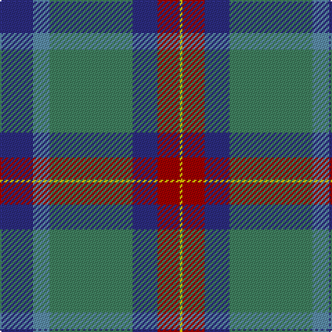

This page is one **sett** — a single exact thread-count. It belongs to the [tartan](/tartans/db12t6g30db9r8ly1/)
(the same proportion at any scale), whose colour order is pattern [BBGBRY](/stripes/bbgbry/).

Sourced from tartans-authority.  It is a [6 stripe tartan](/stripes/stripes6/).

Original link http://www.tartansauthority.com/tartan-ferret/display/11188/

## Register references

External register numbers recorded for this tartan.

- Scottish Register of Tartans: [11188](https://www.tartanregister.gov.uk/tartanDetails?ref=11188)
- Scottish Tartans Authority (ITI): 11188

## Thread count
DB/24 B12 G60 DB18 DR16 Y/2

## Palette

Palette: <strong>Tartan Register</strong>
<table><thead><tr><th>Colour</th><th>Threads</th><th>Shade</th><th>Base</th><th>OKLCh</th></tr></thead><tbody><tr><td>DB/</td><td style="text-align:right;font-variant-numeric:tabular-nums">24</td><td><code style="background-color:#2C2C80;">#2C2C80</code> <small style="color:#888">#2C2C80</small></td><td>B <code style="background-color:#2A418A;">#2A418A</code></td><td><small style="color:#888">oklch(35.0% 0.138 276.6)</small></td></tr><tr><td>B</td><td style="text-align:right;font-variant-numeric:tabular-nums">12</td><td><code style="background-color:#5C8CA8;">#5C8CA8</code> <small style="color:#888">#5C8CA8</small></td><td>B <code style="background-color:#2A418A;">#2A418A</code></td><td><small style="color:#888">oklch(61.7% 0.067 235.0)</small></td></tr><tr><td>G</td><td style="text-align:right;font-variant-numeric:tabular-nums">60</td><td><code style="background-color:#408060;">#408060</code> <small style="color:#888">#408060</small></td><td>G <code style="background-color:#006100;">#006100</code></td><td><small style="color:#888">oklch(54.8% 0.084 160.1)</small></td></tr><tr><td>DB</td><td style="text-align:right;font-variant-numeric:tabular-nums">18</td><td><code style="background-color:#2C2C80;">#2C2C80</code> <small style="color:#888">#2C2C80</small></td><td>B <code style="background-color:#2A418A;">#2A418A</code></td><td><small style="color:#888">oklch(35.0% 0.138 276.6)</small></td></tr><tr><td>DR</td><td style="text-align:right;font-variant-numeric:tabular-nums">16</td><td><code style="background-color:#A00000;">#A00000</code> <small style="color:#888">#A00000</small></td><td>R <code style="background-color:#CC0000;">#CC0000</code></td><td><small style="color:#888">oklch(44.3% 0.182 29.2)</small></td></tr><tr><td>Y/</td><td style="text-align:right;font-variant-numeric:tabular-nums">2</td><td><code style="background-color:#E8C000;">#E8C000</code> <small style="color:#888">#E8C000</small></td><td>Y <code style="background-color:#F2BF00;">#F2BF00</code></td><td><small style="color:#888">oklch(81.9% 0.168 93.7)</small></td></tr></tbody></table>

# Sample pattern

## Nearest tartans

The nearest existing variants by ΔTartan distance, with this tartan at the top so the swatches line up against it.

ΔTartan

Tartan

Sett

—

<a href="/ttd/edit/#slug=db12t6g30db9r8ly1~x2">Wright , Anne (Personal)</a> <a class="nn-out" href="/setts/s6/db12t6g30db9r8ly1~x2/" title="open its dictionary page">↗</a>

1.14

<a href="/ttd/edit/#slug=dp6y2dp1g25db16k2db4~x2">Lawrie</a> <a class="nn-out" href="/setts/s7/dp6y2dp1g25db16k2db4~x2/" title="open its dictionary page">↗</a>

1.16

<a href="/ttd/edit/#slug=db12t6g30db9r8lo1~x2">Wright, Anne (Personal)</a> <a class="nn-out" href="/setts/s6/db12t6g30db9r8lo1~x2/" title="open its dictionary page">↗</a>

1.17

<a href="/ttd/edit/#slug=ri28r1b18ly2g6b18~x2">British Judo Association</a> <a class="nn-out" href="/setts/s6/ri28r1b18ly2g6b18~x2/" title="open its dictionary page">↗</a>

1.19

<a href="/ttd/edit/#slug=dp6r2dp1g25db16k2db4~x2">Laurie Clan Tartan Tartan Number: 3201. Earliest known date: 2000 One of a set of three similar designs for Laurie, Lawrie and Lowry, designed by Peter MacDonald for Iain Laurie. See products available Copyright © Blair Urquhart, Comrie, 2015</a> <a class="nn-out" href="/setts/s7/dp6r2dp1g25db16k2db4~x2/" title="open its dictionary page">↗</a>

1.20

<a href="/ttd/edit/#slug=dp6ly2dp1g25db16k2db4~x2">Lowry</a> <a class="nn-out" href="/setts/s7/dp6ly2dp1g25db16k2db4~x2/" title="open its dictionary page">↗</a>

1.22

<a href="/ttd/edit/#slug=dp6o2dp1g25db16k2db4~x2">Lawrie Clan Tartan Tartan Number: 3202. Earliest known date: 2000 One of a set of three similar designs for Laurie, Lawrie and Lowry, designed by Peter MacDonald for Iain Laurie. See products available Copyright © Blair Urquhart, Comrie, 2015</a> <a class="nn-out" href="/setts/s7/dp6o2dp1g25db16k2db4~x2/" title="open its dictionary page">↗</a>

1.22

<a href="/ttd/edit/#slug=dg6r2db1r3db16n20w2~x2">MacCord (Personal)</a> <a class="nn-out" href="/setts/s7/dg6r2db1r3db16n20w2~x2/" title="open its dictionary page">↗</a>

1.23

<a href="/ttd/edit/#slug=db4k2db16w1k8dg24r4~x2">Colquhoun</a> <a class="nn-out" href="/setts/s7/db4k2db16w1k8dg24r4~x2/" title="open its dictionary page">↗</a>

1.28

<a href="/ttd/edit/#slug=db48w2k20dg22r3dg4~x2">MacFadzean</a> <a class="nn-out" href="/setts/s6/db48w2k20dg22r3dg4~x2/" title="open its dictionary page">↗</a>

1.30

<a href="/ttd/edit/#slug=do8o4w2o4do1o12dg9do24r4~x2">Willsher Wedding (Personal)</a> <a class="nn-out" href="/setts/s9/do8o4w2o4do1o12dg9do24r4~x2/" title="open its dictionary page">↗</a>

## Neighbour map

Every grey dot is one of 14359 variants placed by the first two principal components of the ΔTartan feature space (44% of its variance). Red is this tartan; blue dots are its nearest — click one to open its page.

<svg viewBox="0 0 640 380" role="img" style="max-width:100%;height:auto;border:1px solid #e0e0e0;border-radius:4px;display:block" xmlns="http://www.w3.org/2000/svg"><image href="/nn/cloud.v1.png" width="640" height="380"/><a href="/setts/s7/dp6y2dp1g25db16k2db4~x2/"><circle cx="310.8" cy="172.0" r="4" fill="#3465a4"><title>Lawrie</title></circle></a><a href="/setts/s6/db12t6g30db9r8lo1~x2/"><circle cx="320.0" cy="193.4" r="4" fill="#3465a4"><title>Wright, Anne (Personal)</title></circle></a><a href="/setts/s6/ri28r1b18ly2g6b18~x2/"><circle cx="318.1" cy="172.9" r="4" fill="#3465a4"><title>British Judo Association</title></circle></a><a href="/setts/s7/dp6r2dp1g25db16k2db4~x2/"><circle cx="299.5" cy="166.8" r="4" fill="#3465a4"><title>Laurie Clan Tartan Tartan Number: 3201. Earliest known date: 2000 One of a set of three similar designs for Laurie, Lawrie and Lowry, designed by Peter MacDonald for Iain Laurie. See products available Copyright © Blair Urquhart, Comrie, 2015</title></circle></a><a href="/setts/s7/dp6ly2dp1g25db16k2db4~x2/"><circle cx="303.8" cy="170.1" r="4" fill="#3465a4"><title>Lowry</title></circle></a><a href="/setts/s7/dp6o2dp1g25db16k2db4~x2/"><circle cx="304.5" cy="170.4" r="4" fill="#3465a4"><title>Lawrie Clan Tartan Tartan Number: 3202. Earliest known date: 2000 One of a set of three similar designs for Laurie, Lawrie and Lowry, designed by Peter MacDonald for Iain Laurie. See products available Copyright © Blair Urquhart, Comrie, 2015</title></circle></a><a href="/setts/s7/dg6r2db1r3db16n20w2~x2/"><circle cx="248.0" cy="165.8" r="4" fill="#3465a4"><title>MacCord (Personal)</title></circle></a><a href="/setts/s7/db4k2db16w1k8dg24r4~x2/"><circle cx="265.3" cy="175.7" r="4" fill="#3465a4"><title>Colquhoun</title></circle></a><a href="/setts/s6/db48w2k20dg22r3dg4~x2/"><circle cx="314.5" cy="183.4" r="4" fill="#3465a4"><title>MacFadzean</title></circle></a><a href="/setts/s9/do8o4w2o4do1o12dg9do24r4~x2/"><circle cx="285.3" cy="157.0" r="4" fill="#3465a4"><title>Willsher Wedding (Personal)</title></circle></a><circle cx="288.8" cy="176.3" r="5" fill="#c00000"/></svg>

ID: /setts/s6/db12t6g30db9r8ly1~x2/
