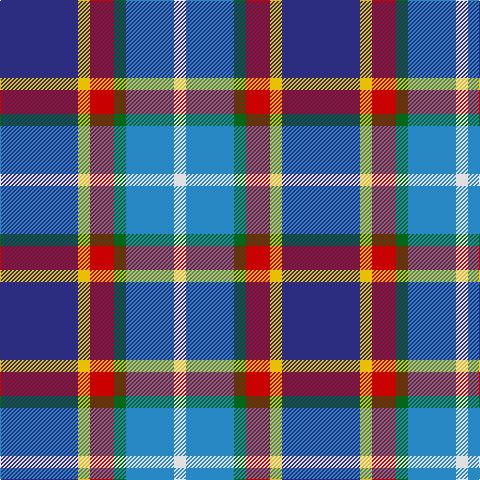

This page is one **sett** — a single exact thread-count. It belongs to the [tartan](/tartans/db13ly2r4g2t8w2/)
(the same proportion at any scale), whose colour order is pattern [BYRGBW](/stripes/byrgbw/).

Sourced from register-of-tartans.  It is a [6 stripe tartan](/stripes/stripes6/).

Original link https://www.tartanregister.gov.uk/tartanDetails.aspx?ref=11404

## Register references

External register numbers recorded for this tartan.

- Scottish Register of Tartans: [11404](https://www.tartanregister.gov.uk/tartanDetails.aspx?ref=11404)

## Thread count
DB/78 Y12 R24 G12 B48 LN/12

## Palette

Palette: <strong>Tartan Register</strong>
<table><thead><tr><th>Colour</th><th>Threads</th><th>Shade</th><th>Base</th><th>OKLCh</th></tr></thead><tbody><tr><td>DB/</td><td style="text-align:right;font-variant-numeric:tabular-nums">78</td><td><code style="background-color:#2C2C80;">#2C2C80</code> <small style="color:#888">#2C2C80</small></td><td>B <code style="background-color:#2A418A;">#2A418A</code></td><td><small style="color:#888">oklch(35.0% 0.138 276.6)</small></td></tr><tr><td>Y</td><td style="text-align:right;font-variant-numeric:tabular-nums">12</td><td><code style="background-color:#E8C000;">#E8C000</code> <small style="color:#888">#E8C000</small></td><td>Y <code style="background-color:#F2BF00;">#F2BF00</code></td><td><small style="color:#888">oklch(81.9% 0.168 93.7)</small></td></tr><tr><td>R</td><td style="text-align:right;font-variant-numeric:tabular-nums">24</td><td><code style="background-color:#C80000;">#C80000</code> <small style="color:#888">#C80000</small></td><td>R <code style="background-color:#CC0000;">#CC0000</code></td><td><small style="color:#888">oklch(52.3% 0.215 29.2)</small></td></tr><tr><td>G</td><td style="text-align:right;font-variant-numeric:tabular-nums">12</td><td><code style="background-color:#006818;">#006818</code> <small style="color:#888">#006818</small></td><td>G <code style="background-color:#006100;">#006100</code></td><td><small style="color:#888">oklch(45.0% 0.142 145.0)</small></td></tr><tr><td>B</td><td style="text-align:right;font-variant-numeric:tabular-nums">48</td><td><code style="background-color:#2888C4;">#2888C4</code> <small style="color:#888">#2888C4</small></td><td>B <code style="background-color:#2A418A;">#2A418A</code></td><td><small style="color:#888">oklch(60.1% 0.125 241.5)</small></td></tr><tr><td>LN/</td><td style="text-align:right;font-variant-numeric:tabular-nums">12</td><td><code style="background-color:#E0E0E0;">#E0E0E0</code> <small style="color:#888">#E0E0E0</small></td><td>W <code style="background-color:#F7F7F7;">#F7F7F7</code></td><td><small style="color:#888">oklch(90.7% 0.000 89.9)</small></td></tr></tbody></table>

# Sample pattern

## Nearest tartans

The nearest existing variants by ΔTartan distance, with this tartan at the top so the swatches line up against it.

ΔTartan

Tartan

Sett

—

<a href="/ttd/edit/#slug=db13ly2r4g2t8w2~x6">Meh Dundee</a> <a class="nn-out" href="/setts/s6/db13ly2r4g2t8w2~x6/" title="open its dictionary page">↗</a>

0.66

<a href="/ttd/edit/#slug=w1o1dp2o7g1db5ly1~x4">Deeside District Tartan Tartan Number: 1833. Earliest known date: 1963 The name Deas is described as an 'alias' for Davidson in historic records, and is a recognised sept of Clan Dhai (Davidson). See products available Copyright © Blair Urquhart, Comrie, 2015</a> <a class="nn-out" href="/setts/s7/w1o1dp2o7g1db5ly1~x4/" title="open its dictionary page">↗</a>

0.90

<a href="/ttd/edit/#slug=w8db5db30lr4db13lr13g5lo5~x2">Waterford County Crest (Fashion)</a> <a class="nn-out" href="/setts/s8/w8db5db30lr4db13lr13g5lo5~x2/" title="open its dictionary page">↗</a>

1.16

<a href="/ttd/edit/#slug=t6db17dp4db2k11g3ly4~x2">East Lothian</a> <a class="nn-out" href="/setts/s7/t6db17dp4db2k11g3ly4~x2/" title="open its dictionary page">↗</a>

1.16

<a href="/ttd/edit/#slug=lr2r1t7db7lb1~x8">Bryson (1988) (Name)</a> <a class="nn-out" href="/setts/s5/lr2r1t7db7lb1~x8/" title="open its dictionary page">↗</a>

1.17

<a href="/ttd/edit/#slug=ly4b22g4o24dp6o4w3~x2">Deeside Plaid (Taobh Dhi) (District)</a> <a class="nn-out" href="/setts/s7/ly4b22g4o24dp6o4w3~x2/" title="open its dictionary page">↗</a>

1.18

<a href="/ttd/edit/#slug=t16db3t3o3t3db10r12w4~x2">Greer (Name?)</a> <a class="nn-out" href="/setts/s8/t16db3t3o3t3db10r12w4~x2/" title="open its dictionary page">↗</a>

1.20

<a href="/ttd/edit/#slug=db24r6w6r6w6r6db25k12b36ly6">Lopatinsky (Personal)</a> <a class="nn-out" href="/setts/s10/db24r6w6r6w6r6db25k12b36ly6/" title="open its dictionary page">↗</a>

1.24

<a href="/ttd/edit/#slug=g4t2g9k4g2r6db12w2~x2">Cherokee</a> <a class="nn-out" href="/setts/s8/g4t2g9k4g2r6db12w2~x2/" title="open its dictionary page">↗</a>

1.26

<a href="/ttd/edit/#slug=m4db2t7db20k7g10ly4~x2">Renfrewshire District Tartan Tartan Number: 2560. Earliest known date: 1998 Designed for anyone residing in the County of Renfrewshire See products available Copyright © Blair Urquhart, Comrie, 2015</a> <a class="nn-out" href="/setts/s7/m4db2t7db20k7g10ly4~x2/" title="open its dictionary page">↗</a>

1.30

<a href="/ttd/edit/#slug=p2g6r1y1db3b10w1~x2">Manx National</a> <a class="nn-out" href="/setts/s7/p2g6r1y1db3b10w1~x2/" title="open its dictionary page">↗</a>

## Neighbour map

Every grey dot is one of 14299 variants placed by the first two principal components of the ΔTartan feature space (44% of its variance). Red is this tartan; blue dots are its nearest — click one to open its page.

<svg viewBox="0 0 640 380" role="img" style="max-width:100%;height:auto;border:1px solid #e0e0e0;border-radius:4px;display:block" xmlns="http://www.w3.org/2000/svg"><image href="/nn/cloud.v1.png" width="640" height="380"/><a href="/setts/s7/w1o1dp2o7g1db5ly1~x4/"><circle cx="158.4" cy="169.7" r="4" fill="#3465a4"><title>Deeside District Tartan Tartan Number: 1833. Earliest known date: 1963 The name Deas is described as an 'alias' for Davidson in historic records, and is a recognised sept of Clan Dhai (Davidson). See products available Copyright © Blair Urquhart, Comrie, 2015</title></circle></a><a href="/setts/s8/w8db5db30lr4db13lr13g5lo5~x2/"><circle cx="99.5" cy="171.8" r="4" fill="#3465a4"><title>Waterford County Crest (Fashion)</title></circle></a><a href="/setts/s7/t6db17dp4db2k11g3ly4~x2/"><circle cx="135.7" cy="186.2" r="4" fill="#3465a4"><title>East Lothian</title></circle></a><a href="/setts/s5/lr2r1t7db7lb1~x8/"><circle cx="161.2" cy="211.8" r="4" fill="#3465a4"><title>Bryson (1988) (Name)</title></circle></a><a href="/setts/s7/ly4b22g4o24dp6o4w3~x2/"><circle cx="179.4" cy="175.8" r="4" fill="#3465a4"><title>Deeside Plaid (Taobh Dhi) (District)</title></circle></a><a href="/setts/s8/t16db3t3o3t3db10r12w4~x2/"><circle cx="124.6" cy="203.5" r="4" fill="#3465a4"><title>Greer (Name?)</title></circle></a><a href="/setts/s10/db24r6w6r6w6r6db25k12b36ly6/"><circle cx="91.4" cy="167.4" r="4" fill="#3465a4"><title>Lopatinsky (Personal)</title></circle></a><a href="/setts/s8/g4t2g9k4g2r6db12w2~x2/"><circle cx="90.5" cy="190.9" r="4" fill="#3465a4"><title>Cherokee</title></circle></a><a href="/setts/s7/m4db2t7db20k7g10ly4~x2/"><circle cx="139.2" cy="183.8" r="4" fill="#3465a4"><title>Renfrewshire District Tartan Tartan Number: 2560. Earliest known date: 1998 Designed for anyone residing in the County of Renfrewshire See products available Copyright © Blair Urquhart, Comrie, 2015</title></circle></a><a href="/setts/s7/p2g6r1y1db3b10w1~x2/"><circle cx="138.3" cy="141.6" r="4" fill="#3465a4"><title>Manx National</title></circle></a><circle cx="136.9" cy="188.9" r="5" fill="#c00000"/></svg>

ID: /setts/s6/db13ly2r4g2t8w2~x6/
