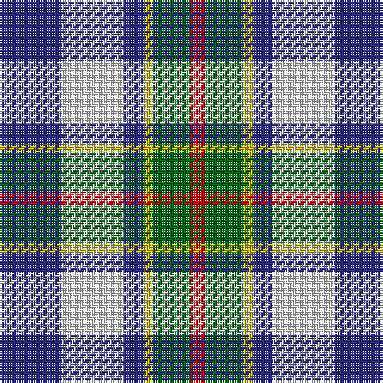

**Bands:** [RGYBWB](/stripes/rgybwb/) · **Stripes:** [R G LY DB W DB](/stripes/stripes6/) R G LY DB W DB

This was sourced from tartans-authority.  It is a [6 band tartan](/bands/bands6/).

Original link http://www.tartansauthority.com/tartan-ferret/display/7929/

## Thread count
DB/26 LN26 DB8 Y4 G16 R/6

## Palette
Each colour and its ΔE from the base-6 reference it is a variant of.

| Colour | Shade | Base | ΔE (OKLab) |
|---|---|---|---|
| DB | <code style="background-color:#2C2C80;">#2C2C80</code> `#2C2C80` | B <code style="background-color:#2A418A;">#2A418A</code> | 0.06 |
| G | <code style="background-color:#006818;">#006818</code> `#006818` | G <code style="background-color:#006100;">#006100</code> | 0.02 |
| LN | <code style="background-color:#E0E0E0;">#E0E0E0</code> `#E0E0E0` | W <code style="background-color:#F7F7F7;">#F7F7F7</code> | 0.07 |
| R | <code style="background-color:#C80000;">#C80000</code> `#C80000` | R <code style="background-color:#CC0000;">#CC0000</code> | 0.01 |
| Y | <code style="background-color:#D4C028;">#D4C028</code> `#D4C028` | Y <code style="background-color:#F2BF00;">#F2BF00</code> | 0.04 |

# Sample pattern

## Nearest tartans

The nearest existing variants by ΔTartan distance.

1. [Ship Hector](/setts/s8/k4db9ly6db22g4w20g6w4/) — ΔT 0.89
1. [Ship Hector, The (Commemorative)](/setts/s8/k3db10ly5db16g3w16g5w3~x2/) — ΔT 0.89
1. [MacTavish Dress](/setts/s6/r4t28k6lb12k12lo3~x2/) — ΔT 1.04
1. [Thomson Dress (Grey) (Fashion)](/setts/s6/r4o25k6w12k11ly3~x2/) — ΔT 1.05
1. [Mitsukoshi (Corporate)](/setts/s8/lb12k3lb3k3lb13t6k17r3~x2/) — ΔT 1.08
1. [U.S. Postal Service (Corporate)](/setts/s7/k2t10r5w2db2w2r2~x6/) — ΔT 1.10
1. [Fraser Red Dress](/setts/s7/r4db18r4dg19w25r10w4~x2/) — ΔT 1.12
1. [Earl of St. Andrews Dress](/setts/s7/w20db14dt14w4db2b2dt7~x2/) — ΔT 1.14
1. [Idaho, Centennial](/setts/s8/db12r2db2r2db2g10w12o3~x2/) — ΔT 1.15
1. [MacTavish / Thom(p)son, dress](/setts/s6/r4t28k6w12k12ly3~x2/) — ΔT 1.18

## Neighbour map

Every grey dot is one of 14299 variants placed by the first two principal components of the ΔTartan feature space (44% of its variance). Red is this tartan; blue dots are its nearest — click one to open its page.

<svg viewBox="0 0 640 380" role="img" style="max-width:100%;height:auto;border:1px solid #e0e0e0;border-radius:4px;display:block" xmlns="http://www.w3.org/2000/svg"><image href="/nn/cloud.v1.png" width="640" height="380"/><a href="/setts/s8/k4db9ly6db22g4w20g6w4/"><circle cx="115.2" cy="188.2" r="4" fill="#3465a4"><title>Ship Hector</title></circle></a><a href="/setts/s8/k3db10ly5db16g3w16g5w3~x2/"><circle cx="109.9" cy="189.2" r="4" fill="#3465a4"><title>Ship Hector, The (Commemorative)</title></circle></a><a href="/setts/s6/r4t28k6lb12k12lo3~x2/"><circle cx="168.3" cy="187.2" r="4" fill="#3465a4"><title>MacTavish Dress</title></circle></a><a href="/setts/s6/r4o25k6w12k11ly3~x2/"><circle cx="141.3" cy="185.0" r="4" fill="#3465a4"><title>Thomson Dress (Grey) (Fashion)</title></circle></a><a href="/setts/s8/lb12k3lb3k3lb13t6k17r3~x2/"><circle cx="131.5" cy="189.9" r="4" fill="#3465a4"><title>Mitsukoshi (Corporate)</title></circle></a><a href="/setts/s7/k2t10r5w2db2w2r2~x6/"><circle cx="119.0" cy="189.4" r="4" fill="#3465a4"><title>U.S. Postal Service (Corporate)</title></circle></a><a href="/setts/s7/r4db18r4dg19w25r10w4~x2/"><circle cx="86.0" cy="191.0" r="4" fill="#3465a4"><title>Fraser Red Dress</title></circle></a><a href="/setts/s7/w20db14dt14w4db2b2dt7~x2/"><circle cx="129.1" cy="171.7" r="4" fill="#3465a4"><title>Earl of St. Andrews Dress</title></circle></a><a href="/setts/s8/db12r2db2r2db2g10w12o3~x2/"><circle cx="106.2" cy="185.5" r="4" fill="#3465a4"><title>Idaho, Centennial</title></circle></a><a href="/setts/s6/r4t28k6w12k12ly3~x2/"><circle cx="148.3" cy="177.9" r="4" fill="#3465a4"><title>MacTavish / Thom(p)son, dress</title></circle></a><circle cx="113.5" cy="205.9" r="5" fill="#c00000"/></svg>

ID: /setts/s6/db13w13db4ly2g8r3~x2/
