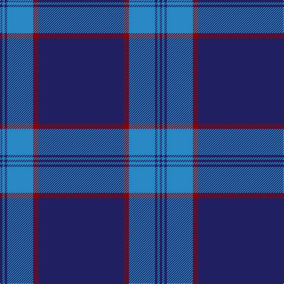

**Bands:** [BBBBRB](/stripes/bbbbrb/) · **Stripes:** [DB T DB T R DB](/stripes/stripes6/) DB T DB T R DB

This was sourced from tartans-authority.  It is a [6 band tartan](/bands/bands6/).

Original link http://www.tartansauthority.com/tartan-ferret/display/8953/

## Thread count
DB/4 B4 DB4 B44 DR9 DB/144

## Palette
Each colour and its ΔE from the base-6 reference it is a variant of.

| Colour | Shade | Base | ΔE (OKLab) |
|---|---|---|---|
| B | <code style="background-color:#2888C4;">#2888C4</code> `#2888C4` | B <code style="background-color:#2A418A;">#2A418A</code> | 0.21 |
| DB | <code style="background-color:#202060;">#202060</code> `#202060` | B <code style="background-color:#2A418A;">#2A418A</code> | 0.11 |
| DR | <code style="background-color:#880000;">#880000</code> `#880000` | R <code style="background-color:#CC0000;">#CC0000</code> | 0.15 |

# Sample pattern

## Nearest tartans

The nearest existing variants by ΔTartan distance.

1. [Affara (Personal)](/setts/s7/db80k5g12k2ly2g2k10~x2/) — ΔT 1.23
1. [French Freemasons' Pride (Fashion)](/setts/s6/db128r8t41n4t4n4/) — ΔT 1.39
1. [Marist School, The](/setts/s8/db29db2db1db1db1db1t8lo1~x4/) — ΔT 1.47
1. [Auchairne (Corporate)](/setts/s6/b11db7b3db70lb4db6~x2/) — ΔT 1.52
1. [Pride of the Clyde](/setts/s8/db8w4dt6db2dt6o10dt63w3/) — ΔT 1.53
1. [S.C.O.T.S.](/setts/s6/db55db18w3db2r2db6~x2/) — ΔT 1.55
1. [Lewis Welsh Name Tartan Tartan Number: 5758. Earliest known date: 22002 The tartan for this Welsh surname and its variations, Lewis, Lewys, Lou, Louis, Lew, Lewes, is actually woven in Wales at the Cambrian Woollen Mill, weaving on the same site since 1830. This tartan differs from many traditional patterns in that the warp and weft differ, giving the finished worsted wool cloth more of a predominant stripe, vertically noticeable in the finished Kilt, or Cilt in Wales. See products available Copyright © Blair Urquhart, Comrie, 2015](/setts/s7/db56lo2dg19lo1dg2lo1db2~x2/) — ΔT 1.58
1. [Royal Conservatoire of Scotland](/setts/s8/dp11t90dy3t11dp7dy11dp13t11/) — ΔT 1.60
1. [United States Trade sett Tartan Tartan Number: 2126. Earliest known date: 1989 This design is different in warp and weft. The display gives the general appearance only. Produced to celebrate American tourism is Scotland. The colours are taken from the flags of the two nations and the Atlantic Ocean that separates them. See products available Copyright © Blair Urquhart, Comrie, 2015](/setts/s9/db7dt5lr6dt5r7dt2db2dt70lr2/) — ΔT 1.62
1. [Marist School, The](/setts/s8/dt29b2dt1b1dt1b1db8ly1~x4/) — ΔT 1.63

## Neighbour map

Every grey dot is one of 14313 variants placed by the first two principal components of the ΔTartan feature space (44% of its variance). Red is this tartan; blue dots are its nearest — click one to open its page.

<svg viewBox="0 0 640 380" role="img" style="max-width:100%;height:auto;border:1px solid #e0e0e0;border-radius:4px;display:block" xmlns="http://www.w3.org/2000/svg"><image href="/nn/cloud.v1.png" width="640" height="380"/><a href="/setts/s7/db80k5g12k2ly2g2k10~x2/"><circle cx="535.9" cy="149.2" r="4" fill="#3465a4"><title>Affara (Personal)</title></circle></a><a href="/setts/s6/db128r8t41n4t4n4/"><circle cx="481.1" cy="159.1" r="4" fill="#3465a4"><title>French Freemasons' Pride (Fashion)</title></circle></a><a href="/setts/s8/db29db2db1db1db1db1t8lo1~x4/"><circle cx="502.6" cy="144.3" r="4" fill="#3465a4"><title>Marist School, The</title></circle></a><a href="/setts/s6/b11db7b3db70lb4db6~x2/"><circle cx="613.6" cy="198.8" r="4" fill="#3465a4"><title>Auchairne (Corporate)</title></circle></a><a href="/setts/s8/db8w4dt6db2dt6o10dt63w3/"><circle cx="510.8" cy="146.5" r="4" fill="#3465a4"><title>Pride of the Clyde</title></circle></a><a href="/setts/s6/db55db18w3db2r2db6~x2/"><circle cx="468.8" cy="179.2" r="4" fill="#3465a4"><title>S.C.O.T.S.</title></circle></a><a href="/setts/s7/db56lo2dg19lo1dg2lo1db2~x2/"><circle cx="581.8" cy="169.5" r="4" fill="#3465a4"><title>Lewis Welsh Name Tartan Tartan Number: 5758. Earliest known date: 22002 The tartan for this Welsh surname and its variations, Lewis, Lewys, Lou, Louis, Lew, Lewes, is actually woven in Wales at the Cambrian Woollen Mill, weaving on the same site since 1830. This tartan differs from many traditional patterns in that the warp and weft differ, giving the finished worsted wool cloth more of a predominant stripe, vertically noticeable in the finished Kilt, or Cilt in Wales. See products available Copyright © Blair Urquhart, Comrie, 2015</title></circle></a><a href="/setts/s8/dp11t90dy3t11dp7dy11dp13t11/"><circle cx="514.8" cy="164.4" r="4" fill="#3465a4"><title>Royal Conservatoire of Scotland</title></circle></a><a href="/setts/s9/db7dt5lr6dt5r7dt2db2dt70lr2/"><circle cx="572.1" cy="136.5" r="4" fill="#3465a4"><title>United States Trade sett Tartan Tartan Number: 2126. Earliest known date: 1989 This design is different in warp and weft. The display gives the general appearance only. Produced to celebrate American tourism is Scotland. The colours are taken from the flags of the two nations and the Atlantic Ocean that separates them. See products available Copyright © Blair Urquhart, Comrie, 2015</title></circle></a><a href="/setts/s8/dt29b2dt1b1dt1b1db8ly1~x4/"><circle cx="530.5" cy="161.5" r="4" fill="#3465a4"><title>Marist School, The</title></circle></a><circle cx="558.2" cy="176.8" r="5" fill="#c00000"/></svg>

ID: /setts/s6/db144r9t44db4t4db4/
