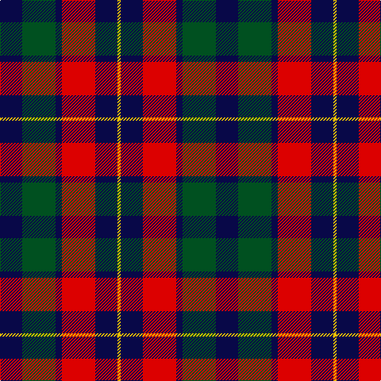

**Bands:** [BGBRBY](/stripes/bgbrby/) · **Stripes:** [DB DG DB R DB LY](/stripes/stripes6/) DB DG DB R DB LY

This was sourced from register-of-tartans.  It is a [6 band tartan](/bands/bands6/).

Original link https://www.tartanregister.gov.uk/tartanDetails.aspx?ref=1967

## Register references

External register numbers recorded for this tartan.

- Scottish Register of Tartans: [1967](https://www.tartanregister.gov.uk/tartanDetails.aspx?ref=1967)
- Scottish Tartans World Register: 1922

## Thread count
DB/28 G42 DB8 R42 DB28 Y/4

## Palette
Each colour and its ΔE from the base-6 reference it is a variant of.

| Colour | Shade | Base | ΔE (OKLab) |
|---|---|---|---|
| DB | <code style="background-color:#080848;">#080848</code> `#080848` | B <code style="background-color:#2A418A;">#2A418A</code> | 0.20 |
| G | <code style="background-color:#005020;">#005020</code> `#005020` | G <code style="background-color:#006100;">#006100</code> | 0.07 |
| R | <code style="background-color:#DC0000;">#DC0000</code> `#DC0000` | R <code style="background-color:#CC0000;">#CC0000</code> | 0.03 |
| Y | <code style="background-color:#E8C000;">#E8C000</code> `#E8C000` | Y <code style="background-color:#F2BF00;">#F2BF00</code> | 0.02 |

# Sample pattern

## Nearest tartans

The nearest existing variants by ΔTartan distance.

1. [Kilgour](/setts/s6/db14g21db4r21db14ly2~x2/) — ΔT 0.64
1. [Brough](/setts/s7/r20k14w2k14g9r3g11~x2/) — ΔT 0.85
1. [Scottish Ballet](/setts/s6/ly5g22dp15dp11dp5g2~x2/) — ΔT 0.92
1. [Thompson Black (Fashion)](/setts/s6/g3k15r8g2o8k2~x4/) — ΔT 1.07
1. [Highland Pub Company](/setts/s5/db13k13db13r29ly4~x2/) — ΔT 1.09
1. [Utah (US State)](/setts/s8/w2r3dg9r3db2r3db3w1~x6/) — ΔT 1.10
1. [MacTavish](/setts/s6/b2r12db2b6k6b1~x2/) — ΔT 1.12
1. [MacTavish](/setts/s6/b2r12db2b6k6b1/) — ΔT 1.12
1. [MacKean (Personal)](/setts/s7/r8k18r6k18b27k2w3~x2/) — ΔT 1.13
1. [Highland Spring Dress (2004)](/setts/s8/r25g10db30w4db30g10r25w2~x2/) — ΔT 1.13

## Neighbour map

Every grey dot is one of 14313 variants placed by the first two principal components of the ΔTartan feature space (44% of its variance). Red is this tartan; blue dots are its nearest — click one to open its page.

<svg viewBox="0 0 640 380" role="img" style="max-width:100%;height:auto;border:1px solid #e0e0e0;border-radius:4px;display:block" xmlns="http://www.w3.org/2000/svg"><image href="/nn/cloud.v1.png" width="640" height="380"/><a href="/setts/s6/db14g21db4r21db14ly2~x2/"><circle cx="185.5" cy="224.5" r="4" fill="#3465a4"><title>Kilgour</title></circle></a><a href="/setts/s7/r20k14w2k14g9r3g11~x2/"><circle cx="161.1" cy="218.0" r="4" fill="#3465a4"><title>Brough</title></circle></a><a href="/setts/s6/ly5g22dp15dp11dp5g2~x2/"><circle cx="194.9" cy="212.9" r="4" fill="#3465a4"><title>Scottish Ballet</title></circle></a><a href="/setts/s6/g3k15r8g2o8k2~x4/"><circle cx="201.2" cy="223.1" r="4" fill="#3465a4"><title>Thompson Black (Fashion)</title></circle></a><a href="/setts/s5/db13k13db13r29ly4~x2/"><circle cx="184.4" cy="248.3" r="4" fill="#3465a4"><title>Highland Pub Company</title></circle></a><a href="/setts/s8/w2r3dg9r3db2r3db3w1~x6/"><circle cx="158.7" cy="206.4" r="4" fill="#3465a4"><title>Utah (US State)</title></circle></a><a href="/setts/s6/b2r12db2b6k6b1~x2/"><circle cx="210.4" cy="195.6" r="4" fill="#3465a4"><title>MacTavish</title></circle></a><a href="/setts/s6/b2r12db2b6k6b1/"><circle cx="210.4" cy="195.6" r="4" fill="#3465a4"><title>MacTavish</title></circle></a><a href="/setts/s7/r8k18r6k18b27k2w3~x2/"><circle cx="230.3" cy="194.6" r="4" fill="#3465a4"><title>MacKean (Personal)</title></circle></a><a href="/setts/s8/r25g10db30w4db30g10r25w2~x2/"><circle cx="231.6" cy="197.1" r="4" fill="#3465a4"><title>Highland Spring Dress (2004)</title></circle></a><circle cx="197.7" cy="227.1" r="5" fill="#c00000"/></svg>

ID: /setts/s6/db14dg21db4r21db14ly2~x2/
