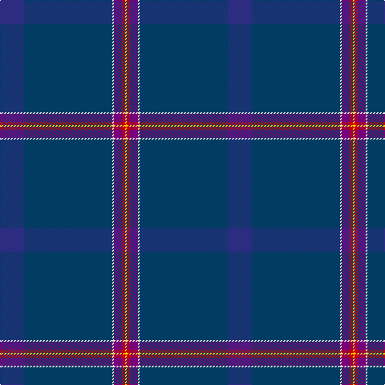

In pattern [BBWBRY](/stripes/bbwbry/).

This was sourced from tartans-authority.  It is a [6 stripe tartan](/stripes/stripes6/).

Original link http://www.tartansauthority.com/tartan-ferret/display/10349/

## Thread count
DB/30 DBa110 LN2 P10 R4 Y/2

## Palette
Each colour and the base-6 reference it is a variant of.

| Colour | Shade | Base |
|---|---|---|
| DB | <code style="background-color:#2C2C80;">#2C2C80</code> `oklch(35.0% 0.138 276.6)` <small>#2C2C80</small> | B <code style="background-color:#2A418A;">#2A418A</code> |
| DBa | <code style="background-color:#003C64;">#003C64</code> `oklch(34.5% 0.089 246.0)` <small>#003C64</small> | B <code style="background-color:#2A418A;">#2A418A</code> |
| LN | <code style="background-color:#E0E0E0;">#E0E0E0</code> `oklch(90.7% 0.000 89.9)` <small>#E0E0E0</small> | W <code style="background-color:#F7F7F7;">#F7F7F7</code> |
| P | <code style="background-color:#780078;">#780078</code> `oklch(40.2% 0.185 328.4)` <small>#780078</small> | B <code style="background-color:#2A418A;">#2A418A</code> |
| R | <code style="background-color:#C80000;">#C80000</code> `oklch(52.3% 0.215 29.2)` <small>#C80000</small> | R <code style="background-color:#CC0000;">#CC0000</code> |
| Y | <code style="background-color:#FCCC00;">#FCCC00</code> `oklch(86.2% 0.176 91.5)` <small>#FCCC00</small> | Y <code style="background-color:#F2BF00;">#F2BF00</code> |

# Sample pattern

## Nearest tartans

The nearest existing variants by ΔTartan distance, with this tartan at the top so the swatches line up against it.

ΔTartan

Tartan

Sett

—

<a href="/ttd/edit/#slug=db15dt55w1dp5r2ly1~x2">Venters (Personal)</a> <a class="nn-out" href="/setts/s6/db15dt55w1dp5r2ly1~x2/" title="open its dictionary page">↗</a>

2.12

<a href="/ttd/edit/#slug=db38k4db2dg6dp11dt3dp2r2db11k1w2~x2">Highland Pride 2 (Fashion)</a> <a class="nn-out" href="/setts/s11/db38k4db2dg6dp11dt3dp2r2db11k1w2~x2/" title="open its dictionary page">↗</a>

2.25

<a href="/ttd/edit/#slug=k2db6k1db7dg13k11db42r2~x2">Scottish Heritage</a> <a class="nn-out" href="/setts/s8/k2db6k1db7dg13k11db42r2~x2/" title="open its dictionary page">↗</a>

2.27

<a href="/ttd/edit/#slug=b64db3dt4r5dt8dt12b3dt4b2lo1~x2">Bank of Scotland (2000)</a> <a class="nn-out" href="/setts/s10/b64db3dt4r5dt8dt12b3dt4b2lo1~x2/" title="open its dictionary page">↗</a>

2.30

<a href="/ttd/edit/#slug=db84dp1db1k2db2k30dp7db2g3lo2~x2">Ulster Scots (Fashion)</a> <a class="nn-out" href="/setts/s10/db84dp1db1k2db2k30dp7db2g3lo2~x2/" title="open its dictionary page">↗</a>

2.31

<a href="/ttd/edit/#slug=db96dp8db12db3db3db3db3dg20dp8k3dp14~x2">Spirit of Scotland (Corporate)</a> <a class="nn-out" href="/setts/s11/db96dp8db12db3db3db3db3dg20dp8k3dp14~x2/" title="open its dictionary page">↗</a>

2.31

<a href="/ttd/edit/#slug=t6dt3n10db2dt2dt45lr2~x2">Vonarb, Alfred (Personal)</a> <a class="nn-out" href="/setts/s7/t6dt3n10db2dt2dt45lr2~x2/" title="open its dictionary page">↗</a>

2.35

<a href="/ttd/edit/#slug=dt58o3y16r3lo2y7dt29r3o2~x2">Aberdeen Mither Kirk (St Nicholas)</a> <a class="nn-out" href="/setts/s9/dt58o3y16r3lo2y7dt29r3o2~x2/" title="open its dictionary page">↗</a>

2.37

<a href="/ttd/edit/#slug=g6db3w1db3g6r2db15b60lo2b30db15r2~x2">Roslin Roseline Da Vinci (Corporate)</a> <a class="nn-out" href="/setts/s12/g6db3w1db3g6r2db15b60lo2b30db15r2~x2/" title="open its dictionary page">↗</a>

2.38

<a href="/ttd/edit/#slug=n15k55w1dp5r2ly1~x2">Venters (Edinburgh)</a> <a class="nn-out" href="/setts/s6/n15k55w1dp5r2ly1~x2/" title="open its dictionary page">↗</a>

2.38

<a href="/ttd/edit/#slug=n4db48n21db14dy3db6n1ly3~x2">Munster Ancestry (Fashion)</a> <a class="nn-out" href="/setts/s8/n4db48n21db14dy3db6n1ly3~x2/" title="open its dictionary page">↗</a>

## Neighbour map

Every grey dot is one of 14299 variants placed by the first two principal components of the ΔTartan feature space (44% of its variance). Red is this tartan; blue dots are its nearest — click one to open its page.

<svg viewBox="0 0 640 380" role="img" style="max-width:100%;height:auto;border:1px solid #e0e0e0;border-radius:4px;display:block" xmlns="http://www.w3.org/2000/svg"><image href="/nn/cloud.v1.png" width="640" height="380"/><a href="/setts/s11/db38k4db2dg6dp11dt3dp2r2db11k1w2~x2/"><circle cx="439.5" cy="121.7" r="4" fill="#3465a4"><title>Highland Pride 2 (Fashion)</title></circle></a><a href="/setts/s8/k2db6k1db7dg13k11db42r2~x2/"><circle cx="461.5" cy="178.8" r="4" fill="#3465a4"><title>Scottish Heritage</title></circle></a><a href="/setts/s10/b64db3dt4r5dt8dt12b3dt4b2lo1~x2/"><circle cx="479.0" cy="101.3" r="4" fill="#3465a4"><title>Bank of Scotland (2000)</title></circle></a><a href="/setts/s10/db84dp1db1k2db2k30dp7db2g3lo2~x2/"><circle cx="527.6" cy="113.6" r="4" fill="#3465a4"><title>Ulster Scots (Fashion)</title></circle></a><a href="/setts/s11/db96dp8db12db3db3db3db3dg20dp8k3dp14~x2/"><circle cx="551.8" cy="165.1" r="4" fill="#3465a4"><title>Spirit of Scotland (Corporate)</title></circle></a><a href="/setts/s7/t6dt3n10db2dt2dt45lr2~x2/"><circle cx="434.8" cy="154.2" r="4" fill="#3465a4"><title>Vonarb, Alfred (Personal)</title></circle></a><a href="/setts/s9/dt58o3y16r3lo2y7dt29r3o2~x2/"><circle cx="515.6" cy="165.1" r="4" fill="#3465a4"><title>Aberdeen Mither Kirk (St Nicholas)</title></circle></a><a href="/setts/s12/g6db3w1db3g6r2db15b60lo2b30db15r2~x2/"><circle cx="464.1" cy="105.8" r="4" fill="#3465a4"><title>Roslin Roseline Da Vinci (Corporate)</title></circle></a><a href="/setts/s6/n15k55w1dp5r2ly1~x2/"><circle cx="503.4" cy="129.6" r="4" fill="#3465a4"><title>Venters (Edinburgh)</title></circle></a><a href="/setts/s8/n4db48n21db14dy3db6n1ly3~x2/"><circle cx="532.5" cy="168.7" r="4" fill="#3465a4"><title>Munster Ancestry (Fashion)</title></circle></a><circle cx="545.1" cy="154.1" r="5" fill="#c00000"/></svg>

ID: /setts/s6/db15dt55w1dp5r2ly1~x2/
