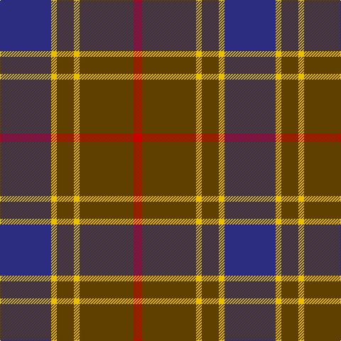

In pattern [BYGYGR](/stripes/bygygr/).

This was sourced from tartans-authority.  It is a [6 stripe tartan](/stripes/stripes6/).

Original link http://www.tartansauthority.com/tartan-ferret/display/684/

## Also known as

This cloth is also recorded under:

- Balfour
- Balfour #2

## Thread count
DB/72 Y8 T24 Y8 T76 R/12

## Palette
Each colour and the base-6 reference it is a variant of.

| Colour | Shade | Base |
|---|---|---|
| DB | <code style="background-color:#2C2C80;">#2C2C80</code> `oklch(35.0% 0.138 276.6)` <small>#2C2C80</small> | B <code style="background-color:#2A418A;">#2A418A</code> |
| R | <code style="background-color:#C80000;">#C80000</code> `oklch(52.3% 0.215 29.2)` <small>#C80000</small> | R <code style="background-color:#CC0000;">#CC0000</code> |
| T | <code style="background-color:#604000;">#604000</code> `oklch(39.8% 0.083 76.8)` <small>#604000</small> | G <code style="background-color:#006100;">#006100</code> |
| Y | <code style="background-color:#E8C000;">#E8C000</code> `oklch(81.9% 0.168 93.7)` <small>#E8C000</small> | Y <code style="background-color:#F2BF00;">#F2BF00</code> |

# Sample pattern

## Nearest tartans

The nearest existing variants by ΔTartan distance, with this tartan at the top so the swatches line up against it.

ΔTartan

Tartan

Sett

—

<a href="/ttd/edit/#slug=db18ly2dy6ly2dy19r3~x4">Balfour (Clan)</a> <a class="nn-out" href="/setts/s6/db18ly2dy6ly2dy19r3~x4/" title="open its dictionary page">↗</a>

0.00

<a href="/ttd/edit/#slug=db18ly2dy6ly2dy19r3~x2">Balfour #2</a> <a class="nn-out" href="/setts/s6/db18ly2dy6ly2dy19r3~x2/" title="open its dictionary page">↗</a>

0.84

<a href="/ttd/edit/#slug=dr2dg14lb3dr13ly1dr2~x4">Swedish Para Whisky Club (Corporate</a> <a class="nn-out" href="/setts/s6/dr2dg14lb3dr13ly1dr2~x4/" title="open its dictionary page">↗</a>

0.86

<a href="/ttd/edit/#slug=lb2dr12g6dr1n6dr1~x4">Fraser Green</a> <a class="nn-out" href="/setts/s6/lb2dr12g6dr1n6dr1~x4/" title="open its dictionary page">↗</a>

0.87

<a href="/ttd/edit/#slug=o5t13dr4r4dr27t3dr4o5">Daks, Blue Loden</a> <a class="nn-out" href="/setts/s8/o5t13dr4r4dr27t3dr4o5/" title="open its dictionary page">↗</a>

0.95

<a href="/ttd/edit/#slug=lo3t7do2m2do14t2do2lo3~x2">Daks (Blue Loden)</a> <a class="nn-out" href="/setts/s8/lo3t7do2m2do14t2do2lo3~x2/" title="open its dictionary page">↗</a>

1.02

<a href="/ttd/edit/#slug=r2b13dr3b3dr16lb2~x4">MacArthur-Fox Blue (Personal)</a> <a class="nn-out" href="/setts/s6/r2b13dr3b3dr16lb2~x4/" title="open its dictionary page">↗</a>

1.08

<a href="/ttd/edit/#slug=dy15r5dy30db32dy4ly3~x2">Cameron Hunting Brown Clan Tartan Tartan Number: 1745. Earliest known date: 1916 Nothing See products available Copyright © Blair Urquhart, Comrie, 2015</a> <a class="nn-out" href="/setts/s6/dy15r5dy30db32dy4ly3~x2/" title="open its dictionary page">↗</a>

1.09

<a href="/ttd/edit/#slug=m10dy60dt13lo24dt24dy8">Bronte House Check</a> <a class="nn-out" href="/setts/s6/m10dy60dt13lo24dt24dy8/" title="open its dictionary page">↗</a>

1.10

<a href="/ttd/edit/#slug=db18ly2o6ly2o19r3~x2">Balfour blue &amp; brown</a> <a class="nn-out" href="/setts/s6/db18ly2o6ly2o19r3~x2/" title="open its dictionary page">↗</a>

1.10

<a href="/ttd/edit/#slug=db3g21db3o21db35w3~x2">Donnolly</a> <a class="nn-out" href="/setts/s6/db3g21db3o21db35w3~x2/" title="open its dictionary page">↗</a>

## Neighbour map

Every grey dot is one of 14299 variants placed by the first two principal components of the ΔTartan feature space (44% of its variance). Red is this tartan; blue dots are its nearest — click one to open its page.

<svg viewBox="0 0 640 380" role="img" style="max-width:100%;height:auto;border:1px solid #e0e0e0;border-radius:4px;display:block" xmlns="http://www.w3.org/2000/svg"><image href="/nn/cloud.v1.png" width="640" height="380"/><a href="/setts/s6/db18ly2dy6ly2dy19r3~x2/"><circle cx="297.5" cy="218.4" r="4" fill="#3465a4"><title>Balfour #2</title></circle></a><a href="/setts/s6/dr2dg14lb3dr13ly1dr2~x4/"><circle cx="312.8" cy="199.0" r="4" fill="#3465a4"><title>Swedish Para Whisky Club (Corporate</title></circle></a><a href="/setts/s6/lb2dr12g6dr1n6dr1~x4/"><circle cx="288.5" cy="212.1" r="4" fill="#3465a4"><title>Fraser Green</title></circle></a><a href="/setts/s8/o5t13dr4r4dr27t3dr4o5/"><circle cx="307.6" cy="202.2" r="4" fill="#3465a4"><title>Daks, Blue Loden</title></circle></a><a href="/setts/s8/lo3t7do2m2do14t2do2lo3~x2/"><circle cx="267.1" cy="206.3" r="4" fill="#3465a4"><title>Daks (Blue Loden)</title></circle></a><a href="/setts/s6/r2b13dr3b3dr16lb2~x4/"><circle cx="279.1" cy="216.5" r="4" fill="#3465a4"><title>MacArthur-Fox Blue (Personal)</title></circle></a><a href="/setts/s6/dy15r5dy30db32dy4ly3~x2/"><circle cx="355.9" cy="235.1" r="4" fill="#3465a4"><title>Cameron Hunting Brown Clan Tartan Tartan Number: 1745. Earliest known date: 1916 Nothing See products available Copyright © Blair Urquhart, Comrie, 2015</title></circle></a><a href="/setts/s6/m10dy60dt13lo24dt24dy8/"><circle cx="248.8" cy="222.4" r="4" fill="#3465a4"><title>Bronte House Check</title></circle></a><a href="/setts/s6/db18ly2o6ly2o19r3~x2/"><circle cx="317.3" cy="226.5" r="4" fill="#3465a4"><title>Balfour blue &amp; brown</title></circle></a><a href="/setts/s6/db3g21db3o21db35w3~x2/"><circle cx="265.1" cy="207.2" r="4" fill="#3465a4"><title>Donnolly</title></circle></a><circle cx="297.5" cy="218.4" r="5" fill="#c00000"/></svg>

ID: /setts/s6/db18ly2dy6ly2dy19r3~x4/
