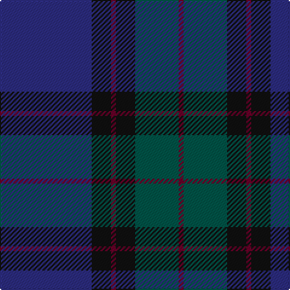

This page is one **sett** — a single exact thread-count. It belongs to the [tartan](/tartans/db19k4dr1k4dg9dr1/)
(the same proportion at any scale), whose colour order is pattern [BGKBKB](/stripes/bgkbkb/).

Sourced from register-of-tartans.  It is a [6 stripe tartan](/stripes/stripes6/).

Original link https://www.tartanregister.gov.uk/tartanDetails.aspx?ref=2979

3 attestations — the source records this cloth was collapsed from (oldest owns this page)

<ul>
<li>01/01/1996 — Monarchs (register-of-tartans, <a href="https://www.tartanregister.gov.uk/tartanDetails.aspx?ref=2979">record</a>)</li>
<li>pre 2002 — Monarchs (Corporate) (tartans-authority, <a href="http://www.tartansauthority.com/tartan-ferret/display/2222/">record</a>)</li>
<li>undated — Monarchs (weddslist, <a href="http://www.weddslist.com/cgi-bin/tartans/pg.pl?source=sts">record</a>)</li>
</ul>

## Register references

External register numbers recorded for this tartan.

- Scottish Register of Tartans: [2979](https://www.tartanregister.gov.uk/tartanDetails.aspx?ref=2979)
- Scottish Tartans Authority (ITI): 2222
- Scottish Tartans World Register: 2222

## Thread count
DB/76 K16 DR4 K16 G36 DR/4

## Palette

Palette: <strong>Tartan Register</strong>
<table><thead><tr><th>Colour</th><th>Threads</th><th>Shade</th><th>Base</th><th>OKLCh</th></tr></thead><tbody><tr><td>DB/</td><td style="text-align:right;font-variant-numeric:tabular-nums">76</td><td><code style="background-color:#2C2C80;">#2C2C80</code> <small style="color:#888">#2C2C80</small></td><td>B <code style="background-color:#2A418A;">#2A418A</code></td><td><small style="color:#888">oklch(35.0% 0.138 276.6)</small></td></tr><tr><td>K</td><td style="text-align:right;font-variant-numeric:tabular-nums">16</td><td><code style="background-color:#101010;">#101010</code> <small style="color:#888">#101010</small></td><td>K <code style="background-color:#000000;">#000000</code></td><td><small style="color:#888">oklch(17.3% 0.000 89.9)</small></td></tr><tr><td>DR</td><td style="text-align:right;font-variant-numeric:tabular-nums">4</td><td><code style="background-color:#680028;">#680028</code> <small style="color:#888">#680028</small></td><td>B <code style="background-color:#2A418A;">#2A418A</code></td><td><small style="color:#888">oklch(33.1% 0.133 8.3)</small></td></tr><tr><td>K</td><td style="text-align:right;font-variant-numeric:tabular-nums">16</td><td><code style="background-color:#101010;">#101010</code> <small style="color:#888">#101010</small></td><td>K <code style="background-color:#000000;">#000000</code></td><td><small style="color:#888">oklch(17.3% 0.000 89.9)</small></td></tr><tr><td>G</td><td style="text-align:right;font-variant-numeric:tabular-nums">36</td><td><code style="background-color:#005448;">#005448</code> <small style="color:#888">#005448</small></td><td>G <code style="background-color:#006100;">#006100</code></td><td><small style="color:#888">oklch(39.9% 0.073 178.8)</small></td></tr><tr><td>DR/</td><td style="text-align:right;font-variant-numeric:tabular-nums">4</td><td><code style="background-color:#680028;">#680028</code> <small style="color:#888">#680028</small></td><td>B <code style="background-color:#2A418A;">#2A418A</code></td><td><small style="color:#888">oklch(33.1% 0.133 8.3)</small></td></tr></tbody></table>

# Sample pattern

## Nearest tartans

The nearest existing variants by ΔTartan distance, with this tartan at the top so the swatches line up against it.

ΔTartan

Tartan

Sett

—

<a href="/ttd/edit/#slug=db19k4dr1k4dg9dr1~x4">Monarchs</a> <a class="nn-out" href="/setts/s6/db19k4dr1k4dg9dr1~x4/" title="open its dictionary page">↗</a>

0.96

<a href="/setts/s6/db19ki4dr1ki4dg9k1~x4/">Monarchs Corporate Sport Tartan Tartan Number: 2222. Earliest known date: 2002 Designed by Enid Brown of Lyle &amp; Scott Ltd for Gleneagles Golf Developments. To be used for golf clothing and accessories. The Monarch's Course, created in the early 1990's by Jack Nicklaus, was renamed The PGA Centenary Course in February 2001 to celebrate the centenary year of The Professional Golfer's Association and is the selected venue for the 2014 Ryder Cup. See products available Copyright © Blair Urquhart, Comrie, 2015</a>

1.25

<a href="/ttd/edit/#slug=dp5db8dt13g21db34dt55o3">Bouncing Blackie (Personal)</a> <a class="nn-out" href="/setts/s7/dp5db8dt13g21db34dt55o3/" title="open its dictionary page">↗</a>

1.40

<a href="/ttd/edit/#slug=g2db1dbi29db2g9db26ly2~x2">Scottish Canals (Corporate)</a> <a class="nn-out" href="/setts/s7/g2db1dbi29db2g9db26ly2~x2/" title="open its dictionary page">↗</a>

1.40

<a href="/ttd/edit/#slug=dt30dp4dt5dg3dt2dg2dt2dg10dp7k2dp9~x2">Paxton Tartan Tartan Number: 6691. Earliest known date: 2004 Thread samples supplied See products available Copyright © Blair Urquhart, Comrie, 2015</a> <a class="nn-out" href="/setts/s11/dt30dp4dt5dg3dt2dg2dt2dg10dp7k2dp9~x2/" title="open its dictionary page">↗</a>

1.44

<a href="/ttd/edit/#slug=dg4db3dg20db9r2db2r2db18dp4~x2">New Club Centenary</a> <a class="nn-out" href="/setts/s9/dg4db3dg20db9r2db2r2db18dp4~x2/" title="open its dictionary page">↗</a>

1.45

<a href="/ttd/edit/#slug=dt6o4dt2db25k30g2k2~x2">Passion of Scotland (Fashion)</a> <a class="nn-out" href="/setts/s7/dt6o4dt2db25k30g2k2~x2/" title="open its dictionary page">↗</a>

1.50

<a href="/ttd/edit/#slug=db2k3dg5k7db20k2db5k2dg20lb1~x2">Pitceathly Chamberlain Tartan Tartan Number: 10190. Earliest known date: 2010 Designed for the 80th birthday of Sophia Joan Chamberlain nee Pitceathly for her own use and that of her immediate family. See products available Copyright © Blair Urquhart, Comrie, 2015</a> <a class="nn-out" href="/setts/s10/db2k3dg5k7db20k2db5k2dg20lb1~x2/" title="open its dictionary page">↗</a>

1.53

<a href="/ttd/edit/#slug=dg2k1db29k2dg9k27lo2~x2">Caledonian Canals (Corporate)</a> <a class="nn-out" href="/setts/s7/dg2k1db29k2dg9k27lo2~x2/" title="open its dictionary page">↗</a>

1.56

<a href="/ttd/edit/#slug=dp32dg16o14k4o6dp7k2~x2">Aisteach</a> <a class="nn-out" href="/setts/s7/dp32dg16o14k4o6dp7k2~x2/" title="open its dictionary page">↗</a>

1.59

<a href="/ttd/edit/#slug=dp18dg24k3db6dp2db5dp18~x2">Saorsa</a> <a class="nn-out" href="/setts/s7/dp18dg24k3db6dp2db5dp18~x2/" title="open its dictionary page">↗</a>

## Neighbour map

Every grey dot is one of 14359 variants placed by the first two principal components of the ΔTartan feature space (44% of its variance). Red is this tartan; blue dots are its nearest — click one to open its page.

<svg viewBox="0 0 640 380" role="img" style="max-width:100%;height:auto;border:1px solid #e0e0e0;border-radius:4px;display:block" xmlns="http://www.w3.org/2000/svg"><image href="/nn/cloud.v1.png" width="640" height="380"/><a href="/setts/s6/db19ki4dr1ki4dg9k1~x4/"><circle cx="351.2" cy="212.4" r="4" fill="#3465a4"><title>Monarchs Corporate Sport Tartan Tartan Number: 2222. Earliest known date: 2002 Designed by Enid Brown of Lyle &amp; Scott Ltd for Gleneagles Golf Developments. To be used for golf clothing and accessories. The Monarch's Course, created in the early 1990's by Jack Nicklaus, was renamed The PGA Centenary Course in February 2001 to celebrate the centenary year of The Professional Golfer's Association and is the selected venue for the 2014 Ryder Cup. See products available Copyright © Blair Urquhart, Comrie, 2015</title></circle></a><a href="/setts/s7/dp5db8dt13g21db34dt55o3/"><circle cx="344.7" cy="218.9" r="4" fill="#3465a4"><title>Bouncing Blackie (Personal)</title></circle></a><a href="/setts/s7/g2db1dbi29db2g9db26ly2~x2/"><circle cx="359.3" cy="199.4" r="4" fill="#3465a4"><title>Scottish Canals (Corporate)</title></circle></a><a href="/setts/s11/dt30dp4dt5dg3dt2dg2dt2dg10dp7k2dp9~x2/"><circle cx="385.1" cy="206.5" r="4" fill="#3465a4"><title>Paxton Tartan Tartan Number: 6691. Earliest known date: 2004 Thread samples supplied See products available Copyright © Blair Urquhart, Comrie, 2015</title></circle></a><a href="/setts/s9/dg4db3dg20db9r2db2r2db18dp4~x2/"><circle cx="377.1" cy="250.4" r="4" fill="#3465a4"><title>New Club Centenary</title></circle></a><a href="/setts/s7/dt6o4dt2db25k30g2k2~x2/"><circle cx="335.1" cy="211.3" r="4" fill="#3465a4"><title>Passion of Scotland (Fashion)</title></circle></a><a href="/setts/s10/db2k3dg5k7db20k2db5k2dg20lb1~x2/"><circle cx="331.2" cy="205.8" r="4" fill="#3465a4"><title>Pitceathly Chamberlain Tartan Tartan Number: 10190. Earliest known date: 2010 Designed for the 80th birthday of Sophia Joan Chamberlain nee Pitceathly for her own use and that of her immediate family. See products available Copyright © Blair Urquhart, Comrie, 2015</title></circle></a><a href="/setts/s7/dg2k1db29k2dg9k27lo2~x2/"><circle cx="360.7" cy="202.2" r="4" fill="#3465a4"><title>Caledonian Canals (Corporate)</title></circle></a><a href="/setts/s7/dp32dg16o14k4o6dp7k2~x2/"><circle cx="351.7" cy="236.1" r="4" fill="#3465a4"><title>Aisteach</title></circle></a><a href="/setts/s7/dp18dg24k3db6dp2db5dp18~x2/"><circle cx="335.2" cy="249.2" r="4" fill="#3465a4"><title>Saorsa</title></circle></a><circle cx="381.1" cy="233.2" r="5" fill="#c00000"/></svg>

ID: /setts/s6/db19k4dr1k4dg9dr1~x4/
