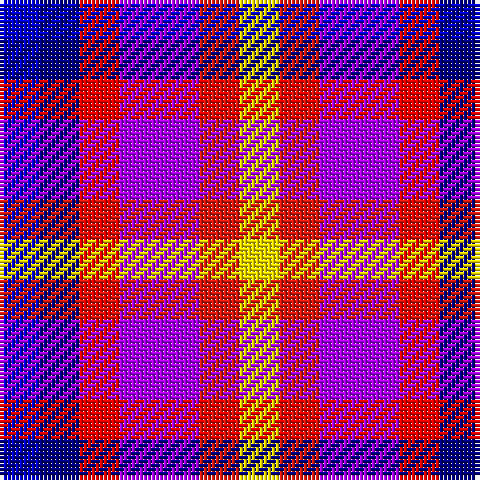

**Bands:** [BBRBRY](/stripes/bbrbry/) · **Stripes:** [DB DB R P R LY](/stripes/stripes6/) DB DB R P R LY

This was sourced from register-of-tartans.  It is a [6 band tartan](/bands/bands6/).

Original link https://www.tartanregister.gov.uk/tartanDetails.aspx?ref=10476

## Register references

External register numbers recorded for this tartan.

- Scottish Register of Tartans: [10476](https://www.tartanregister.gov.uk/tartanDetails.aspx?ref=10476)

## Thread count
B/10 DB10 R10 P20 Ra10 Y/10

## Palette
Each colour and its ΔE from the base-6 reference it is a variant of.

| Colour | Shade | Base | ΔE (OKLab) |
|---|---|---|---|
| B | <code style="background-color:#0000CD;">#0000CD</code> `#0000CD` | B <code style="background-color:#2A418A;">#2A418A</code> | 0.14 |
| DB | <code style="background-color:#000080;">#000080</code> `#000080` | B <code style="background-color:#2A418A;">#2A418A</code> | 0.14 |
| P | <code style="background-color:#AA00FF;">#AA00FF</code> `#AA00FF` | B <code style="background-color:#2A418A;">#2A418A</code> | 0.28 |
| R | <code style="background-color:#FF0000;">#FF0000</code> `#FF0000` | R <code style="background-color:#CC0000;">#CC0000</code> | 0.11 |
| Ra | <code style="background-color:#E3170D;">#E3170D</code> `#E3170D` | R <code style="background-color:#CC0000;">#CC0000</code> | 0.05 |
| Y | <code style="background-color:#FFE600;">#FFE600</code> `#FFE600` | Y <code style="background-color:#F2BF00;">#F2BF00</code> | 0.10 |

# Sample pattern

## Nearest tartans

The nearest existing variants by ΔTartan distance.

1. [Lytley Formal (Personal)](/setts/s6/db1dt1r1dp2r1ly1~x10/) — ΔT 1.84
1. [Becker (Name)](/setts/s6/lb3lb2db3r3k3ly1~x8/) — ΔT 2.03
1. [Anglicare (Corporate)](/setts/s12/db12w4db4k12db12k4db8db12t12w11r4w8/) — ΔT 2.67
1. [Crinnion (Middlesbrough) (Personal)](/setts/s5/b3k1lb3p4lg3~x4/) — ΔT 2.74
1. [Krifa-Jean (Personal)](/setts/s7/dg4r5ly4db4dy2k4r4~x10/) — ΔT 2.81
1. [Stewarton](/setts/s8/g2o5lp6b7b7b7y5k2~x2/) — ΔT 2.86
1. [Nicolson of Assynt & Coigach (Name)](/setts/s7/db8r11g5db3ly3w5k3~x2/) — ΔT 2.87
1. [Williams, Edmund (Personal)](/setts/s6/dp15dp15g15dg15k8w5~x2/) — ΔT 2.90
1. [Unidentified (2103)](/setts/s11/n2k2n2k2w1o1w1o1w1o1r2~x8/) — ΔT 2.91
1. [MacBlain (2016)](/setts/s6/db5dp3w2dg3k1ly1~x10/) — ΔT 2.92

## Neighbour map

Every grey dot is one of 14313 variants placed by the first two principal components of the ΔTartan feature space (44% of its variance). Red is this tartan; blue dots are its nearest — click one to open its page.

<svg viewBox="0 0 640 380" role="img" style="max-width:100%;height:auto;border:1px solid #e0e0e0;border-radius:4px;display:block" xmlns="http://www.w3.org/2000/svg"><image href="/nn/cloud.v1.png" width="640" height="380"/><a href="/setts/s6/db1dt1r1dp2r1ly1~x10/"><circle cx="14.0" cy="276.4" r="4" fill="#3465a4"><title>Lytley Formal (Personal)</title></circle></a><a href="/setts/s6/lb3lb2db3r3k3ly1~x8/"><circle cx="14.0" cy="254.4" r="4" fill="#3465a4"><title>Becker (Name)</title></circle></a><a href="/setts/s12/db12w4db4k12db12k4db8db12t12w11r4w8/"><circle cx="14.0" cy="215.9" r="4" fill="#3465a4"><title>Anglicare (Corporate)</title></circle></a><a href="/setts/s5/b3k1lb3p4lg3~x4/"><circle cx="14.0" cy="268.9" r="4" fill="#3465a4"><title>Crinnion (Middlesbrough) (Personal)</title></circle></a><a href="/setts/s7/dg4r5ly4db4dy2k4r4~x10/"><circle cx="14.0" cy="255.5" r="4" fill="#3465a4"><title>Krifa-Jean (Personal)</title></circle></a><a href="/setts/s8/g2o5lp6b7b7b7y5k2~x2/"><circle cx="14.0" cy="234.9" r="4" fill="#3465a4"><title>Stewarton</title></circle></a><a href="/setts/s7/db8r11g5db3ly3w5k3~x2/"><circle cx="14.0" cy="197.3" r="4" fill="#3465a4"><title>Nicolson of Assynt &amp; Coigach (Name)</title></circle></a><a href="/setts/s6/dp15dp15g15dg15k8w5~x2/"><circle cx="14.0" cy="265.6" r="4" fill="#3465a4"><title>Williams, Edmund (Personal)</title></circle></a><a href="/setts/s11/n2k2n2k2w1o1w1o1w1o1r2~x8/"><circle cx="14.0" cy="258.7" r="4" fill="#3465a4"><title>Unidentified (2103)</title></circle></a><a href="/setts/s6/db5dp3w2dg3k1ly1~x10/"><circle cx="35.2" cy="210.6" r="4" fill="#3465a4"><title>MacBlain (2016)</title></circle></a><circle cx="14.0" cy="256.8" r="5" fill="#c00000"/></svg>

ID: /setts/s6/db1db1r1p2r1ly1~x10/
