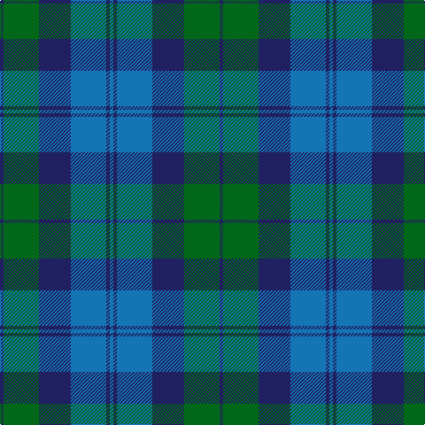

This page is one **sett** — a single exact thread-count. It belongs to the [tartan](/tartans/db1g10db9b10db1b1/)
(the same proportion at any scale), whose colour order is pattern [BBBBGB](/stripes/bbbbgb/).

Sourced from register-of-tartans.  It is a [6 stripe tartan](/stripes/stripes6/).

Original link https://www.tartanregister.gov.uk/tartanDetails.aspx?ref=5372

## Register references

External register numbers recorded for this tartan.

- Scottish Register of Tartans: [5372](https://www.tartanregister.gov.uk/tartanDetails.aspx?ref=5372)
- Scottish Tartans Authority (ITI): 3698

## Thread count
DB/4 G40 DB36 B40 DB4 B/4

## Palette

Palette: <strong>Tartan Register</strong>
<table><thead><tr><th>Colour</th><th>Threads</th><th>Shade</th><th>Base</th><th>OKLCh</th></tr></thead><tbody><tr><td>DB/</td><td style="text-align:right;font-variant-numeric:tabular-nums">4</td><td><code style="background-color:#202060;">#202060</code> <small style="color:#888">#202060</small></td><td>B <code style="background-color:#2A418A;">#2A418A</code></td><td><small style="color:#888">oklch(28.9% 0.111 276.9)</small></td></tr><tr><td>G</td><td style="text-align:right;font-variant-numeric:tabular-nums">40</td><td><code style="background-color:#006818;">#006818</code> <small style="color:#888">#006818</small></td><td>G <code style="background-color:#006100;">#006100</code></td><td><small style="color:#888">oklch(45.0% 0.142 145.0)</small></td></tr><tr><td>DB</td><td style="text-align:right;font-variant-numeric:tabular-nums">36</td><td><code style="background-color:#202060;">#202060</code> <small style="color:#888">#202060</small></td><td>B <code style="background-color:#2A418A;">#2A418A</code></td><td><small style="color:#888">oklch(28.9% 0.111 276.9)</small></td></tr><tr><td>B</td><td style="text-align:right;font-variant-numeric:tabular-nums">40</td><td><code style="background-color:#1474B4;">#1474B4</code> <small style="color:#888">#1474B4</small></td><td>B <code style="background-color:#2A418A;">#2A418A</code></td><td><small style="color:#888">oklch(54.0% 0.129 245.1)</small></td></tr><tr><td>DB</td><td style="text-align:right;font-variant-numeric:tabular-nums">4</td><td><code style="background-color:#202060;">#202060</code> <small style="color:#888">#202060</small></td><td>B <code style="background-color:#2A418A;">#2A418A</code></td><td><small style="color:#888">oklch(28.9% 0.111 276.9)</small></td></tr><tr><td>B/</td><td style="text-align:right;font-variant-numeric:tabular-nums">4</td><td><code style="background-color:#1474B4;">#1474B4</code> <small style="color:#888">#1474B4</small></td><td>B <code style="background-color:#2A418A;">#2A418A</code></td><td><small style="color:#888">oklch(54.0% 0.129 245.1)</small></td></tr></tbody></table>

# Sample pattern

## Nearest tartans

The nearest existing variants by ΔTartan distance, with this tartan at the top so the swatches line up against it.

ΔTartan

Tartan

Sett

—

<a href="/ttd/edit/#slug=db1g10db9b10db1b1~x4">Black Watch (Aljean)</a> <a class="nn-out" href="/setts/s6/db1g10db9b10db1b1~x4/" title="open its dictionary page">↗</a>

1.35

<a href="/ttd/edit/#slug=g3t1db7t1g3k1~x8">Scott Green (Sir Walter)</a> <a class="nn-out" href="/setts/s6/g3t1db7t1g3k1~x8/" title="open its dictionary page">↗</a>

1.39

<a href="/ttd/edit/#slug=g10db2g2db6t5db1t2~x2">Unnamed, No 17</a> <a class="nn-out" href="/setts/s7/g10db2g2db6t5db1t2~x2/" title="open its dictionary page">↗</a>

1.43

<a href="/ttd/edit/#slug=o1b7k4b1g7b1~x4">Flower of Scotland Commemorative Tartan Tartan Number: 2059. Earliest known date: September 1990 Designed as a tribute to Roy Williamson, writer of the words and music of 'The Flower of Scotland'. Roy wore the Gunn tartan which has been used as the framework of the new tartan. Cornflower blue and Zephyr green have been used to suggest the bluebell and the thistle. Worn by the Seafield and District pipe band, Strathallan Games, 1994 (UK Reg. Design No.600421) See products available Copyright © Blair Urquhart, Comrie, 2015</a> <a class="nn-out" href="/setts/s6/o1b7k4b1g7b1~x4/" title="open its dictionary page">↗</a>

1.43

<a href="/ttd/edit/#slug=o1b7k4b1g7b1~x2">Flower of Scotland MINI Tartan Tartan Number: 20599. Earliest known date: Dupion Silk. Generated only for display purposes. reduced copy of the original 2059 Flower of Scotland. See products available Copyright © Blair Urquhart, Comrie, 2015</a> <a class="nn-out" href="/setts/s6/o1b7k4b1g7b1~x2/" title="open its dictionary page">↗</a>

1.43

<a href="/ttd/edit/#slug=k4g23k23g2db23g4~x2">MacKay (Logan)</a> <a class="nn-out" href="/setts/s6/k4g23k23g2db23g4~x2/" title="open its dictionary page">↗</a>

1.44

<a href="/ttd/edit/#slug=g8b1g1k6db6k1~x4">Graham of Menteith</a> <a class="nn-out" href="/setts/s6/g8b1g1k6db6k1~x4/" title="open its dictionary page">↗</a>

1.46

<a href="/ttd/edit/#slug=t2db29t12g29w2~x2">Wallace Blue (Fashion)</a> <a class="nn-out" href="/setts/s5/t2db29t12g29w2~x2/" title="open its dictionary page">↗</a>

1.51

<a href="/ttd/edit/#slug=dg3b6db11t2dg11db3~x2">Unidentified No 29</a> <a class="nn-out" href="/setts/s6/dg3b6db11t2dg11db3~x2/" title="open its dictionary page">↗</a>

1.53

<a href="/ttd/edit/#slug=t1db11k11dg11k2t1~x2">Unidentified No 59</a> <a class="nn-out" href="/setts/s6/t1db11k11dg11k2t1~x2/" title="open its dictionary page">↗</a>

1.56

<a href="/ttd/edit/#slug=db10k1db1k1db2k8dg10w1~x4">Lamont</a> <a class="nn-out" href="/setts/s8/db10k1db1k1db2k8dg10w1~x4/" title="open its dictionary page">↗</a>

## Neighbour map

Every grey dot is one of 14299 variants placed by the first two principal components of the ΔTartan feature space (44% of its variance). Red is this tartan; blue dots are its nearest — click one to open its page.

<svg viewBox="0 0 640 380" role="img" style="max-width:100%;height:auto;border:1px solid #e0e0e0;border-radius:4px;display:block" xmlns="http://www.w3.org/2000/svg"><image href="/nn/cloud.v1.png" width="640" height="380"/><a href="/setts/s6/g3t1db7t1g3k1~x8/"><circle cx="249.7" cy="252.0" r="4" fill="#3465a4"><title>Scott Green (Sir Walter)</title></circle></a><a href="/setts/s7/g10db2g2db6t5db1t2~x2/"><circle cx="276.6" cy="258.1" r="4" fill="#3465a4"><title>Unnamed, No 17</title></circle></a><a href="/setts/s6/o1b7k4b1g7b1~x4/"><circle cx="238.7" cy="252.6" r="4" fill="#3465a4"><title>Flower of Scotland Commemorative Tartan Tartan Number: 2059. Earliest known date: September 1990 Designed as a tribute to Roy Williamson, writer of the words and music of 'The Flower of Scotland'. Roy wore the Gunn tartan which has been used as the framework of the new tartan. Cornflower blue and Zephyr green have been used to suggest the bluebell and the thistle. Worn by the Seafield and District pipe band, Strathallan Games, 1994 (UK Reg. Design No.600421) See products available Copyright © Blair Urquhart, Comrie, 2015</title></circle></a><a href="/setts/s6/o1b7k4b1g7b1~x2/"><circle cx="238.7" cy="252.6" r="4" fill="#3465a4"><title>Flower of Scotland MINI Tartan Tartan Number: 20599. Earliest known date: Dupion Silk. Generated only for display purposes. reduced copy of the original 2059 Flower of Scotland. See products available Copyright © Blair Urquhart, Comrie, 2015</title></circle></a><a href="/setts/s6/k4g23k23g2db23g4~x2/"><circle cx="244.7" cy="255.3" r="4" fill="#3465a4"><title>MacKay (Logan)</title></circle></a><a href="/setts/s6/g8b1g1k6db6k1~x4/"><circle cx="220.4" cy="250.2" r="4" fill="#3465a4"><title>Graham of Menteith</title></circle></a><a href="/setts/s5/t2db29t12g29w2~x2/"><circle cx="249.0" cy="223.1" r="4" fill="#3465a4"><title>Wallace Blue (Fashion)</title></circle></a><a href="/setts/s6/dg3b6db11t2dg11db3~x2/"><circle cx="212.7" cy="284.7" r="4" fill="#3465a4"><title>Unidentified No 29</title></circle></a><a href="/setts/s6/t1db11k11dg11k2t1~x2/"><circle cx="243.5" cy="250.4" r="4" fill="#3465a4"><title>Unidentified No 59</title></circle></a><a href="/setts/s8/db10k1db1k1db2k8dg10w1~x4/"><circle cx="244.0" cy="219.3" r="4" fill="#3465a4"><title>Lamont</title></circle></a><circle cx="250.9" cy="258.3" r="5" fill="#c00000"/></svg>

ID: /setts/s6/db1g10db9b10db1b1~x4/
