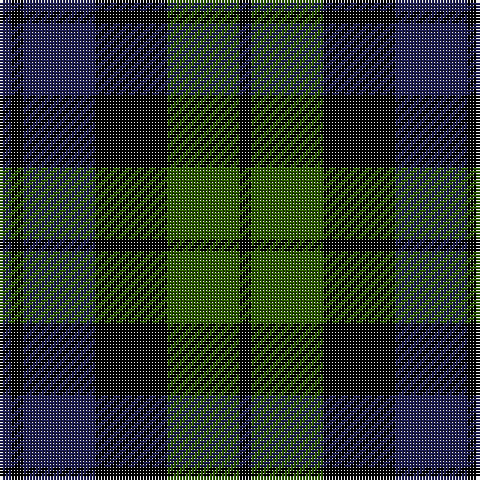

**Bands:** [BKBKGK](/stripes/bkbkgk/) · **Stripes:** [DB K DB K DG K](/stripes/stripes6/) DB K DB K DG K

This was sourced from register-of-tartans.  It is a [6 band tartan](/bands/bands6/).

Original link https://www.tartanregister.gov.uk/tartanDetails.aspx?ref=5376

## Register references

External register numbers recorded for this tartan.

- Scottish Register of Tartans: [5376](https://www.tartanregister.gov.uk/tartanDetails.aspx?ref=5376)
- Scottish Tartans Authority (ITI): 3695

## Variants

Other setts woven to the same stripe pattern.

- [Sutherland 42nd](/setts/s6/db1k1db3k3dg3k1~x4/)

## Thread count
DBa/4 K4 DBa24 K24 Ga24 K/4

## Palette
Each colour and its ΔE from the base-6 reference it is a variant of.

| Colour | Shade | Base | ΔE (OKLab) |
|---|---|---|---|
| B | <code style="background-color:#1474B4;">#1474B4</code> `#1474B4` | B <code style="background-color:#2A418A;">#2A418A</code> | 0.15 |
| DB | <code style="background-color:#00008C;">#00008C</code> `#00008C` | B <code style="background-color:#2A418A;">#2A418A</code> | 0.13 |
| DBa | <code style="background-color:#1C1C50;">#1C1C50</code> `#1C1C50` | B <code style="background-color:#2A418A;">#2A418A</code> | 0.14 |
| DG | <code style="background-color:#003820;">#003820</code> `#003820` | G <code style="background-color:#006100;">#006100</code> | 0.15 |
| G | <code style="background-color:#007800;">#007800</code> `#007800` | G <code style="background-color:#006100;">#006100</code> | 0.07 |
| Ga | <code style="background-color:#285800;">#285800</code> `#285800` | G <code style="background-color:#006100;">#006100</code> | 0.03 |
| K | <code style="background-color:#000000;">#000000</code> `#000000` | K <code style="background-color:#000000;">#000000</code> | 0.00 |
| Y | <code style="background-color:#E8C000;">#E8C000</code> `#E8C000` | Y <code style="background-color:#F2BF00;">#F2BF00</code> | 0.02 |

# Sample pattern

## Nearest tartans

The nearest existing variants by ΔTartan distance.

1. [MacKay](/setts/s6/dg3db14dg2k14dg14k3/) — ΔT 0.56
1. [MacKay](/setts/s6/dg3db14dg2k14dg14k3~x2/) — ΔT 0.67
1. [Morrison](/setts/s6/k3dg14k14dg2db14r3~x2/) — ΔT 1.03
1. [Morrison](/setts/s6/k3dg14k14dg2db14r3/) — ΔT 1.07
1. [Fletcher](/setts/s7/db6k1db6k8r1dg8k2/) — ΔT 1.18
1. [MacCallum](/setts/s7/dg8k2b1dg4k6db6k1~x2/) — ΔT 1.18
1. [Fletcher C](/setts/s7/db6k1db6k8r1dg8r2~x2/) — ΔT 1.24
1. [Austin](/setts/s5/db4k4db4dg9k2/) — ΔT 1.26
1. [Unnamed, No 54](/setts/s6/db2g6db6dp5db1dp2~x2/) — ΔT 1.26
1. [Scottish Airports](/setts/s6/dp4dt18k17dt3g18dt4~x2/) — ΔT 1.28

## Neighbour map

Every grey dot is one of 14313 variants placed by the first two principal components of the ΔTartan feature space (44% of its variance). Red is this tartan; blue dots are its nearest — click one to open its page.

<svg viewBox="0 0 640 380" role="img" style="max-width:100%;height:auto;border:1px solid #e0e0e0;border-radius:4px;display:block" xmlns="http://www.w3.org/2000/svg"><image href="/nn/cloud.v1.png" width="640" height="380"/><a href="/setts/s6/dg3db14dg2k14dg14k3/"><circle cx="217.3" cy="277.7" r="4" fill="#3465a4"><title>MacKay</title></circle></a><a href="/setts/s6/dg3db14dg2k14dg14k3~x2/"><circle cx="230.9" cy="284.1" r="4" fill="#3465a4"><title>MacKay</title></circle></a><a href="/setts/s6/k3dg14k14dg2db14r3~x2/"><circle cx="177.9" cy="259.9" r="4" fill="#3465a4"><title>Morrison</title></circle></a><a href="/setts/s6/k3dg14k14dg2db14r3/"><circle cx="163.9" cy="252.7" r="4" fill="#3465a4"><title>Morrison</title></circle></a><a href="/setts/s7/db6k1db6k8r1dg8k2/"><circle cx="196.8" cy="257.0" r="4" fill="#3465a4"><title>Fletcher</title></circle></a><a href="/setts/s7/dg8k2b1dg4k6db6k1~x2/"><circle cx="216.1" cy="256.2" r="4" fill="#3465a4"><title>MacCallum</title></circle></a><a href="/setts/s7/db6k1db6k8r1dg8r2~x2/"><circle cx="182.9" cy="251.1" r="4" fill="#3465a4"><title>Fletcher C</title></circle></a><a href="/setts/s5/db4k4db4dg9k2/"><circle cx="199.1" cy="324.7" r="4" fill="#3465a4"><title>Austin</title></circle></a><a href="/setts/s6/db2g6db6dp5db1dp2~x2/"><circle cx="207.3" cy="288.5" r="4" fill="#3465a4"><title>Unnamed, No 54</title></circle></a><a href="/setts/s6/dp4dt18k17dt3g18dt4~x2/"><circle cx="162.0" cy="252.7" r="4" fill="#3465a4"><title>Scottish Airports</title></circle></a><circle cx="215.8" cy="275.8" r="5" fill="#c00000"/></svg>

ID: /setts/s6/db1k1db6k6dg6k1~x4/
