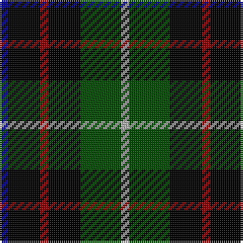

This page is one **sett** — a single exact thread-count. It belongs to the [tartan](/tartans/db1k4dr1k4g5n1/)
(the same proportion at any scale), whose colour order is pattern [BKRKGY](/stripes/bkrkgy/).

Sourced from register-of-tartans.  It is a [6 stripe tartan](/stripes/stripes6/).

Original link https://www.tartanregister.gov.uk/tartanDetails.aspx?ref=4290

## Register references

External register numbers recorded for this tartan.

- Scottish Register of Tartans: [4290](https://www.tartanregister.gov.uk/tartanDetails.aspx?ref=4290)
- Scottish Tartans Authority (ITI): 4833

## Thread count
DB/4 K16 DR4 K16 G20 N/4

## Palette
Each colour and the base-6 reference it is a variant of.

| Colour | Shade | Base |
|---|---|---|
| DB | <code style="background-color:#00008C;">#00008C</code> `oklch(28.9% 0.200 264.1)` <small>#00008C</small> | B <code style="background-color:#2A418A;">#2A418A</code> |
| DR | <code style="background-color:#8C0000;">#8C0000</code> `oklch(40.2% 0.165 29.2)` <small>#8C0000</small> | R <code style="background-color:#CC0000;">#CC0000</code> |
| G | <code style="background-color:#004C00;">#004C00</code> `oklch(36.1% 0.123 142.5)` <small>#004C00</small> | G <code style="background-color:#006100;">#006100</code> |
| K | <code style="background-color:#000000;">#000000</code> `oklch(0.0% 0.000 0.0)` <small>#000000</small> | K <code style="background-color:#000000;">#000000</code> |
| N | <code style="background-color:#B0B0B0;">#B0B0B0</code> `oklch(75.7% 0.000 89.9)` <small>#B0B0B0</small> | Y <code style="background-color:#F2BF00;">#F2BF00</code> |

# Sample pattern

## Nearest tartans

The nearest existing variants by ΔTartan distance, with this tartan at the top so the swatches line up against it.

ΔTartan

Tartan

Sett

—

<a href="/ttd/edit/#slug=db1k4r1k4dg5lr1~x4">Unidentified Dance</a> <a class="nn-out" href="/setts/s6/db1k4r1k4dg5lr1~x4/" title="open its dictionary page">↗</a>

1.19

<a href="/ttd/edit/#slug=db1k6db6k6g6k1w1~x2">Forbes Ancient</a> <a class="nn-out" href="/setts/s7/db1k6db6k6g6k1w1~x2/" title="open its dictionary page">↗</a>

1.25

<a href="/ttd/edit/#slug=t3k16g16k16db3t3~x2">Murray</a> <a class="nn-out" href="/setts/s6/t3k16g16k16db3t3~x2/" title="open its dictionary page">↗</a>

1.32

<a href="/ttd/edit/#slug=db1k6db6k6dg6k1lb1">Forbes LC</a> <a class="nn-out" href="/setts/s7/db1k6db6k6dg6k1lb1/" title="open its dictionary page">↗</a>

1.33

<a href="/ttd/edit/#slug=r2dg8ly1k8dg8db8r2">Brodie Hunting</a> <a class="nn-out" href="/setts/s7/r2dg8ly1k8dg8db8r2/" title="open its dictionary page">↗</a>

1.35

<a href="/ttd/edit/#slug=k3g9t2k11p9k3~x2">Scott, Sir Walter</a> <a class="nn-out" href="/setts/s6/k3g9t2k11p9k3~x2/" title="open its dictionary page">↗</a>

1.35

<a href="/ttd/edit/#slug=r2k8ly1k8dg8db8r2~x2">Brodie Hunting</a> <a class="nn-out" href="/setts/s7/r2k8ly1k8dg8db8r2~x2/" title="open its dictionary page">↗</a>

1.36

<a href="/ttd/edit/#slug=r2k8ly1k8g8db8r2~x2">Brodie hunting</a> <a class="nn-out" href="/setts/s7/r2k8ly1k8g8db8r2~x2/" title="open its dictionary page">↗</a>

1.38

<a href="/ttd/edit/#slug=k2g8db2k9p7k2~x2">Campbell, Sir Walter Scott</a> <a class="nn-out" href="/setts/s6/k2g8db2k9p7k2~x2/" title="open its dictionary page">↗</a>

1.46

<a href="/ttd/edit/#slug=k10dg3k6dg20k8r4w4dg10~x2">BlackRock (Symmetrical)</a> <a class="nn-out" href="/setts/s8/k10dg3k6dg20k8r4w4dg10~x2/" title="open its dictionary page">↗</a>

1.48

<a href="/ttd/edit/#slug=dg8k2lb1dg4k6db6k1~x2">MacCallum</a> <a class="nn-out" href="/setts/s7/dg8k2lb1dg4k6db6k1~x2/" title="open its dictionary page">↗</a>

## Neighbour map

Every grey dot is one of 14299 variants placed by the first two principal components of the ΔTartan feature space (44% of its variance). Red is this tartan; blue dots are its nearest — click one to open its page.

<svg viewBox="0 0 640 380" role="img" style="max-width:100%;height:auto;border:1px solid #e0e0e0;border-radius:4px;display:block" xmlns="http://www.w3.org/2000/svg"><image href="/nn/cloud.v1.png" width="640" height="380"/><a href="/setts/s7/db1k6db6k6g6k1w1~x2/"><circle cx="184.4" cy="240.8" r="4" fill="#3465a4"><title>Forbes Ancient</title></circle></a><a href="/setts/s6/t3k16g16k16db3t3~x2/"><circle cx="234.4" cy="250.9" r="4" fill="#3465a4"><title>Murray</title></circle></a><a href="/setts/s7/db1k6db6k6dg6k1lb1/"><circle cx="212.6" cy="258.9" r="4" fill="#3465a4"><title>Forbes LC</title></circle></a><a href="/setts/s7/r2dg8ly1k8dg8db8r2/"><circle cx="154.1" cy="224.2" r="4" fill="#3465a4"><title>Brodie Hunting</title></circle></a><a href="/setts/s6/k3g9t2k11p9k3~x2/"><circle cx="168.4" cy="251.1" r="4" fill="#3465a4"><title>Scott, Sir Walter</title></circle></a><a href="/setts/s7/r2k8ly1k8dg8db8r2~x2/"><circle cx="165.5" cy="231.0" r="4" fill="#3465a4"><title>Brodie Hunting</title></circle></a><a href="/setts/s7/r2k8ly1k8g8db8r2~x2/"><circle cx="138.4" cy="213.8" r="4" fill="#3465a4"><title>Brodie hunting</title></circle></a><a href="/setts/s6/k2g8db2k9p7k2~x2/"><circle cx="152.2" cy="255.5" r="4" fill="#3465a4"><title>Campbell, Sir Walter Scott</title></circle></a><a href="/setts/s8/k10dg3k6dg20k8r4w4dg10~x2/"><circle cx="203.0" cy="231.2" r="4" fill="#3465a4"><title>BlackRock (Symmetrical)</title></circle></a><a href="/setts/s7/dg8k2lb1dg4k6db6k1~x2/"><circle cx="194.4" cy="245.0" r="4" fill="#3465a4"><title>MacCallum</title></circle></a><circle cx="187.2" cy="245.7" r="5" fill="#c00000"/></svg>

ID: /setts/s6/db1k4r1k4dg5lr1~x4/
