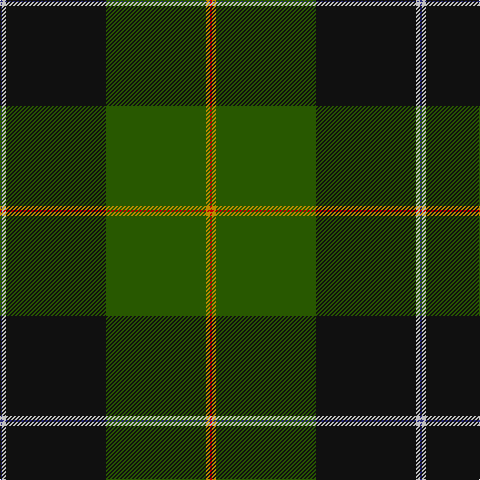

In pattern [BWKGYR](/stripes/bwkgyr/).

This was sourced from tartans-authority.  It is a [6 stripe tartan](/stripes/stripes6/).

Original link http://www.tartansauthority.com/tartan-ferret/display/10427/

## Thread count
DB/2 N4 K100 G100 DY4 R/2

## Palette
Each colour and the base-6 reference it is a variant of.

| Colour | Shade | Base |
|---|---|---|
| DB | <code style="background-color:#2C2C80;">#2C2C80</code> `oklch(35.0% 0.138 276.6)` <small>#2C2C80</small> | B <code style="background-color:#2A418A;">#2A418A</code> |
| DY | <code style="background-color:#BC8C00;">#BC8C00</code> `oklch(66.8% 0.137 84.1)` <small>#BC8C00</small> | Y <code style="background-color:#F2BF00;">#F2BF00</code> |
| G | <code style="background-color:#285800;">#285800</code> `oklch(41.0% 0.122 135.8)` <small>#285800</small> | G <code style="background-color:#006100;">#006100</code> |
| K | <code style="background-color:#101010;">#101010</code> `oklch(17.3% 0.000 89.9)` <small>#101010</small> | K <code style="background-color:#000000;">#000000</code> |
| N | <code style="background-color:#C0C0C0;">#C0C0C0</code> `oklch(80.8% 0.000 89.9)` <small>#C0C0C0</small> | W <code style="background-color:#F7F7F7;">#F7F7F7</code> |
| R | <code style="background-color:#C80000;">#C80000</code> `oklch(52.3% 0.215 29.2)` <small>#C80000</small> | R <code style="background-color:#CC0000;">#CC0000</code> |

# Sample pattern

## Nearest tartans

The nearest existing variants by ΔTartan distance.

1. [Josse (Bro Sant Malo), Gilbert (Personal)](/setts/s6/db1t2k50g50ly2r1~x2/) — ΔT 0.73
1. [Wells (2014)](/setts/s7/db50dg25lo3o8r1w1r1~x2/) — ΔT 1.57
1. [Nolan Family, John J (Personal)](/setts/s5/do8g19dg42lo3o1~x2/) — ΔT 1.65
1. [Ataç, H.M. & I.C. (Personal)](/setts/s8/db9g5w1g15k2g1k44r1~x2/) — ΔT 1.71
1. [MacWilliam Hunting](/setts/s6/dy2dg44k10r1db16r1~x2/) — ΔT 1.72
1. [Moran Family Tartan Tartan Number: 675. Earliest known date: 1986 The designers requested that the threadcount be Restricted. See products available Copyright © Blair Urquhart, Comrie, 2015](/setts/s6/g55k17r9k11ly2db4~x2/) — ΔT 1.75
1. [Duffy](/setts/s7/g8dg60w1k33g9ly4g4~x2/) — ΔT 1.76
1. [Bomb Disposal](/setts/s10/k28r3lo2r3k13dg28k1dg3k1dg16~x2/) — ΔT 1.76
1. [Johnston, Diana Hunting (Personal)](/setts/s8/ly3dt1k2dg26dt28w1dt1r2~x2/) — ΔT 1.77
1. [Mull Millennium](/setts/s8/g92ly3k28n18r12db18w2g12/) — ΔT 1.78

## Neighbour map

Every grey dot is one of 14299 variants placed by the first two principal components of the ΔTartan feature space (44% of its variance). Red is this tartan; blue dots are its nearest — click one to open its page.

<svg viewBox="0 0 640 380" role="img" style="max-width:100%;height:auto;border:1px solid #e0e0e0;border-radius:4px;display:block" xmlns="http://www.w3.org/2000/svg"><image href="/nn/cloud.v1.png" width="640" height="380"/><a href="/setts/s6/db1t2k50g50ly2r1~x2/"><circle cx="347.7" cy="113.9" r="4" fill="#3465a4"><title>Josse (Bro Sant Malo), Gilbert (Personal)</title></circle></a><a href="/setts/s7/db50dg25lo3o8r1w1r1~x2/"><circle cx="371.8" cy="103.9" r="4" fill="#3465a4"><title>Wells (2014)</title></circle></a><a href="/setts/s5/do8g19dg42lo3o1~x2/"><circle cx="378.3" cy="157.0" r="4" fill="#3465a4"><title>Nolan Family, John J (Personal)</title></circle></a><a href="/setts/s8/db9g5w1g15k2g1k44r1~x2/"><circle cx="402.4" cy="120.1" r="4" fill="#3465a4"><title>Ataç, H.M. &amp; I.C. (Personal)</title></circle></a><a href="/setts/s6/dy2dg44k10r1db16r1~x2/"><circle cx="428.1" cy="155.3" r="4" fill="#3465a4"><title>MacWilliam Hunting</title></circle></a><a href="/setts/s6/g55k17r9k11ly2db4~x2/"><circle cx="345.4" cy="155.8" r="4" fill="#3465a4"><title>Moran Family Tartan Tartan Number: 675. Earliest known date: 1986 The designers requested that the threadcount be Restricted. See products available Copyright © Blair Urquhart, Comrie, 2015</title></circle></a><a href="/setts/s7/g8dg60w1k33g9ly4g4~x2/"><circle cx="322.5" cy="123.9" r="4" fill="#3465a4"><title>Duffy</title></circle></a><a href="/setts/s10/k28r3lo2r3k13dg28k1dg3k1dg16~x2/"><circle cx="334.9" cy="153.4" r="4" fill="#3465a4"><title>Bomb Disposal</title></circle></a><a href="/setts/s8/ly3dt1k2dg26dt28w1dt1r2~x2/"><circle cx="319.1" cy="125.7" r="4" fill="#3465a4"><title>Johnston, Diana Hunting (Personal)</title></circle></a><a href="/setts/s8/g92ly3k28n18r12db18w2g12/"><circle cx="321.4" cy="94.2" r="4" fill="#3465a4"><title>Mull Millennium</title></circle></a><circle cx="368.3" cy="122.4" r="5" fill="#c00000"/></svg>

ID: /setts/s6/db1lb2k50dg50lo2r1~x2/
