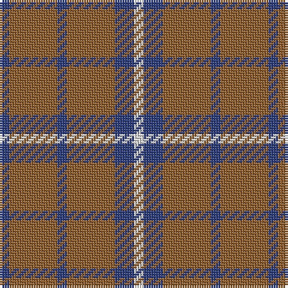

In pattern [BRBRBW](/stripes/brbrbw/).

This was sourced from weddslist.  It is a [6 stripe tartan](/stripes/stripes6/).

Original link http://www.weddslist.com/cgi-bin/tartans/pg.pl?source=sts

## Thread count
B/4 LT20 B4 LT20 B8 LN/4

## Palette
Each colour and the base-6 reference it is a variant of.

| Colour | Shade | Base |
|---|---|---|
| B | <code style="background-color:#304080;">#304080</code> `oklch(39.4% 0.109 270.2)` <small>#304080</small> | B <code style="background-color:#2A418A;">#2A418A</code> |
| LN | <code style="background-color:#E0E0E0;">#E0E0E0</code> `oklch(90.7% 0.000 89.9)` <small>#E0E0E0</small> | W <code style="background-color:#F7F7F7;">#F7F7F7</code> |
| LT | <code style="background-color:#906030;">#906030</code> `oklch(53.1% 0.089 63.7)` <small>#906030</small> | R <code style="background-color:#CC0000;">#CC0000</code> |

# Sample pattern

## Nearest tartans

The nearest existing variants by ΔTartan distance.

1. [Tokharion](/setts/s6/db1lo5db1lo5db2w1~x4/) — ΔT 1.22
1. [Leeds University Corporate Tartan Tartan Number: 980. Earliest known date: pre 2003 Leeds University Scottish Country Dance Club. See products available Copyright © Blair Urquhart, Comrie, 2015](/setts/s8/g9m2g2m2g2m8g11w2~x4/) — ΔT 1.63
1. [Lister (Name)](/setts/s7/dy8o29dy8ly3dy8o8ly3~x2/) — ΔT 1.80
1. [Ikelman #3a (Personal)](/setts/s5/n11k4r4lo4n11~x4/) — ΔT 1.80
1. [Grange School](/setts/s7/n27lr3n14k3n13k3ly23~x2/) — ΔT 1.83
1. [Unidentified #59](/setts/s7/r1dg4r1lr1r4dg1r1~x4/) — ΔT 1.90
1. [Wilson's No.212](/setts/s4/r2g9r2t2~x4/) — ΔT 1.91
1. [Mowdowny (Fashion)](/setts/s9/r1o6k1o1k2o1k1o6lo1~x8/) — ΔT 1.95
1. [Ceredigion (Personal)](/setts/s5/ly5n1ly1n12r1~x8/) — ΔT 1.97
1. [Elphinstone Clan Tartan Tartan Number: 115. Earliest known date: 1842 The village of Elphinstone is next to Tranent near Edinburgh in East Lothian. Sir Henry Elphinstone of Pittendriech in Midlothian was created Baron Elphinstone in 1509 and fell at Flodden Field. The Elphinstone tartan first appeared in the text of the Vestiarium Scoticum (1842). It is similar to some extent with the Montgomerie tartan and to the Montgomerie Hunting sett, suggesting a link to an early provenance. D.W. Stewart (1893) maintained that he could date the Montgomerie of Eglinton to 1707. See products available Copyright © Blair Urquhart, Comrie, 2015](/setts/s4/g28dp10g3~x2/) — ΔT 2.01

## Neighbour map

Every grey dot is one of 14299 variants placed by the first two principal components of the ΔTartan feature space (44% of its variance). Red is this tartan; blue dots are its nearest — click one to open its page.

<svg viewBox="0 0 640 380" role="img" style="max-width:100%;height:auto;border:1px solid #e0e0e0;border-radius:4px;display:block" xmlns="http://www.w3.org/2000/svg"><image href="/nn/cloud.v1.png" width="640" height="380"/><a href="/setts/s6/db1lo5db1lo5db2w1~x4/"><circle cx="360.6" cy="259.5" r="4" fill="#3465a4"><title>Tokharion</title></circle></a><a href="/setts/s8/g9m2g2m2g2m8g11w2~x4/"><circle cx="350.3" cy="249.9" r="4" fill="#3465a4"><title>Leeds University Corporate Tartan Tartan Number: 980. Earliest known date: pre 2003 Leeds University Scottish Country Dance Club. See products available Copyright © Blair Urquhart, Comrie, 2015</title></circle></a><a href="/setts/s7/dy8o29dy8ly3dy8o8ly3~x2/"><circle cx="362.0" cy="233.6" r="4" fill="#3465a4"><title>Lister (Name)</title></circle></a><a href="/setts/s5/n11k4r4lo4n11~x4/"><circle cx="307.8" cy="315.3" r="4" fill="#3465a4"><title>Ikelman #3a (Personal)</title></circle></a><a href="/setts/s7/n27lr3n14k3n13k3ly23~x2/"><circle cx="334.3" cy="216.3" r="4" fill="#3465a4"><title>Grange School</title></circle></a><a href="/setts/s7/r1dg4r1lr1r4dg1r1~x4/"><circle cx="316.3" cy="274.6" r="4" fill="#3465a4"><title>Unidentified #59</title></circle></a><a href="/setts/s4/r2g9r2t2~x4/"><circle cx="343.7" cy="288.2" r="4" fill="#3465a4"><title>Wilson's No.212</title></circle></a><a href="/setts/s9/r1o6k1o1k2o1k1o6lo1~x8/"><circle cx="369.9" cy="204.1" r="4" fill="#3465a4"><title>Mowdowny (Fashion)</title></circle></a><a href="/setts/s5/ly5n1ly1n12r1~x8/"><circle cx="433.6" cy="218.8" r="4" fill="#3465a4"><title>Ceredigion (Personal)</title></circle></a><a href="/setts/s4/g28dp10g3~x2/"><circle cx="408.4" cy="287.6" r="4" fill="#3465a4"><title>Elphinstone Clan Tartan Tartan Number: 115. Earliest known date: 1842 The village of Elphinstone is next to Tranent near Edinburgh in East Lothian. Sir Henry Elphinstone of Pittendriech in Midlothian was created Baron Elphinstone in 1509 and fell at Flodden Field. The Elphinstone tartan first appeared in the text of the Vestiarium Scoticum (1842). It is similar to some extent with the Montgomerie tartan and to the Montgomerie Hunting sett, suggesting a link to an early provenance. D.W. Stewart (1893) maintained that he could date the Montgomerie of Eglinton to 1707. See products available Copyright © Blair Urquhart, Comrie, 2015</title></circle></a><circle cx="394.3" cy="275.8" r="5" fill="#c00000"/></svg>

ID: /setts/s6/db1o5db1o5db2w1~x4/
