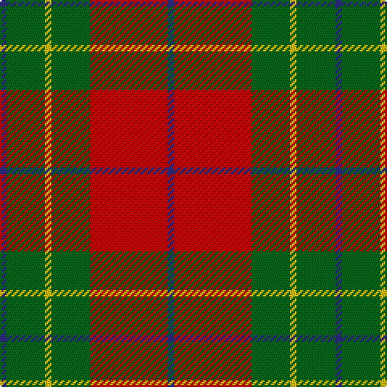

This page is one **sett** — a single exact thread-count. It belongs to the [tartan](/tartans/db1r12g6ly1g6db1/)
(the same proportion at any scale), whose colour order is pattern [BGYGRB](/stripes/bgygrb/).

Sourced from tartans-authority.  It is a [6 stripe tartan](/stripes/stripes6/).

Original link http://www.tartansauthority.com/tartan-ferret/display/2049/

## Register references

External register numbers recorded for this tartan.

- Scottish Tartans Authority (ITI): 2049

## Thread count
DB/4 R48 G24 Y4 G24 DB/4

## Palette

Palette: <strong>Tartan Register</strong>
<table><thead><tr><th>Colour</th><th>Threads</th><th>Shade</th><th>Base</th><th>OKLCh</th></tr></thead><tbody><tr><td>DB/</td><td style="text-align:right;font-variant-numeric:tabular-nums">4</td><td><code style="background-color:#2C2C80;">#2C2C80</code> <small style="color:#888">#2C2C80</small></td><td>B <code style="background-color:#2A418A;">#2A418A</code></td><td><small style="color:#888">oklch(35.0% 0.138 276.6)</small></td></tr><tr><td>R</td><td style="text-align:right;font-variant-numeric:tabular-nums">48</td><td><code style="background-color:#C80000;">#C80000</code> <small style="color:#888">#C80000</small></td><td>R <code style="background-color:#CC0000;">#CC0000</code></td><td><small style="color:#888">oklch(52.3% 0.215 29.2)</small></td></tr><tr><td>G</td><td style="text-align:right;font-variant-numeric:tabular-nums">24</td><td><code style="background-color:#006818;">#006818</code> <small style="color:#888">#006818</small></td><td>G <code style="background-color:#006100;">#006100</code></td><td><small style="color:#888">oklch(45.0% 0.142 145.0)</small></td></tr><tr><td>Y</td><td style="text-align:right;font-variant-numeric:tabular-nums">4</td><td><code style="background-color:#E8C000;">#E8C000</code> <small style="color:#888">#E8C000</small></td><td>Y <code style="background-color:#F2BF00;">#F2BF00</code></td><td><small style="color:#888">oklch(81.9% 0.168 93.7)</small></td></tr><tr><td>G</td><td style="text-align:right;font-variant-numeric:tabular-nums">24</td><td><code style="background-color:#006818;">#006818</code> <small style="color:#888">#006818</small></td><td>G <code style="background-color:#006100;">#006100</code></td><td><small style="color:#888">oklch(45.0% 0.142 145.0)</small></td></tr><tr><td>DB/</td><td style="text-align:right;font-variant-numeric:tabular-nums">4</td><td><code style="background-color:#2C2C80;">#2C2C80</code> <small style="color:#888">#2C2C80</small></td><td>B <code style="background-color:#2A418A;">#2A418A</code></td><td><small style="color:#888">oklch(35.0% 0.138 276.6)</small></td></tr></tbody></table>

# Sample pattern

## Nearest tartans

The nearest existing variants by ΔTartan distance, with this tartan at the top so the swatches line up against it.

ΔTartan

Tartan

Sett

—

<a href="/ttd/edit/#slug=db1r12g6ly1g6db1~x4">Cetoloni (Personal)</a> <a class="nn-out" href="/setts/s6/db1r12g6ly1g6db1~x4/" title="open its dictionary page">↗</a>

0.68

<a href="/ttd/edit/#slug=g28r7m7g14m7r48k4~x2">MacNab 6</a> <a class="nn-out" href="/setts/s7/g28r7m7g14m7r48k4~x2/" title="open its dictionary page">↗</a>

0.69

<a href="/ttd/edit/#slug=r2ri1r10ri2g10w1g2~x2">Lennox</a> <a class="nn-out" href="/setts/s7/r2ri1r10ri2g10w1g2~x2/" title="open its dictionary page">↗</a>

0.71

<a href="/ttd/edit/#slug=g9r2g9r14k1w2~x2">MacGregor of Balquidder (Logan)</a> <a class="nn-out" href="/setts/s6/g9r2g9r14k1w2~x2/" title="open its dictionary page">↗</a>

0.80

<a href="/ttd/edit/#slug=r2ri1r10ri2g10lr1g2~x4">Lennox</a> <a class="nn-out" href="/setts/s7/r2ri1r10ri2g10lr1g2~x4/" title="open its dictionary page">↗</a>

0.80

<a href="/ttd/edit/#slug=db6lo25dy16k2db3~x2">Prince of Orange #2</a> <a class="nn-out" href="/setts/s5/db6lo25dy16k2db3~x2/" title="open its dictionary page">↗</a>

0.89

<a href="/ttd/edit/#slug=g6r2ri2g4ri2r12k1~x2">MacNab 5</a> <a class="nn-out" href="/setts/s7/g6r2ri2g4ri2r12k1~x2/" title="open its dictionary page">↗</a>

0.94

<a href="/ttd/edit/#slug=r4g14ly3g14r4g3r29y4~x2">Burnett</a> <a class="nn-out" href="/setts/s8/r4g14ly3g14r4g3r29y4~x2/" title="open its dictionary page">↗</a>

0.97

<a href="/ttd/edit/#slug=k2o20k8dg18o3w2~x2">Celtic Combat</a> <a class="nn-out" href="/setts/s6/k2o20k8dg18o3w2~x2/" title="open its dictionary page">↗</a>

0.99

<a href="/ttd/edit/#slug=k2r16g6r3g8lb1~x2">MacAulay</a> <a class="nn-out" href="/setts/s6/k2r16g6r3g8lb1~x2/" title="open its dictionary page">↗</a>

1.00

<a href="/ttd/edit/#slug=k2r16g6r3g8w1~x4">MacAulay (Clan)</a> <a class="nn-out" href="/setts/s6/k2r16g6r3g8w1~x4/" title="open its dictionary page">↗</a>

## Neighbour map

Every grey dot is one of 14359 variants placed by the first two principal components of the ΔTartan feature space (44% of its variance). Red is this tartan; blue dots are its nearest — click one to open its page.

<svg viewBox="0 0 640 380" role="img" style="max-width:100%;height:auto;border:1px solid #e0e0e0;border-radius:4px;display:block" xmlns="http://www.w3.org/2000/svg"><image href="/nn/cloud.v1.png" width="640" height="380"/><a href="/setts/s7/g28r7m7g14m7r48k4~x2/"><circle cx="288.4" cy="187.7" r="4" fill="#3465a4"><title>MacNab 6</title></circle></a><a href="/setts/s7/r2ri1r10ri2g10w1g2~x2/"><circle cx="269.2" cy="192.0" r="4" fill="#3465a4"><title>Lennox</title></circle></a><a href="/setts/s6/g9r2g9r14k1w2~x2/"><circle cx="297.2" cy="199.7" r="4" fill="#3465a4"><title>MacGregor of Balquidder (Logan)</title></circle></a><a href="/setts/s7/r2ri1r10ri2g10lr1g2~x4/"><circle cx="284.3" cy="198.8" r="4" fill="#3465a4"><title>Lennox</title></circle></a><a href="/setts/s5/db6lo25dy16k2db3~x2/"><circle cx="276.5" cy="201.1" r="4" fill="#3465a4"><title>Prince of Orange #2</title></circle></a><a href="/setts/s7/g6r2ri2g4ri2r12k1~x2/"><circle cx="287.1" cy="191.2" r="4" fill="#3465a4"><title>MacNab 5</title></circle></a><a href="/setts/s8/r4g14ly3g14r4g3r29y4~x2/"><circle cx="307.7" cy="194.6" r="4" fill="#3465a4"><title>Burnett</title></circle></a><a href="/setts/s6/k2o20k8dg18o3w2~x2/"><circle cx="236.7" cy="205.2" r="4" fill="#3465a4"><title>Celtic Combat</title></circle></a><a href="/setts/s6/k2r16g6r3g8lb1~x2/"><circle cx="334.7" cy="190.5" r="4" fill="#3465a4"><title>MacAulay</title></circle></a><a href="/setts/s6/k2r16g6r3g8w1~x4/"><circle cx="330.6" cy="188.3" r="4" fill="#3465a4"><title>MacAulay (Clan)</title></circle></a><circle cx="287.5" cy="198.5" r="5" fill="#c00000"/></svg>

ID: /setts/s6/db1r12g6ly1g6db1~x4/
