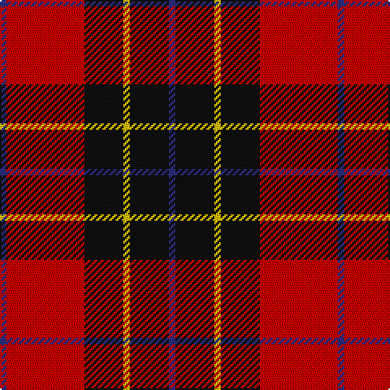

In pattern [BKYKRB](/stripes/bkykrb/).

This was sourced from register-of-tartans.  It is a [6 stripe tartan](/stripes/stripes6/).

Original link https://www.tartanregister.gov.uk/tartanDetails.aspx?ref=612

## Register references

External register numbers recorded for this tartan.

- Scottish Register of Tartans: [612](https://www.tartanregister.gov.uk/tartanDetails.aspx?ref=612)
- Scottish Tartans Authority (ITI): 2049
- Scottish Tartans World Register: 2049

## Thread count
DB/4 R48 K24 Y4 K24 DB/4

## Palette
Each colour and the base-6 reference it is a variant of.

| Colour | Shade | Base |
|---|---|---|
| DB | <code style="background-color:#2C2C80;">#2C2C80</code> `oklch(35.0% 0.138 276.6)` <small>#2C2C80</small> | B <code style="background-color:#2A418A;">#2A418A</code> |
| K | <code style="background-color:#101010;">#101010</code> `oklch(17.3% 0.000 89.9)` <small>#101010</small> | K <code style="background-color:#000000;">#000000</code> |
| R | <code style="background-color:#C80000;">#C80000</code> `oklch(52.3% 0.215 29.2)` <small>#C80000</small> | R <code style="background-color:#CC0000;">#CC0000</code> |
| Y | <code style="background-color:#E8C000;">#E8C000</code> `oklch(81.9% 0.168 93.7)` <small>#E8C000</small> | Y <code style="background-color:#F2BF00;">#F2BF00</code> |

# Sample pattern

## Nearest tartans

The nearest existing variants by ΔTartan distance.

1. [Ramsay Red Clan Tartan Tartan Number: 1238. Earliest known date: 1842 Ramsay was one of the names adopted by members of the Clan MacGregor when their own was proscribed. It is not surprising then that an early MacGregor sett was used as a basis for the Ramsay tartan. It is possible that the tartan was in existance long before the earliest recorded date given. See products available Copyright © Blair Urquhart, Comrie, 2015](/setts/s6/r5m2r30k28w2k4~x2/) — ΔT 0.85
1. [Fraser VS](/setts/s6/r1db6r1dg6r12lb1/) — ΔT 0.92
1. [MacPherson Red Cluny](/setts/s7/r6k3r29k23w4k7ly3~x2/) — ΔT 0.94
1. [Fraser Red Clan Tartan Tartan Number: 1424. Earliest known date: 1842 Early references include Wilson's of Bannockburn, but Wilson did not name the sett. D W Stewart contends that this is in fact an early Grant tartan which he traced to a portrait of Robert Grant of Lurg (1678-1771), hanging at Troup House before it was closed around 1894. It is undoubtedly the most popular Fraser pattern today. See products available Copyright © Blair Urquhart, Comrie, 2015](/setts/s6/r1db6r1dg6r12w1~x2/) — ΔT 1.00
1. [Fraser VS](/setts/s6/r1db6r1dg6r12lr1~x2/) — ΔT 1.05
1. [Graham of Menteith (Red)](/setts/s6/r36lb3r5k21db24k3~x2/) — ΔT 1.06
1. [Wormeck (2013) Germany](/setts/s5/db4lo4r33k30w2~x2/) — ΔT 1.08
1. [Templar Grand Priory USA](/setts/s4/db3k32r27w2~x2/) — ΔT 1.09
1. [Dunbar #2](/setts/s6/k4r26k4w2k13ly4~x2/) — ΔT 1.09
1. [Americana - 1978 #2 (Fashion)](/setts/s7/db2r2db28k11r27w2r2~x2/) — ΔT 1.09

## Neighbour map

Every grey dot is one of 14299 variants placed by the first two principal components of the ΔTartan feature space (44% of its variance). Red is this tartan; blue dots are its nearest — click one to open its page.

<svg viewBox="0 0 640 380" role="img" style="max-width:100%;height:auto;border:1px solid #e0e0e0;border-radius:4px;display:block" xmlns="http://www.w3.org/2000/svg"><image href="/nn/cloud.v1.png" width="640" height="380"/><a href="/setts/s6/r5m2r30k28w2k4~x2/"><circle cx="325.6" cy="168.7" r="4" fill="#3465a4"><title>Ramsay Red Clan Tartan Tartan Number: 1238. Earliest known date: 1842 Ramsay was one of the names adopted by members of the Clan MacGregor when their own was proscribed. It is not surprising then that an early MacGregor sett was used as a basis for the Ramsay tartan. It is possible that the tartan was in existance long before the earliest recorded date given. See products available Copyright © Blair Urquhart, Comrie, 2015</title></circle></a><a href="/setts/s6/r1db6r1dg6r12lb1/"><circle cx="281.5" cy="184.5" r="4" fill="#3465a4"><title>Fraser VS</title></circle></a><a href="/setts/s7/r6k3r29k23w4k7ly3~x2/"><circle cx="261.4" cy="174.4" r="4" fill="#3465a4"><title>MacPherson Red Cluny</title></circle></a><a href="/setts/s6/r1db6r1dg6r12w1~x2/"><circle cx="293.5" cy="188.1" r="4" fill="#3465a4"><title>Fraser Red Clan Tartan Tartan Number: 1424. Earliest known date: 1842 Early references include Wilson's of Bannockburn, but Wilson did not name the sett. D W Stewart contends that this is in fact an early Grant tartan which he traced to a portrait of Robert Grant of Lurg (1678-1771), hanging at Troup House before it was closed around 1894. It is undoubtedly the most popular Fraser pattern today. See products available Copyright © Blair Urquhart, Comrie, 2015</title></circle></a><a href="/setts/s6/r1db6r1dg6r12lr1~x2/"><circle cx="298.9" cy="196.9" r="4" fill="#3465a4"><title>Fraser VS</title></circle></a><a href="/setts/s6/r36lb3r5k21db24k3~x2/"><circle cx="249.2" cy="194.7" r="4" fill="#3465a4"><title>Graham of Menteith (Red)</title></circle></a><a href="/setts/s5/db4lo4r33k30w2~x2/"><circle cx="267.9" cy="163.6" r="4" fill="#3465a4"><title>Wormeck (2013) Germany</title></circle></a><a href="/setts/s4/db3k32r27w2~x2/"><circle cx="315.6" cy="199.6" r="4" fill="#3465a4"><title>Templar Grand Priory USA</title></circle></a><a href="/setts/s6/k4r26k4w2k13ly4~x2/"><circle cx="281.4" cy="165.5" r="4" fill="#3465a4"><title>Dunbar #2</title></circle></a><a href="/setts/s7/db2r2db28k11r27w2r2~x2/"><circle cx="270.5" cy="168.0" r="4" fill="#3465a4"><title>Americana - 1978 #2 (Fashion)</title></circle></a><circle cx="273.5" cy="187.5" r="5" fill="#c00000"/></svg>

ID: /setts/s6/db1r12k6ly1k6db1~x4/
