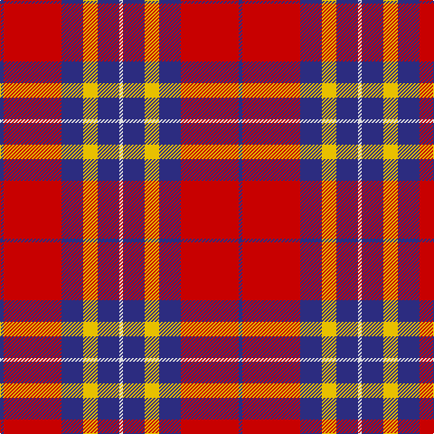

This page is one **sett** — a single exact thread-count. It belongs to the [tartan](/tartans/db1r16db6y4db6ln1/)
(the same proportion at any scale), whose colour order is pattern [BRBYBW](/stripes/brbybw/).

Sourced from tartans-authority.  It is a [6 stripe tartan](/stripes/stripes6/).

Original link http://www.tartansauthority.com/tartan-ferret/display/3187/

## Thread count
DB/4 R64 DB24 Y16 DB24 LN/4

## Palette
Each colour and the base-6 reference it is a variant of.

| Colour | Shade | Base |
|---|---|---|
| DB | <code style="background-color:#2C2C80;">#2C2C80</code> `oklch(35.0% 0.138 276.6)` <small>#2C2C80</small> | B <code style="background-color:#2A418A;">#2A418A</code> |
| LN | <code style="background-color:#E0E0E0;">#E0E0E0</code> `oklch(90.7% 0.000 89.9)` <small>#E0E0E0</small> | W <code style="background-color:#F7F7F7;">#F7F7F7</code> |
| R | <code style="background-color:#C80000;">#C80000</code> `oklch(52.3% 0.215 29.2)` <small>#C80000</small> | R <code style="background-color:#CC0000;">#CC0000</code> |
| Y | <code style="background-color:#E8C000;">#E8C000</code> `oklch(81.9% 0.168 93.7)` <small>#E8C000</small> | Y <code style="background-color:#F2BF00;">#F2BF00</code> |

# Sample pattern

## Nearest tartans

The nearest existing variants by ΔTartan distance, with this tartan at the top so the swatches line up against it.

ΔTartan

Tartan

Sett

—

<a href="/ttd/edit/#slug=db1r16db6ly4db6w1~x4">Superfast Ferries (Corporate)</a> <a class="nn-out" href="/setts/s6/db1r16db6ly4db6w1~x4/" title="open its dictionary page">↗</a>

0.72

<a href="/ttd/edit/#slug=k3r11db3w1db3w1~x4">Suntan (Masai Shuka) (District?)</a> <a class="nn-out" href="/setts/s6/k3r11db3w1db3w1~x4/" title="open its dictionary page">↗</a>

0.84

<a href="/ttd/edit/#slug=m3w1m20k8w8g2~x4">Nisbet Dress Rose (Dance)</a> <a class="nn-out" href="/setts/s6/m3w1m20k8w8g2~x4/" title="open its dictionary page">↗</a>

0.86

<a href="/ttd/edit/#slug=w2db3r24db15w6db3ly2~x2">Fazzolettone (Fashion?)</a> <a class="nn-out" href="/setts/s7/w2db3r24db15w6db3ly2~x2/" title="open its dictionary page">↗</a>

0.95

<a href="/ttd/edit/#slug=dg2r1db16r16db1ly2~x2">Galloway Dress (Yellow Line)</a> <a class="nn-out" href="/setts/s6/dg2r1db16r16db1ly2~x2/" title="open its dictionary page">↗</a>

0.99

<a href="/ttd/edit/#slug=g3r2db22r22db2w3~x2">Galloway Red</a> <a class="nn-out" href="/setts/s6/g3r2db22r22db2w3~x2/" title="open its dictionary page">↗</a>

1.01

<a href="/ttd/edit/#slug=r1db6r1dg6r12w1~x2">Fraser Red Clan Tartan Tartan Number: 1424. Earliest known date: 1842 Early references include Wilson's of Bannockburn, but Wilson did not name the sett. D W Stewart contends that this is in fact an early Grant tartan which he traced to a portrait of Robert Grant of Lurg (1678-1771), hanging at Troup House before it was closed around 1894. It is undoubtedly the most popular Fraser pattern today. See products available Copyright © Blair Urquhart, Comrie, 2015</a> <a class="nn-out" href="/setts/s6/r1db6r1dg6r12w1~x2/" title="open its dictionary page">↗</a>

1.03

<a href="/ttd/edit/#slug=r1db6r1dg6r12lb1">Fraser VS</a> <a class="nn-out" href="/setts/s6/r1db6r1dg6r12lb1/" title="open its dictionary page">↗</a>

1.06

<a href="/ttd/edit/#slug=w6g15db18r30g2r4~x2">Ruthven (V.S.)</a> <a class="nn-out" href="/setts/s6/w6g15db18r30g2r4~x2/" title="open its dictionary page">↗</a>

1.08

<a href="/ttd/edit/#slug=r6lb3r37k16lb16g4~x2">Nesbit, Rose</a> <a class="nn-out" href="/setts/s6/r6lb3r37k16lb16g4~x2/" title="open its dictionary page">↗</a>

1.13

<a href="/ttd/edit/#slug=g2r1db16r16db1ly2~x2">Galloway dress</a> <a class="nn-out" href="/setts/s6/g2r1db16r16db1ly2~x2/" title="open its dictionary page">↗</a>

## Neighbour map

Every grey dot is one of 14299 variants placed by the first two principal components of the ΔTartan feature space (44% of its variance). Red is this tartan; blue dots are its nearest — click one to open its page.

<svg viewBox="0 0 640 380" role="img" style="max-width:100%;height:auto;border:1px solid #e0e0e0;border-radius:4px;display:block" xmlns="http://www.w3.org/2000/svg"><image href="/nn/cloud.v1.png" width="640" height="380"/><a href="/setts/s6/k3r11db3w1db3w1~x4/"><circle cx="265.9" cy="177.9" r="4" fill="#3465a4"><title>Suntan (Masai Shuka) (District?)</title></circle></a><a href="/setts/s6/m3w1m20k8w8g2~x4/"><circle cx="301.4" cy="152.0" r="4" fill="#3465a4"><title>Nisbet Dress Rose (Dance)</title></circle></a><a href="/setts/s7/w2db3r24db15w6db3ly2~x2/"><circle cx="240.4" cy="158.3" r="4" fill="#3465a4"><title>Fazzolettone (Fashion?)</title></circle></a><a href="/setts/s6/dg2r1db16r16db1ly2~x2/"><circle cx="308.4" cy="166.9" r="4" fill="#3465a4"><title>Galloway Dress (Yellow Line)</title></circle></a><a href="/setts/s6/g3r2db22r22db2w3~x2/"><circle cx="277.4" cy="178.6" r="4" fill="#3465a4"><title>Galloway Red</title></circle></a><a href="/setts/s6/r1db6r1dg6r12w1~x2/"><circle cx="293.5" cy="188.1" r="4" fill="#3465a4"><title>Fraser Red Clan Tartan Tartan Number: 1424. Earliest known date: 1842 Early references include Wilson's of Bannockburn, but Wilson did not name the sett. D W Stewart contends that this is in fact an early Grant tartan which he traced to a portrait of Robert Grant of Lurg (1678-1771), hanging at Troup House before it was closed around 1894. It is undoubtedly the most popular Fraser pattern today. See products available Copyright © Blair Urquhart, Comrie, 2015</title></circle></a><a href="/setts/s6/r1db6r1dg6r12lb1/"><circle cx="281.5" cy="184.5" r="4" fill="#3465a4"><title>Fraser VS</title></circle></a><a href="/setts/s6/w6g15db18r30g2r4~x2/"><circle cx="241.9" cy="184.8" r="4" fill="#3465a4"><title>Ruthven (V.S.)</title></circle></a><a href="/setts/s6/r6lb3r37k16lb16g4~x2/"><circle cx="266.8" cy="172.0" r="4" fill="#3465a4"><title>Nesbit, Rose</title></circle></a><a href="/setts/s6/g2r1db16r16db1ly2~x2/"><circle cx="316.6" cy="172.0" r="4" fill="#3465a4"><title>Galloway dress</title></circle></a><circle cx="279.6" cy="168.2" r="5" fill="#c00000"/></svg>

ID: /setts/s6/db1r16db6ly4db6w1~x4/
