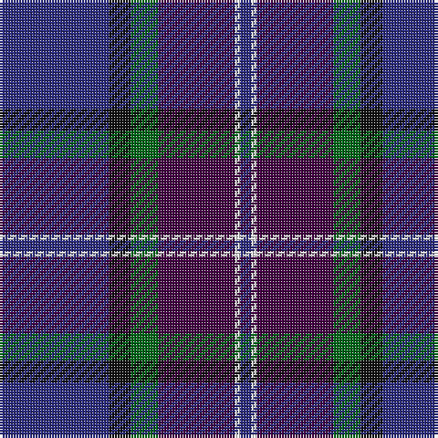

In pattern [BKGBWB](/stripes/bkgbwb/).

This was sourced from tartans-authority.  It is a [6 stripe tartan](/stripes/stripes6/).

Original link http://www.tartansauthority.com/tartan-ferret/display/10657/

## Thread count
DB/40 K8 G10 DP28 W2 DB/4

## Palette
Each colour and its ΔE from the base-6 reference it is a variant of.

| Colour | Shade | Base | ΔE (OKLab) |
|---|---|---|---|
| DB | <code style="background-color:#2C2C80;">#2C2C80</code> `#2C2C80` | B <code style="background-color:#2A418A;">#2A418A</code> | 0.06 |
| DP | <code style="background-color:#440044;">#440044</code> `#440044` | B <code style="background-color:#2A418A;">#2A418A</code> | 0.18 |
| G | <code style="background-color:#006818;">#006818</code> `#006818` | G <code style="background-color:#006100;">#006100</code> | 0.02 |
| K | <code style="background-color:#101010;">#101010</code> `#101010` | K <code style="background-color:#000000;">#000000</code> | 0.17 |
| W | <code style="background-color:#FCFCFC;">#FCFCFC</code> `#FCFCFC` | W <code style="background-color:#F7F7F7;">#F7F7F7</code> | 0.01 |

# Sample pattern

## Nearest tartans

The nearest existing variants by ΔTartan distance.

1. [World Federation of Building Contractors](/setts/s5/w4b44db19db44r2~x2/) — ΔT 1.15
1. [Charleston Police Department](/setts/s7/dp22lo10dp6lr18dp50db71k6/) — ΔT 1.22
1. [Monarchs Corporate Sport Tartan Tartan Number: 2222. Earliest known date: 2002 Designed by Enid Brown of Lyle & Scott Ltd for Gleneagles Golf Developments. To be used for golf clothing and accessories. The Monarch's Course, created in the early 1990's by Jack Nicklaus, was renamed The PGA Centenary Course in February 2001 to celebrate the centenary year of The Professional Golfer's Association and is the selected venue for the 2014 Ryder Cup. See products available Copyright © Blair Urquhart, Comrie, 2015](/setts/s6/db19k4dr1k4dg9k1~x4/) — ΔT 1.27
1. [First (Corporate)](/setts/s7/m4dp1m1dp12k6dt16w1~x2/) — ΔT 1.27
1. [Moray Council](/setts/s8/db8r2db33dt15g12lo2g2r2~x2/) — ΔT 1.31
1. [Hutchesons' Grammar (Corporate)](/setts/s6/t8o4db30dt30r3dt4~x2/) — ΔT 1.32
1. [Waters of Georgian Bay (District)](/setts/s6/db38w3db8db36dg9r3~x2/) — ΔT 1.37
1. [Moray (Corporate)](/setts/s8/db15dp3db30k22dg18dp3dg3w3~x2/) — ΔT 1.39
1. [MacFadzean](/setts/s6/db48w2k20dg22r3dg4~x2/) — ΔT 1.42
1. [Royal Marines Condor](/setts/s7/k8r4k36db48r6g3lo2~x2/) — ΔT 1.42

## Neighbour map

Every grey dot is one of 14299 variants placed by the first two principal components of the ΔTartan feature space (44% of its variance). Red is this tartan; blue dots are its nearest — click one to open its page.

<svg viewBox="0 0 640 380" role="img" style="max-width:100%;height:auto;border:1px solid #e0e0e0;border-radius:4px;display:block" xmlns="http://www.w3.org/2000/svg"><image href="/nn/cloud.v1.png" width="640" height="380"/><a href="/setts/s5/w4b44db19db44r2~x2/"><circle cx="264.9" cy="202.0" r="4" fill="#3465a4"><title>World Federation of Building Contractors</title></circle></a><a href="/setts/s7/dp22lo10dp6lr18dp50db71k6/"><circle cx="262.2" cy="200.0" r="4" fill="#3465a4"><title>Charleston Police Department</title></circle></a><a href="/setts/s6/db19k4dr1k4dg9k1~x4/"><circle cx="351.1" cy="211.8" r="4" fill="#3465a4"><title>Monarchs Corporate Sport Tartan Tartan Number: 2222. Earliest known date: 2002 Designed by Enid Brown of Lyle &amp; Scott Ltd for Gleneagles Golf Developments. To be used for golf clothing and accessories. The Monarch's Course, created in the early 1990's by Jack Nicklaus, was renamed The PGA Centenary Course in February 2001 to celebrate the centenary year of The Professional Golfer's Association and is the selected venue for the 2014 Ryder Cup. See products available Copyright © Blair Urquhart, Comrie, 2015</title></circle></a><a href="/setts/s7/m4dp1m1dp12k6dt16w1~x2/"><circle cx="252.4" cy="183.2" r="4" fill="#3465a4"><title>First (Corporate)</title></circle></a><a href="/setts/s8/db8r2db33dt15g12lo2g2r2~x2/"><circle cx="326.9" cy="180.8" r="4" fill="#3465a4"><title>Moray Council</title></circle></a><a href="/setts/s6/t8o4db30dt30r3dt4~x2/"><circle cx="279.8" cy="227.9" r="4" fill="#3465a4"><title>Hutchesons' Grammar (Corporate)</title></circle></a><a href="/setts/s6/db38w3db8db36dg9r3~x2/"><circle cx="307.5" cy="220.5" r="4" fill="#3465a4"><title>Waters of Georgian Bay (District)</title></circle></a><a href="/setts/s8/db15dp3db30k22dg18dp3dg3w3~x2/"><circle cx="255.1" cy="217.1" r="4" fill="#3465a4"><title>Moray (Corporate)</title></circle></a><a href="/setts/s6/db48w2k20dg22r3dg4~x2/"><circle cx="314.7" cy="182.8" r="4" fill="#3465a4"><title>MacFadzean</title></circle></a><a href="/setts/s7/k8r4k36db48r6g3lo2~x2/"><circle cx="320.8" cy="163.4" r="4" fill="#3465a4"><title>Royal Marines Condor</title></circle></a><circle cx="311.4" cy="197.1" r="5" fill="#c00000"/></svg>

ID: /setts/s6/db20k4g5dp14w1db2~x2/
