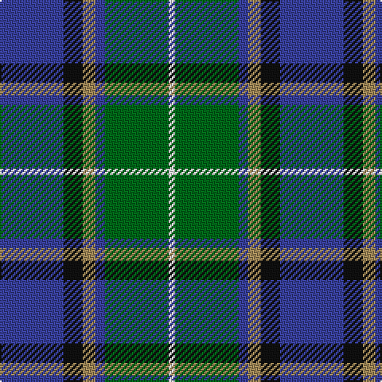

In pattern [BKYBGW](/stripes/bkybgw/).

This was sourced from tartans-authority.  It is a [6 stripe tartan](/stripes/stripes6/).

Original link http://www.tartansauthority.com/tartan-ferret/display/10658/

## Thread count
B/40 K12 LT8 B6 G40 W/4

## Palette
Each colour and the base-6 reference it is a variant of.

| Colour | Shade | Base |
|---|---|---|
| B | <code style="background-color:#38409C;">#38409C</code> `oklch(42.1% 0.148 274.4)` <small>#38409C</small> | B <code style="background-color:#2A418A;">#2A418A</code> |
| G | <code style="background-color:#006818;">#006818</code> `oklch(45.0% 0.142 145.0)` <small>#006818</small> | G <code style="background-color:#006100;">#006100</code> |
| K | <code style="background-color:#101010;">#101010</code> `oklch(17.3% 0.000 89.9)` <small>#101010</small> | K <code style="background-color:#000000;">#000000</code> |
| LT | <code style="background-color:#A08858;">#A08858</code> `oklch(63.7% 0.071 84.0)` <small>#A08858</small> | Y <code style="background-color:#F2BF00;">#F2BF00</code> |
| W | <code style="background-color:#FCFCFC;">#FCFCFC</code> `oklch(99.1% 0.000 89.9)` <small>#FCFCFC</small> | W <code style="background-color:#F7F7F7;">#F7F7F7</code> |

# Sample pattern

## Nearest tartans

The nearest existing variants by ΔTartan distance, with this tartan at the top so the swatches line up against it.

ΔTartan

Tartan

Sett

—

<a href="/ttd/edit/#slug=db20k6lo4db3g20w2~x2">DeLoughery (Personal)</a> <a class="nn-out" href="/setts/s6/db20k6lo4db3g20w2~x2/" title="open its dictionary page">↗</a>

0.52

<a href="/ttd/edit/#slug=b11k4g4m1g4k1r1~x4">Ednie (Personal)</a> <a class="nn-out" href="/setts/s7/b11k4g4m1g4k1r1~x4/" title="open its dictionary page">↗</a>

0.66

<a href="/ttd/edit/#slug=k6g15w2db22r2k4~x2">Leslie, Hebridean</a> <a class="nn-out" href="/setts/s6/k6g15w2db22r2k4~x2/" title="open its dictionary page">↗</a>

0.68

<a href="/ttd/edit/#slug=k2ly1g10db10w1~x6">Turnbull Hunting (1983) #2</a> <a class="nn-out" href="/setts/s5/k2ly1g10db10w1~x6/" title="open its dictionary page">↗</a>

0.73

<a href="/ttd/edit/#slug=r2ly1g10db10w1~x6">Turnbull Hunting (Name)</a> <a class="nn-out" href="/setts/s5/r2ly1g10db10w1~x6/" title="open its dictionary page">↗</a>

0.76

<a href="/ttd/edit/#slug=r7ly3dg28db28w3~x2">Turnbull Hunting</a> <a class="nn-out" href="/setts/s5/r7ly3dg28db28w3~x2/" title="open its dictionary page">↗</a>

0.78

<a href="/ttd/edit/#slug=b5dy28lb5k20lo5b47lo4~x2">State Seal of Washington (Fashion)</a> <a class="nn-out" href="/setts/s7/b5dy28lb5k20lo5b47lo4~x2/" title="open its dictionary page">↗</a>

0.78

<a href="/ttd/edit/#slug=db22w2k10g11r3g4~x2">Paterson Blue (Personal)</a> <a class="nn-out" href="/setts/s6/db22w2k10g11r3g4~x2/" title="open its dictionary page">↗</a>

0.78

<a href="/ttd/edit/#slug=dg5lp3dg32k16b32m3b5~x2">MacThomas (Clan)</a> <a class="nn-out" href="/setts/s7/dg5lp3dg32k16b32m3b5~x2/" title="open its dictionary page">↗</a>

0.79

<a href="/ttd/edit/#slug=k7lb3g18db18w2~x2">Bhatti (Name)</a> <a class="nn-out" href="/setts/s5/k7lb3g18db18w2~x2/" title="open its dictionary page">↗</a>

0.80

<a href="/ttd/edit/#slug=k1db1g8db8w1~x4">Douglas, Green (Wilsons)</a> <a class="nn-out" href="/setts/s5/k1db1g8db8w1~x4/" title="open its dictionary page">↗</a>

## Neighbour map

Every grey dot is one of 14299 variants placed by the first two principal components of the ΔTartan feature space (44% of its variance). Red is this tartan; blue dots are its nearest — click one to open its page.

<svg viewBox="0 0 640 380" role="img" style="max-width:100%;height:auto;border:1px solid #e0e0e0;border-radius:4px;display:block" xmlns="http://www.w3.org/2000/svg"><image href="/nn/cloud.v1.png" width="640" height="380"/><a href="/setts/s7/b11k4g4m1g4k1r1~x4/"><circle cx="213.1" cy="194.5" r="4" fill="#3465a4"><title>Ednie (Personal)</title></circle></a><a href="/setts/s6/k6g15w2db22r2k4~x2/"><circle cx="214.6" cy="197.6" r="4" fill="#3465a4"><title>Leslie, Hebridean</title></circle></a><a href="/setts/s5/k2ly1g10db10w1~x6/"><circle cx="215.6" cy="204.5" r="4" fill="#3465a4"><title>Turnbull Hunting (1983) #2</title></circle></a><a href="/setts/s5/r2ly1g10db10w1~x6/"><circle cx="220.9" cy="202.5" r="4" fill="#3465a4"><title>Turnbull Hunting (Name)</title></circle></a><a href="/setts/s5/r7ly3dg28db28w3~x2/"><circle cx="224.8" cy="218.4" r="4" fill="#3465a4"><title>Turnbull Hunting</title></circle></a><a href="/setts/s7/b5dy28lb5k20lo5b47lo4~x2/"><circle cx="219.0" cy="176.9" r="4" fill="#3465a4"><title>State Seal of Washington (Fashion)</title></circle></a><a href="/setts/s6/db22w2k10g11r3g4~x2/"><circle cx="204.0" cy="204.8" r="4" fill="#3465a4"><title>Paterson Blue (Personal)</title></circle></a><a href="/setts/s7/dg5lp3dg32k16b32m3b5~x2/"><circle cx="213.8" cy="200.8" r="4" fill="#3465a4"><title>MacThomas (Clan)</title></circle></a><a href="/setts/s5/k7lb3g18db18w2~x2/"><circle cx="167.9" cy="220.5" r="4" fill="#3465a4"><title>Bhatti (Name)</title></circle></a><a href="/setts/s5/k1db1g8db8w1~x4/"><circle cx="219.2" cy="217.1" r="4" fill="#3465a4"><title>Douglas, Green (Wilsons)</title></circle></a><circle cx="206.8" cy="203.1" r="5" fill="#c00000"/></svg>

ID: /setts/s6/db20k6lo4db3g20w2~x2/
