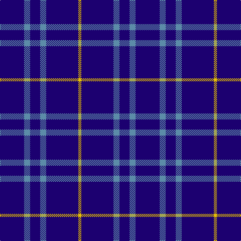

This page is one **sett** — a single exact thread-count. It belongs to the [tartan](/tartans/db24b6db10b6db32y3/)
(the same proportion at any scale), whose colour order is pattern [BBBBBY](/stripes/bbbbby/).

Sourced from register-of-tartans.  It is a [6 stripe tartan](/stripes/stripes6/).

Original link https://www.tartanregister.gov.uk/tartanDetails.aspx?ref=4037

2 attestations — the source records this cloth was collapsed from (oldest owns this page)

<ul>
<li>01/01/1996 — Sultan of Qaboo's Air Force (register-of-tartans, <a href="https://www.tartanregister.gov.uk/tartanDetails.aspx?ref=4037">record</a>)</li>
<li>pre 1996 — Sultan of Qaboo's Air Force (Milit.) (tartans-authority, <a href="http://www.tartansauthority.com/tartan-ferret/display/5165/">record</a>)</li>
</ul>

## Register references

External register numbers recorded for this tartan.

- Scottish Register of Tartans: [4037](https://www.tartanregister.gov.uk/tartanDetails.aspx?ref=4037)
- Scottish Tartans Authority (ITI): 5165

## Thread count
DB/48 B12 DB20 B12 DB64 Y/6

## Palette
Each colour and the base-6 reference it is a variant of.

| Colour | Shade | Base |
|---|---|---|
| B | <code style="background-color:#5C8CA8;">#5C8CA8</code> `oklch(61.7% 0.067 235.0)` <small>#5C8CA8</small> | B <code style="background-color:#2A418A;">#2A418A</code> |
| DB | <code style="background-color:#1C0070;">#1C0070</code> `oklch(26.3% 0.162 277.1)` <small>#1C0070</small> | B <code style="background-color:#2A418A;">#2A418A</code> |
| Y | <code style="background-color:#E8C000;">#E8C000</code> `oklch(81.9% 0.168 93.7)` <small>#E8C000</small> | Y <code style="background-color:#F2BF00;">#F2BF00</code> |

# Sample pattern

## Nearest tartans

The nearest existing variants by ΔTartan distance, with this tartan at the top so the swatches line up against it.

ΔTartan

Tartan

Sett

—

<a href="/ttd/edit/#slug=db24t6db10t6db32ly3~x2">Sultan of Qaboo's Air Force</a> <a class="nn-out" href="/setts/s6/db24t6db10t6db32ly3~x2/" title="open its dictionary page">↗</a>

1.55

<a href="/ttd/edit/#slug=r1db9lo2db9lo1~x4">Brooks Brothers Tattersall Blue</a> <a class="nn-out" href="/setts/s5/r1db9lo2db9lo1~x4/" title="open its dictionary page">↗</a>

1.63

<a href="/ttd/edit/#slug=db16r4db3r1~x2">Elliott</a> <a class="nn-out" href="/setts/s4/db16r4db3r1~x2/" title="open its dictionary page">↗</a>

1.66

<a href="/ttd/edit/#slug=db9k9db9k9db42w5~x2">Dollar Academy (1930s) (Corporate)</a> <a class="nn-out" href="/setts/s6/db9k9db9k9db42w5~x2/" title="open its dictionary page">↗</a>

1.81

<a href="/ttd/edit/#slug=db72t6db12t17w6~x2">Gulfmark (Corporate)</a> <a class="nn-out" href="/setts/s5/db72t6db12t17w6~x2/" title="open its dictionary page">↗</a>

1.83

<a href="/ttd/edit/#slug=db9k9db9k9db42lb5~x2">Dollar Academy</a> <a class="nn-out" href="/setts/s6/db9k9db9k9db42lb5~x2/" title="open its dictionary page">↗</a>

1.88

<a href="/ttd/edit/#slug=dt50k12dt21w5~x2">Coinean Dubh</a> <a class="nn-out" href="/setts/s4/dt50k12dt21w5~x2/" title="open its dictionary page">↗</a>

1.92

<a href="/ttd/edit/#slug=db35w4db10m3r3m3~x4">Steffen, Markus (Personal)</a> <a class="nn-out" href="/setts/s6/db35w4db10m3r3m3~x4/" title="open its dictionary page">↗</a>

1.97

<a href="/ttd/edit/#slug=db35lr8db21lr13db6lo4~x2">Ochterlonie</a> <a class="nn-out" href="/setts/s6/db35lr8db21lr13db6lo4~x2/" title="open its dictionary page">↗</a>

1.98

<a href="/ttd/edit/#slug=k4k12k3o7k26o3~x2">Crombie House Check</a> <a class="nn-out" href="/setts/s6/k4k12k3o7k26o3~x2/" title="open its dictionary page">↗</a>

1.98

<a href="/ttd/edit/#slug=db35w4db10r3r3r3~x4">Steffen, Morris (Personal)</a> <a class="nn-out" href="/setts/s6/db35w4db10r3r3r3~x4/" title="open its dictionary page">↗</a>

## Neighbour map

Every grey dot is one of 14299 variants placed by the first two principal components of the ΔTartan feature space (44% of its variance). Red is this tartan; blue dots are its nearest — click one to open its page.

<svg viewBox="0 0 640 380" role="img" style="max-width:100%;height:auto;border:1px solid #e0e0e0;border-radius:4px;display:block" xmlns="http://www.w3.org/2000/svg"><image href="/nn/cloud.v1.png" width="640" height="380"/><a href="/setts/s5/r1db9lo2db9lo1~x4/"><circle cx="543.9" cy="269.1" r="4" fill="#3465a4"><title>Brooks Brothers Tattersall Blue</title></circle></a><a href="/setts/s4/db16r4db3r1~x2/"><circle cx="554.6" cy="251.1" r="4" fill="#3465a4"><title>Elliott</title></circle></a><a href="/setts/s6/db9k9db9k9db42w5~x2/"><circle cx="448.5" cy="249.6" r="4" fill="#3465a4"><title>Dollar Academy (1930s) (Corporate)</title></circle></a><a href="/setts/s5/db72t6db12t17w6~x2/"><circle cx="496.7" cy="232.9" r="4" fill="#3465a4"><title>Gulfmark (Corporate)</title></circle></a><a href="/setts/s6/db9k9db9k9db42lb5~x2/"><circle cx="464.1" cy="257.7" r="4" fill="#3465a4"><title>Dollar Academy</title></circle></a><a href="/setts/s4/dt50k12dt21w5~x2/"><circle cx="508.5" cy="276.5" r="4" fill="#3465a4"><title>Coinean Dubh</title></circle></a><a href="/setts/s6/db35w4db10m3r3m3~x4/"><circle cx="466.8" cy="192.8" r="4" fill="#3465a4"><title>Steffen, Markus (Personal)</title></circle></a><a href="/setts/s6/db35lr8db21lr13db6lo4~x2/"><circle cx="388.0" cy="238.8" r="4" fill="#3465a4"><title>Ochterlonie</title></circle></a><a href="/setts/s6/k4k12k3o7k26o3~x2/"><circle cx="552.8" cy="280.2" r="4" fill="#3465a4"><title>Crombie House Check</title></circle></a><a href="/setts/s6/db35w4db10r3r3r3~x4/"><circle cx="494.8" cy="196.4" r="4" fill="#3465a4"><title>Steffen, Morris (Personal)</title></circle></a><circle cx="511.2" cy="252.1" r="5" fill="#c00000"/></svg>

ID: /setts/s6/db24t6db10t6db32ly3~x2/
