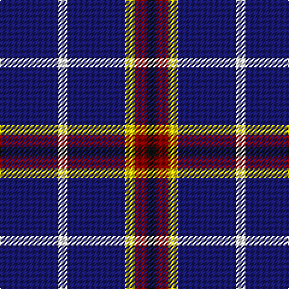

This page is one **sett** — a single exact thread-count. It belongs to the [tartan](/tartans/db24w4db24ly4r5k4/)
(the same proportion at any scale), whose colour order is pattern [BWBYRK](/stripes/bwbyrk/).

Sourced from register-of-tartans.  It is a [6 stripe tartan](/stripes/stripes6/).

Original link https://www.tartanregister.gov.uk/tartanDetails.aspx?ref=10045

## Register references

External register numbers recorded for this tartan.

- Scottish Register of Tartans: [10045](https://www.tartanregister.gov.uk/tartanDetails.aspx?ref=10045)

## Thread count
DB/48 W8 DB48 Y8 DR10 K/8

## Palette

Palette: <strong>Tartan Register</strong> <small style="color:#888">(3 of 5 colours)</small>
<table><thead><tr><th>Colour</th><th>Threads</th><th>Shade</th><th>Base</th><th>OKLCh</th></tr></thead><tbody><tr><td>DB/</td><td style="text-align:right;font-variant-numeric:tabular-nums">48</td><td><code style="background-color:#191970;">#191970</code> <small style="color:#888">#191970</small></td><td>B <code style="background-color:#2A418A;">#2A418A</code></td><td><small style="color:#888">oklch(28.8% 0.144 272.8)</small></td></tr><tr><td>W</td><td style="text-align:right;font-variant-numeric:tabular-nums">8</td><td><code style="background-color:#FFFFFF;">#FFFFFF</code> <small style="color:#888">#FFFFFF</small></td><td>W <code style="background-color:#F7F7F7;">#F7F7F7</code></td><td><small style="color:#888">oklch(100.0% 0.000 89.9)</small></td></tr><tr><td>DB</td><td style="text-align:right;font-variant-numeric:tabular-nums">48</td><td><code style="background-color:#191970;">#191970</code> <small style="color:#888">#191970</small></td><td>B <code style="background-color:#2A418A;">#2A418A</code></td><td><small style="color:#888">oklch(28.8% 0.144 272.8)</small></td></tr><tr><td>Y</td><td style="text-align:right;font-variant-numeric:tabular-nums">8</td><td><code style="background-color:#FFD700;">#FFD700</code> <small style="color:#888">#FFD700</small></td><td>Y <code style="background-color:#F2BF00;">#F2BF00</code></td><td><small style="color:#888">oklch(88.7% 0.182 95.3)</small></td></tr><tr><td>DR</td><td style="text-align:right;font-variant-numeric:tabular-nums">10</td><td><code style="background-color:#8B0000;">#8B0000</code> <small style="color:#888">#8B0000</small></td><td>R <code style="background-color:#CC0000;">#CC0000</code></td><td><small style="color:#888">oklch(40.0% 0.164 29.2)</small></td></tr><tr><td>K/</td><td style="text-align:right;font-variant-numeric:tabular-nums">8</td><td><code style="background-color:#101010;">#101010</code> <small style="color:#888">#101010</small></td><td>K <code style="background-color:#000000;">#000000</code></td><td><small style="color:#888">oklch(17.3% 0.000 89.9)</small></td></tr></tbody></table>

# Sample pattern

## Nearest tartans

The nearest existing variants by ΔTartan distance, with this tartan at the top so the swatches line up against it.

ΔTartan

Tartan

Sett

—

<a href="/ttd/edit/#slug=db24w4db24ly4r5k4~x2">De Grussa</a> <a class="nn-out" href="/setts/s6/db24w4db24ly4r5k4~x2/" title="open its dictionary page">↗</a>

0.92

<a href="/ttd/edit/#slug=db24w4db24lo4r5k4~x2">de Grussa (Personal)</a> <a class="nn-out" href="/setts/s6/db24w4db24lo4r5k4~x2/" title="open its dictionary page">↗</a>

1.50

<a href="/ttd/edit/#slug=r5db15g3db15ly3db3~x2">Abertay University (Estimated threadcount)</a> <a class="nn-out" href="/setts/s6/r5db15g3db15ly3db3~x2/" title="open its dictionary page">↗</a>

1.55

<a href="/ttd/edit/#slug=db65k9db21ly8db21w8db35r35">Maud, Mary</a> <a class="nn-out" href="/setts/s8/db65k9db21ly8db21w8db35r35/" title="open its dictionary page">↗</a>

1.72

<a href="/ttd/edit/#slug=lo4db23k4g16db23lb4">Baptist Union of Scotland</a> <a class="nn-out" href="/setts/s6/lo4db23k4g16db23lb4/" title="open its dictionary page">↗</a>

1.81

<a href="/ttd/edit/#slug=db8r1w1r1k1~x8">Laing of Archiestown</a> <a class="nn-out" href="/setts/s5/db8r1w1r1k1~x8/" title="open its dictionary page">↗</a>

1.81

<a href="/ttd/edit/#slug=db14m3db14dy6db14w4db14ly3~x2">Columba of Iona (School)</a> <a class="nn-out" href="/setts/s8/db14m3db14dy6db14w4db14ly3~x2/" title="open its dictionary page">↗</a>

1.82

<a href="/setts/s6/r3lo2k10w1~x6/">St. Eloi</a>

1.84

<a href="/ttd/edit/#slug=db8r1k1lr1~x10">Kucher, Gregory</a> <a class="nn-out" href="/setts/s4/db8r1k1lr1~x10/" title="open its dictionary page">↗</a>

1.87

<a href="/ttd/edit/#slug=db19r2w2r2k2~x4">Laing of Archiestown</a> <a class="nn-out" href="/setts/s5/db19r2w2r2k2~x4/" title="open its dictionary page">↗</a>

1.88

<a href="/ttd/edit/#slug=lo1db6k5db6lb1~x6">Bank of Scotland (1995)</a> <a class="nn-out" href="/setts/s5/lo1db6k5db6lb1~x6/" title="open its dictionary page">↗</a>

## Neighbour map

Every grey dot is one of 14359 variants placed by the first two principal components of the ΔTartan feature space (44% of its variance). Red is this tartan; blue dots are its nearest — click one to open its page.

<svg viewBox="0 0 640 380" role="img" style="max-width:100%;height:auto;border:1px solid #e0e0e0;border-radius:4px;display:block" xmlns="http://www.w3.org/2000/svg"><image href="/nn/cloud.v1.png" width="640" height="380"/><a href="/setts/s6/db24w4db24lo4r5k4~x2/"><circle cx="376.6" cy="221.6" r="4" fill="#3465a4"><title>de Grussa (Personal)</title></circle></a><a href="/setts/s6/r5db15g3db15ly3db3~x2/"><circle cx="400.8" cy="256.3" r="4" fill="#3465a4"><title>Abertay University (Estimated threadcount)</title></circle></a><a href="/setts/s8/db65k9db21ly8db21w8db35r35/"><circle cx="349.3" cy="204.7" r="4" fill="#3465a4"><title>Maud, Mary</title></circle></a><a href="/setts/s6/lo4db23k4g16db23lb4/"><circle cx="274.4" cy="236.1" r="4" fill="#3465a4"><title>Baptist Union of Scotland</title></circle></a><a href="/setts/s5/db8r1w1r1k1~x8/"><circle cx="369.3" cy="199.8" r="4" fill="#3465a4"><title>Laing of Archiestown</title></circle></a><a href="/setts/s8/db14m3db14dy6db14w4db14ly3~x2/"><circle cx="375.6" cy="252.0" r="4" fill="#3465a4"><title>Columba of Iona (School)</title></circle></a><a href="/setts/s6/r3lo2k10w1~x6/"><circle cx="376.0" cy="216.8" r="4" fill="#3465a4"><title>St. Eloi</title></circle></a><a href="/setts/s4/db8r1k1lr1~x10/"><circle cx="422.6" cy="233.4" r="4" fill="#3465a4"><title>Kucher, Gregory</title></circle></a><a href="/setts/s5/db19r2w2r2k2~x4/"><circle cx="413.9" cy="194.3" r="4" fill="#3465a4"><title>Laing of Archiestown</title></circle></a><a href="/setts/s5/lo1db6k5db6lb1~x6/"><circle cx="295.8" cy="264.2" r="4" fill="#3465a4"><title>Bank of Scotland (1995)</title></circle></a><circle cx="359.3" cy="214.5" r="5" fill="#c00000"/></svg>

ID: /setts/s6/db24w4db24ly4r5k4~x2/
