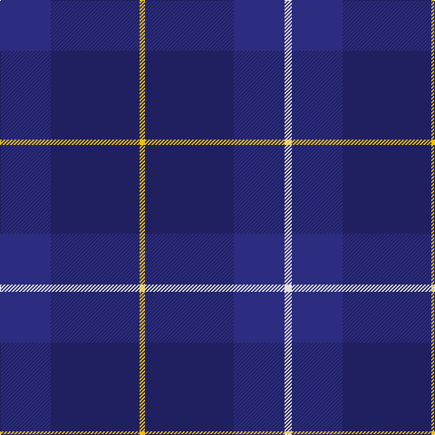

**Bands:** [BBYBBW](/stripes/bbybbw/) · **Stripes:** [DB DB LY DB DB W](/stripes/stripes6/) DB DB LY DB DB W

This was sourced from house-of-tartan.  It is a [6 band tartan](/bands/bands6/).

Original link http://www.house-of-tartan.scotland.net/house/TartanViewjs.asp?colr=Def&tnam=1758

## Thread count
DB/56 DBa98 Y6 DBa98 DB56 LN/8

## Palette
Each colour and its ΔE from the base-6 reference it is a variant of.

| Colour | Shade | Base | ΔE (OKLab) |
|---|---|---|---|
| DB | <code style="background-color:#2C2C80;">#2C2C80</code> `#2C2C80` | B <code style="background-color:#2A418A;">#2A418A</code> | 0.06 |
| DBa | <code style="background-color:#202060;">#202060</code> `#202060` | B <code style="background-color:#2A418A;">#2A418A</code> | 0.11 |
| LN | <code style="background-color:#E0E0E0;">#E0E0E0</code> `#E0E0E0` | W <code style="background-color:#F7F7F7;">#F7F7F7</code> | 0.07 |
| R | <code style="background-color:#C8002C;">#C8002C</code> `#C8002C` | R <code style="background-color:#CC0000;">#CC0000</code> | 0.03 |
| Y | <code style="background-color:#E8C000;">#E8C000</code> `#E8C000` | Y <code style="background-color:#F2BF00;">#F2BF00</code> | 0.02 |

# Sample pattern

## Nearest tartans

The nearest existing variants by ΔTartan distance.

1. [St. George's (Birmingham) (School)](/setts/s7/r4dt21w2dt20db21dt2db2~x2/) — ΔT 1.80
1. [St. George's School (Birmingham)](/setts/s12/db2dt2db21dt20w2dt21r4dt21w2dt20db21dt2~x2/) — ΔT 1.88
1. [Edinburgh Monarchs](/setts/s8/dt5db4dr1db14dt14dr1dt5lo3~x2/) — ΔT 1.96
1. [Brash](/setts/s9/db60r5db60dt40db36r10db36dt40w5/) — ΔT 1.97
1. [US Navy Edzell](/setts/s6/dt104db16w8db66r3db16/) — ΔT 2.00
1. [Ewell Castle School](/setts/s6/dt4r1dt18dt18w1dt4~x4/) — ΔT 2.12
1. [Open Championship (2000)](/setts/s5/dg1db2db5db10ly1~x8/) — ΔT 2.14
1. [Craig Devlin (Dundee) (Personal)](/setts/s6/dg8w3dt6db11dt30db5~x2/) — ΔT 2.48
1. [Hughes Welsh Name Tartan Tartan Number: 5756. Earliest known date: 2002 The tartan for this Welsh surname and its variations, Hugh, Hullin, Hullyn, Huws, Pugh, Tugh, Hoell, is actually woven in Wales at the Cambrian Woollen Mill, weaving on the same site since 1830. This tartan differs from many traditional patterns in that the warp and weft differ, giving the finished worsted wool cloth more of a predominant stripe, vertically noticeable in the finished Kilt, or Cilt in Wales. See products available Copyright © Blair Urquhart, Comrie, 2015](/setts/s11/g4db34dt20db4dt8db6r2db5dt2db3g4/) — ΔT 2.51
1. [Argentina Argentinian District Tartan Tartan Number: 2487. Earliest known date: 1998 Original notes said: Designed by the St Andrew's Society of the River Plate for Scots living in Argentina. But in May 2005 notes were submitted by the designer Edward Macrae, a Scottish-Argentinian who designed the Argentina District Tartan in 1998. It is based in the sett of the Robertson tartan honouring John and William Robertson two Scotsmen from Kelso who started the first settlement of Scottish immigrants in Argentina. 220 emigrants left the port of Leith on board of the Symmetry and arrived in Buenos Aires on August 8, 1825 settling in a ranch 20 miles south-west of the city in the area of Monte Grande and called Santa Catalina. The tartan combines the colours of the Argentine and Scottish flags. Blue, navy blue and white are part of the iconography used in sports and national symbols representing Argentina. See products available Copyright © Blair Urquhart, Comrie, 2015](/setts/s12/db36db3db3db33w3db5w3db33db3db3db36db3~x2/) — ΔT 2.52

## Neighbour map

Every grey dot is one of 14313 variants placed by the first two principal components of the ΔTartan feature space (44% of its variance). Red is this tartan; blue dots are its nearest — click one to open its page.

<svg viewBox="0 0 640 380" role="img" style="max-width:100%;height:auto;border:1px solid #e0e0e0;border-radius:4px;display:block" xmlns="http://www.w3.org/2000/svg"><image href="/nn/cloud.v1.png" width="640" height="380"/><a href="/setts/s7/r4dt21w2dt20db21dt2db2~x2/"><circle cx="409.2" cy="257.2" r="4" fill="#3465a4"><title>St. George's (Birmingham) (School)</title></circle></a><a href="/setts/s12/db2dt2db21dt20w2dt21r4dt21w2dt20db21dt2~x2/"><circle cx="425.5" cy="252.7" r="4" fill="#3465a4"><title>St. George's School (Birmingham)</title></circle></a><a href="/setts/s8/dt5db4dr1db14dt14dr1dt5lo3~x2/"><circle cx="386.7" cy="253.9" r="4" fill="#3465a4"><title>Edinburgh Monarchs</title></circle></a><a href="/setts/s9/db60r5db60dt40db36r10db36dt40w5/"><circle cx="431.0" cy="269.8" r="4" fill="#3465a4"><title>Brash</title></circle></a><a href="/setts/s6/dt104db16w8db66r3db16/"><circle cx="458.6" cy="228.7" r="4" fill="#3465a4"><title>US Navy Edzell</title></circle></a><a href="/setts/s6/dt4r1dt18dt18w1dt4~x4/"><circle cx="414.7" cy="250.3" r="4" fill="#3465a4"><title>Ewell Castle School</title></circle></a><a href="/setts/s5/dg1db2db5db10ly1~x8/"><circle cx="422.5" cy="265.1" r="4" fill="#3465a4"><title>Open Championship (2000)</title></circle></a><a href="/setts/s6/dg8w3dt6db11dt30db5~x2/"><circle cx="372.5" cy="263.9" r="4" fill="#3465a4"><title>Craig Devlin (Dundee) (Personal)</title></circle></a><a href="/setts/s11/g4db34dt20db4dt8db6r2db5dt2db3g4/"><circle cx="477.4" cy="239.2" r="4" fill="#3465a4"><title>Hughes Welsh Name Tartan Tartan Number: 5756. Earliest known date: 2002 The tartan for this Welsh surname and its variations, Hugh, Hullin, Hullyn, Huws, Pugh, Tugh, Hoell, is actually woven in Wales at the Cambrian Woollen Mill, weaving on the same site since 1830. This tartan differs from many traditional patterns in that the warp and weft differ, giving the finished worsted wool cloth more of a predominant stripe, vertically noticeable in the finished Kilt, or Cilt in Wales. See products available Copyright © Blair Urquhart, Comrie, 2015</title></circle></a><a href="/setts/s12/db36db3db3db33w3db5w3db33db3db3db36db3~x2/"><circle cx="448.6" cy="260.1" r="4" fill="#3465a4"><title>Argentina Argentinian District Tartan Tartan Number: 2487. Earliest known date: 1998 Original notes said: Designed by the St Andrew's Society of the River Plate for Scots living in Argentina. But in May 2005 notes were submitted by the designer Edward Macrae, a Scottish-Argentinian who designed the Argentina District Tartan in 1998. It is based in the sett of the Robertson tartan honouring John and William Robertson two Scotsmen from Kelso who started the first settlement of Scottish immigrants in Argentina. 220 emigrants left the port of Leith on board of the Symmetry and arrived in Buenos Aires on August 8, 1825 settling in a ranch 20 miles south-west of the city in the area of Monte Grande and called Santa Catalina. The tartan combines the colours of the Argentine and Scottish flags. Blue, navy blue and white are part of the iconography used in sports and national symbols representing Argentina. See products available Copyright © Blair Urquhart, Comrie, 2015</title></circle></a><circle cx="455.7" cy="282.7" r="5" fill="#c00000"/></svg>

ID: /setts/s6/db28db49ly3db49db28w4~x2/
