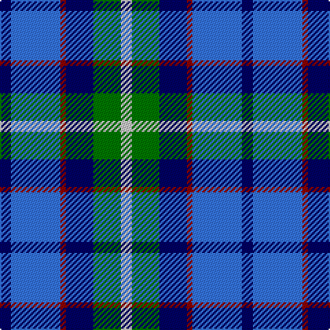

In pattern [BBRBGW](/stripes/bbrbgw/).

This was sourced from register-of-tartans.  It is a [6 stripe tartan](/stripes/stripes6/).

Original link https://www.tartanregister.gov.uk/tartanDetails.aspx?ref=68

## Attestations

This cloth appears in 2 source records; the oldest owns this page.

- 01/04/1997 — American Express (register-of-tartans, [record](https://www.tartanregister.gov.uk/tartanDetails.aspx?ref=68))
- April 1997 — American Express (Corporate) (tartans-authority, [record](http://www.tartansauthority.com/tartan-ferret/display/2354/))

## Register references

External register numbers recorded for this tartan.

- Scottish Register of Tartans: [68](https://www.tartanregister.gov.uk/tartanDetails.aspx?ref=68)
- Scottish Tartans Authority (ITI): 2354
- Scottish Tartans World Register: 2354

## Thread count
DB/8 B36 DR4 DB20 G20 N/8

## Palette
Each colour and its ΔE from the base-6 reference it is a variant of.

| Colour | Shade | Base | ΔE (OKLab) |
|---|---|---|---|
| B | <code style="background-color:#3474FC;">#3474FC</code> `#3474FC` | B <code style="background-color:#2A418A;">#2A418A</code> | 0.22 |
| DB | <code style="background-color:#000064;">#000064</code> `#000064` | B <code style="background-color:#2A418A;">#2A418A</code> | 0.18 |
| DR | <code style="background-color:#8C0000;">#8C0000</code> `#8C0000` | R <code style="background-color:#CC0000;">#CC0000</code> | 0.14 |
| G | <code style="background-color:#007800;">#007800</code> `#007800` | G <code style="background-color:#006100;">#006100</code> | 0.07 |
| N | <code style="background-color:#C8C8C8;">#C8C8C8</code> `#C8C8C8` | W <code style="background-color:#F7F7F7;">#F7F7F7</code> | 0.14 |

# Sample pattern

## Nearest tartans

The nearest existing variants by ΔTartan distance.

1. [RSCDS Australia? (Corporate)](/setts/s5/r2db12k5t16w2~x4/) — ΔT 1.05
1. [American Express Corporate Tartan Tartan Number: 2354. Earliest known date: April 1997 American Express began operating in Glasgow in 1903 and in 1920 acquired WA Williamson Ltd of Glasgow. This tartan (commissioned by VP Donald Daly) was designed for the 1997 American Association of Travel Agents conference in Glasgow and based on the MacWilliam tartan. For more details see archives. See products available Copyright © Blair Urquhart, Comrie, 2015](/setts/s10/b9r1db5g5lb2g5db5r1b9db2~x4/) — ΔT 1.11
1. [American Express](/setts/s6/db2b9m1db9dg9w2~x4/) — ΔT 1.23
1. [Strathclyde](/setts/s7/k4db2k15w10b15db2b4~x2/) — ΔT 1.27
1. [Bryson (1988) (Name)](/setts/s5/lr2r1t7db7lb1~x8/) — ΔT 1.29
1. [Hummelt, Katherine (Personal)](/setts/s8/db11dg10y6db7lt2db3dp10lt2~x2/) — ΔT 1.30
1. [F.I.A.T.A. Congress of 1990](/setts/s7/dg12b8db4ly2r1ly1db6~x4/) — ΔT 1.34
1. [Icelandair](/setts/s7/db3t24k11db20w2db5lo3~x2/) — ΔT 1.38
1. [(1) Skene](/setts/s6/b24k4r3g24k4ly3~x2/) — ΔT 1.40
1. [Bryson (1988)](/setts/s5/y16r8b57db56lb8/) — ΔT 1.41

## Neighbour map

Every grey dot is one of 14299 variants placed by the first two principal components of the ΔTartan feature space (44% of its variance). Red is this tartan; blue dots are its nearest — click one to open its page.

<svg viewBox="0 0 640 380" role="img" style="max-width:100%;height:auto;border:1px solid #e0e0e0;border-radius:4px;display:block" xmlns="http://www.w3.org/2000/svg"><image href="/nn/cloud.v1.png" width="640" height="380"/><a href="/setts/s5/r2db12k5t16w2~x4/"><circle cx="182.3" cy="214.5" r="4" fill="#3465a4"><title>RSCDS Australia? (Corporate)</title></circle></a><a href="/setts/s10/b9r1db5g5lb2g5db5r1b9db2~x4/"><circle cx="136.6" cy="194.6" r="4" fill="#3465a4"><title>American Express Corporate Tartan Tartan Number: 2354. Earliest known date: April 1997 American Express began operating in Glasgow in 1903 and in 1920 acquired WA Williamson Ltd of Glasgow. This tartan (commissioned by VP Donald Daly) was designed for the 1997 American Association of Travel Agents conference in Glasgow and based on the MacWilliam tartan. For more details see archives. See products available Copyright © Blair Urquhart, Comrie, 2015</title></circle></a><a href="/setts/s6/db2b9m1db9dg9w2~x4/"><circle cx="126.8" cy="207.5" r="4" fill="#3465a4"><title>American Express</title></circle></a><a href="/setts/s7/k4db2k15w10b15db2b4~x2/"><circle cx="129.5" cy="207.5" r="4" fill="#3465a4"><title>Strathclyde</title></circle></a><a href="/setts/s5/lr2r1t7db7lb1~x8/"><circle cx="161.2" cy="211.8" r="4" fill="#3465a4"><title>Bryson (1988) (Name)</title></circle></a><a href="/setts/s8/db11dg10y6db7lt2db3dp10lt2~x2/"><circle cx="108.6" cy="230.6" r="4" fill="#3465a4"><title>Hummelt, Katherine (Personal)</title></circle></a><a href="/setts/s7/dg12b8db4ly2r1ly1db6~x4/"><circle cx="148.8" cy="188.9" r="4" fill="#3465a4"><title>F.I.A.T.A. Congress of 1990</title></circle></a><a href="/setts/s7/db3t24k11db20w2db5lo3~x2/"><circle cx="206.9" cy="187.5" r="4" fill="#3465a4"><title>Icelandair</title></circle></a><a href="/setts/s6/b24k4r3g24k4ly3~x2/"><circle cx="152.5" cy="188.5" r="4" fill="#3465a4"><title>(1) Skene</title></circle></a><a href="/setts/s5/y16r8b57db56lb8/"><circle cx="177.2" cy="220.1" r="4" fill="#3465a4"><title>Bryson (1988)</title></circle></a><circle cx="129.3" cy="208.4" r="5" fill="#c00000"/></svg>

ID: /setts/s6/db2b9r1db5g5lb2~x4/
