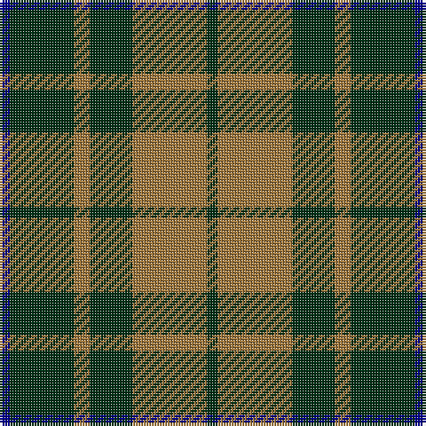

**Bands:** [BGRGRG](/stripes/bgrgrg/) · **Stripes:** [DB DG O DG O DG](/stripes/stripes6/) DB DG O DG O DG

This was sourced from register-of-tartans.  It is a [6 band tartan](/bands/bands6/).

Original link https://www.tartanregister.gov.uk/tartanDetails.aspx?ref=731

## Attestations

This cloth appears in 2 source records; the oldest owns this page.

- 01/01/1998 — Confederate Infantry (register-of-tartans, [record](https://www.tartanregister.gov.uk/tartanDetails.aspx?ref=731))
- 1998 — Confederate Infantry (Military) (tartans-authority, [record](http://www.tartansauthority.com/tartan-ferret/display/4568/))

## Register references

External register numbers recorded for this tartan.

- Scottish Register of Tartans: [731](https://www.tartanregister.gov.uk/tartanDetails.aspx?ref=731)
- Scottish Tartans Authority (ITI): 4568

## Thread count
DB/4 DG24 LT6 DG16 LT28 DG/4

## Palette
Each colour and its ΔE from the base-6 reference it is a variant of.

| Colour | Shade | Base | ΔE (OKLab) |
|---|---|---|---|
| B | <code style="background-color:#788CB4;">#788CB4</code> `#788CB4` | B <code style="background-color:#2A418A;">#2A418A</code> | 0.25 |
| DB | <code style="background-color:#00008C;">#00008C</code> `#00008C` | B <code style="background-color:#2A418A;">#2A418A</code> | 0.13 |
| DG | <code style="background-color:#003014;">#003014</code> `#003014` | G <code style="background-color:#006100;">#006100</code> | 0.17 |
| DR | <code style="background-color:#8C0000;">#8C0000</code> `#8C0000` | R <code style="background-color:#CC0000;">#CC0000</code> | 0.14 |
| DY | <code style="background-color:#C88C00;">#C88C00</code> `#C88C00` | Y <code style="background-color:#F2BF00;">#F2BF00</code> | 0.15 |
| K | <code style="background-color:#000000;">#000000</code> `#000000` | K <code style="background-color:#000000;">#000000</code> | 0.00 |
| LT | <code style="background-color:#A0783C;">#A0783C</code> `#A0783C` | R <code style="background-color:#CC0000;">#CC0000</code> | 0.18 |
| N | <code style="background-color:#C8C8C8;">#C8C8C8</code> `#C8C8C8` | W <code style="background-color:#F7F7F7;">#F7F7F7</code> | 0.14 |
| P | <code style="background-color:#64008C;">#64008C</code> `#64008C` | B <code style="background-color:#2A418A;">#2A418A</code> | 0.14 |

# Sample pattern

## Nearest tartans

The nearest existing variants by ΔTartan distance.

1. [Confederate Artillery](/setts/s6/dg2o14dg8o3dg12r2~x2/) — ΔT 0.38
1. [Confederate Cavalry (Military)](/setts/s6/dg2y14dg8y3dg12lo2~x2/) — ΔT 0.91
1. [MacArthur](/setts/s5/k9g3k3g12ly2~x4/) — ΔT 1.09
1. [Skene Clan Tartan Tartan Number: 516. Earliest known date: 1886 Smith No 53 has ROSE in place of RED. Grant's version is similar to the sample named Skene in the 1830 pattern book of Wilson's of Bannockburn. See products available Copyright © Blair Urquhart, Comrie, 2015](/setts/s7/db6r3g2r3g12r3g2~x2/) — ΔT 1.09
1. [Romsdal](/setts/s5/g22dt5r4dt5r3~x2/) — ΔT 1.17
1. [MacArthur-Fox (Personal)](/setts/s5/k8g3k4g20r4~x2/) — ΔT 1.24
1. [Leeds University Corporate Tartan Tartan Number: 980. Earliest known date: pre 2003 Leeds University Scottish Country Dance Club. See products available Copyright © Blair Urquhart, Comrie, 2015](/setts/s8/g9m2g2m2g2m8g11w2~x4/) — ΔT 1.27
1. [Cameron of Lochiel (Hunting) Clan/Family Tartan Tartan Number: 5351. Earliest known date: 01/01/1940 Design close to Cameron Hunting which has two red lines shown in Vestiarium Scoticum. This design evolved in the 1940s by J G MacKay of Portree and was first put on show at the Cameron Gathering at Achnacarry in 1956. (original STA ref: 1535) See products available Copyright © Blair Urquhart, Comrie, 2015](/setts/s7/r5g20r5g20db24g6ly4/) — ΔT 1.28
1. [Scotch Tape 2 (Corporate)](/setts/s4/k3g15k20ly3~x2/) — ΔT 1.31
1. [MacLean of Duart Hunting](/setts/s8/g3k6w2k6g2k2g16k2~x2/) — ΔT 1.33

## Neighbour map

Every grey dot is one of 14313 variants placed by the first two principal components of the ΔTartan feature space (44% of its variance). Red is this tartan; blue dots are its nearest — click one to open its page.

<svg viewBox="0 0 640 380" role="img" style="max-width:100%;height:auto;border:1px solid #e0e0e0;border-radius:4px;display:block" xmlns="http://www.w3.org/2000/svg"><image href="/nn/cloud.v1.png" width="640" height="380"/><a href="/setts/s6/dg2o14dg8o3dg12r2~x2/"><circle cx="320.4" cy="263.1" r="4" fill="#3465a4"><title>Confederate Artillery</title></circle></a><a href="/setts/s6/dg2y14dg8y3dg12lo2~x2/"><circle cx="337.1" cy="274.0" r="4" fill="#3465a4"><title>Confederate Cavalry (Military)</title></circle></a><a href="/setts/s5/k9g3k3g12ly2~x4/"><circle cx="282.4" cy="278.7" r="4" fill="#3465a4"><title>MacArthur</title></circle></a><a href="/setts/s7/db6r3g2r3g12r3g2~x2/"><circle cx="284.1" cy="253.4" r="4" fill="#3465a4"><title>Skene Clan Tartan Tartan Number: 516. Earliest known date: 1886 Smith No 53 has ROSE in place of RED. Grant's version is similar to the sample named Skene in the 1830 pattern book of Wilson's of Bannockburn. See products available Copyright © Blair Urquhart, Comrie, 2015</title></circle></a><a href="/setts/s5/g22dt5r4dt5r3~x2/"><circle cx="342.1" cy="256.7" r="4" fill="#3465a4"><title>Romsdal</title></circle></a><a href="/setts/s5/k8g3k4g20r4~x2/"><circle cx="356.0" cy="278.0" r="4" fill="#3465a4"><title>MacArthur-Fox (Personal)</title></circle></a><a href="/setts/s8/g9m2g2m2g2m8g11w2~x4/"><circle cx="350.5" cy="250.2" r="4" fill="#3465a4"><title>Leeds University Corporate Tartan Tartan Number: 980. Earliest known date: pre 2003 Leeds University Scottish Country Dance Club. See products available Copyright © Blair Urquhart, Comrie, 2015</title></circle></a><a href="/setts/s7/r5g20r5g20db24g6ly4/"><circle cx="264.2" cy="247.9" r="4" fill="#3465a4"><title>Cameron of Lochiel (Hunting) Clan/Family Tartan Tartan Number: 5351. Earliest known date: 01/01/1940 Design close to Cameron Hunting which has two red lines shown in Vestiarium Scoticum. This design evolved in the 1940s by J G MacKay of Portree and was first put on show at the Cameron Gathering at Achnacarry in 1956. (original STA ref: 1535) See products available Copyright © Blair Urquhart, Comrie, 2015</title></circle></a><a href="/setts/s4/k3g15k20ly3~x2/"><circle cx="311.8" cy="278.9" r="4" fill="#3465a4"><title>Scotch Tape 2 (Corporate)</title></circle></a><a href="/setts/s8/g3k6w2k6g2k2g16k2~x2/"><circle cx="321.0" cy="231.3" r="4" fill="#3465a4"><title>MacLean of Duart Hunting</title></circle></a><circle cx="313.8" cy="262.2" r="5" fill="#c00000"/></svg>

ID: /setts/s6/db2dg12o3dg8o14dg2~x2/
