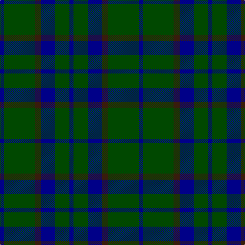

This page is one **sett** — a single exact thread-count. It belongs to the [tartan](/tartans/db2g15k3db7g7db2/)
(the same proportion at any scale), whose colour order is pattern [BGBBGB](/stripes/bgbbgb/).

Sourced from tartans-authority.  It is a [6 stripe tartan](/stripes/stripes6/).

Original link http://www.tartansauthority.com/tartan-ferret/display/5112/

## Thread count
DB/8 G60 K12 DB28 G28 DB/8

## Palette
Each colour and the base-6 reference it is a variant of.

| Colour | Shade | Base |
|---|---|---|
| DB | <code style="background-color:#000088;">#000088</code> `oklch(28.3% 0.196 264.1)` <small>#000088</small> | B <code style="background-color:#2A418A;">#2A418A</code> |
| G | <code style="background-color:#004800;">#004800</code> `oklch(34.8% 0.118 142.5)` <small>#004800</small> | G <code style="background-color:#006100;">#006100</code> |
| K | <code style="background-color:#381C0C;">#381C0C</code> `oklch(26.2% 0.051 48.9)` <small>#381C0C</small> | B <code style="background-color:#2A418A;">#2A418A</code> |

# Sample pattern

## Nearest tartans

The nearest existing variants by ΔTartan distance, with this tartan at the top so the swatches line up against it.

ΔTartan

Tartan

Sett

—

<a href="/ttd/edit/#slug=db2dg15do3db7dg7db2~x4">Green Highland, The (Fashion)</a> <a class="nn-out" href="/setts/s6/db2dg15do3db7dg7db2~x4/" title="open its dictionary page">↗</a>

1.34

<a href="/ttd/edit/#slug=db11dg2db15dg18w2~x2">Hamilton Hunting</a> <a class="nn-out" href="/setts/s5/db11dg2db15dg18w2~x2/" title="open its dictionary page">↗</a>

1.43

<a href="/ttd/edit/#slug=dg2k12dg1k12dg12r2~x2">Gunn (Logan)</a> <a class="nn-out" href="/setts/s6/dg2k12dg1k12dg12r2~x2/" title="open its dictionary page">↗</a>

1.45

<a href="/ttd/edit/#slug=db5k9g7k3g7k3g7k25g3~x2">Menez Du</a> <a class="nn-out" href="/setts/s9/db5k9g7k3g7k3g7k25g3~x2/" title="open its dictionary page">↗</a>

1.54

<a href="/ttd/edit/#slug=g40k20db10k4db7g13k4db4~x2">Letham Personal Tartan Tartan Number: 6718. Earliest known date: pre 2005 Jimmy said, in his recording application, &quot;To allow my family to wear a single tartan&quot; See products available Copyright © Blair Urquhart, Comrie, 2015</a> <a class="nn-out" href="/setts/s8/g40k20db10k4db7g13k4db4~x2/" title="open its dictionary page">↗</a>

1.55

<a href="/ttd/edit/#slug=dg4db1dg12db12w1db4~x2">Unidentified Tweed</a> <a class="nn-out" href="/setts/s6/dg4db1dg12db12w1db4~x2/" title="open its dictionary page">↗</a>

1.58

<a href="/ttd/edit/#slug=k5g23k18db21k33db3~x2">Black Watch (variation)</a> <a class="nn-out" href="/setts/s6/k5g23k18db21k33db3~x2/" title="open its dictionary page">↗</a>

1.58

<a href="/ttd/edit/#slug=t3k16dg16k16db3t3~x2">Murray</a> <a class="nn-out" href="/setts/s6/t3k16dg16k16db3t3~x2/" title="open its dictionary page">↗</a>

1.61

<a href="/ttd/edit/#slug=g3db8g3k4g15r2~x2">Lauder (Family)</a> <a class="nn-out" href="/setts/s6/g3db8g3k4g15r2~x2/" title="open its dictionary page">↗</a>

1.63

<a href="/ttd/edit/#slug=k6t1dg7k1~x2">Innes (Miniature)</a> <a class="nn-out" href="/setts/s4/k6t1dg7k1~x2/" title="open its dictionary page">↗</a>

1.64

<a href="/ttd/edit/#slug=g4db36lg6g16db16g3~x2">City of Kincardine</a> <a class="nn-out" href="/setts/s6/g4db36lg6g16db16g3~x2/" title="open its dictionary page">↗</a>

## Neighbour map

Every grey dot is one of 14299 variants placed by the first two principal components of the ΔTartan feature space (44% of its variance). Red is this tartan; blue dots are its nearest — click one to open its page.

<svg viewBox="0 0 640 380" role="img" style="max-width:100%;height:auto;border:1px solid #e0e0e0;border-radius:4px;display:block" xmlns="http://www.w3.org/2000/svg"><image href="/nn/cloud.v1.png" width="640" height="380"/><a href="/setts/s5/db11dg2db15dg18w2~x2/"><circle cx="365.9" cy="291.4" r="4" fill="#3465a4"><title>Hamilton Hunting</title></circle></a><a href="/setts/s6/dg2k12dg1k12dg12r2~x2/"><circle cx="403.3" cy="269.0" r="4" fill="#3465a4"><title>Gunn (Logan)</title></circle></a><a href="/setts/s9/db5k9g7k3g7k3g7k25g3~x2/"><circle cx="365.1" cy="251.1" r="4" fill="#3465a4"><title>Menez Du</title></circle></a><a href="/setts/s8/g40k20db10k4db7g13k4db4~x2/"><circle cx="331.2" cy="242.5" r="4" fill="#3465a4"><title>Letham Personal Tartan Tartan Number: 6718. Earliest known date: pre 2005 Jimmy said, in his recording application, &quot;To allow my family to wear a single tartan&quot; See products available Copyright © Blair Urquhart, Comrie, 2015</title></circle></a><a href="/setts/s6/dg4db1dg12db12w1db4~x2/"><circle cx="385.7" cy="269.5" r="4" fill="#3465a4"><title>Unidentified Tweed</title></circle></a><a href="/setts/s6/k5g23k18db21k33db3~x2/"><circle cx="346.4" cy="289.3" r="4" fill="#3465a4"><title>Black Watch (variation)</title></circle></a><a href="/setts/s6/t3k16dg16k16db3t3~x2/"><circle cx="300.9" cy="281.4" r="4" fill="#3465a4"><title>Murray</title></circle></a><a href="/setts/s6/g3db8g3k4g15r2~x2/"><circle cx="329.0" cy="253.4" r="4" fill="#3465a4"><title>Lauder (Family)</title></circle></a><a href="/setts/s4/k6t1dg7k1~x2/"><circle cx="336.5" cy="308.0" r="4" fill="#3465a4"><title>Innes (Miniature)</title></circle></a><a href="/setts/s6/g4db36lg6g16db16g3~x2/"><circle cx="410.7" cy="249.5" r="4" fill="#3465a4"><title>City of Kincardine</title></circle></a><circle cx="389.2" cy="290.3" r="5" fill="#c00000"/></svg>

ID: /setts/s6/db2dg15do3db7dg7db2~x4/
