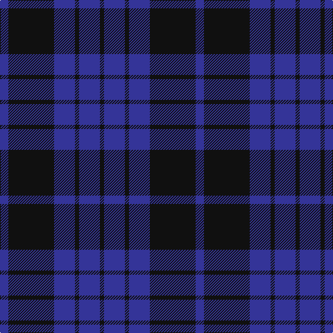

In pattern [BKBKBK](/stripes/bkbkbk/).

This was sourced from tartans-authority.  It is a [6 stripe tartan](/stripes/stripes6/).

Original link http://www.tartansauthority.com/tartan-ferret/display/7557/

## Also known as

This cloth is also recorded under:

- Gagetown School

## Attestations

This cloth appears in 2 source records; the oldest owns this page.

- pre 2008 — Gagetown (School) (tartans-authority, [record](http://www.tartansauthority.com/tartan-ferret/display/7557/))
- undated — Gagetown School (register-of-tartans, [record](https://www.tartanregister.gov.uk/tartanDetails.aspx?ref=5585))

## Register references

External register numbers recorded for this tartan.

- Scottish Register of Tartans: [5585](https://www.tartanregister.gov.uk/tartanDetails.aspx?ref=5585)
- Scottish Tartans Authority (ITI): 7557

## Thread count
B/12 K66 B30 K6 B30 K/6

## Palette
Each colour and the base-6 reference it is a variant of.

| Colour | Shade | Base |
|---|---|---|
| B | <code style="background-color:#343498;">#343498</code> `oklch(39.3% 0.159 276.2)` <small>#343498</small> | B <code style="background-color:#2A418A;">#2A418A</code> |
| K | <code style="background-color:#101010;">#101010</code> `oklch(17.3% 0.000 89.9)` <small>#101010</small> | K <code style="background-color:#000000;">#000000</code> |

# Sample pattern

## Nearest tartans

The nearest existing variants by ΔTartan distance.

1. [Marchmont (Personal)](/setts/s7/k1db12k12g1k12db12g1~x4/) — ΔT 1.15
1. [Largan (?)](/setts/s6/db8k39db8k39db87r6/) — ΔT 1.20
1. [Morgan (MacKay Blue) Clan Tartan Tartan Number: 264. Earliest known date: 1842 The design comes from the Vestiarium Scoticum (1842). The authors, the Sobieski Stuart brothers, enjoyed a popular following among the Scottish gentry in the early Victorian era, and in the spirit of the times, added mystery, romance and some spurious historical documentation to the subject of tartan. Of the better known tartans, the book offers some minor variation, but in other cases it provides the only recorded version of many tartans in use today. See products available Copyright © Blair Urquhart, Comrie, 2015](/setts/s6/db1k3db1k3db8r1~x4/) — ΔT 1.21
1. [MacKay (Blue) #2](/setts/s5/k15db4k15db28r2~x2/) — ΔT 1.21
1. [Royal Scotsman Train (Corporate)](/setts/s6/db5k2db14k14db2lr2~x2/) — ΔT 1.31
1. [Wellington Variation](/setts/s4/k3db23k17r2~x2/) — ΔT 1.34
1. [Pride of Kinross](/setts/s8/k20db2k6db2k4db27w2db8~x2/) — ΔT 1.45
1. [Perthshire, New /Tourist Board](/setts/s6/db37r10dg22db11dg3r3~x2/) — ΔT 1.47
1. [Oban](/setts/s8/k6db10k10b1k1b1k10b6~x4/) — ΔT 1.51
1. [Gallaecia - Galicia National](/setts/s5/db24n13db4n4w2~x2/) — ΔT 1.62

## Neighbour map

Every grey dot is one of 14299 variants placed by the first two principal components of the ΔTartan feature space (44% of its variance). Red is this tartan; blue dots are its nearest — click one to open its page.

<svg viewBox="0 0 640 380" role="img" style="max-width:100%;height:auto;border:1px solid #e0e0e0;border-radius:4px;display:block" xmlns="http://www.w3.org/2000/svg"><image href="/nn/cloud.v1.png" width="640" height="380"/><a href="/setts/s7/k1db12k12g1k12db12g1~x4/"><circle cx="366.9" cy="264.5" r="4" fill="#3465a4"><title>Marchmont (Personal)</title></circle></a><a href="/setts/s6/db8k39db8k39db87r6/"><circle cx="429.9" cy="254.8" r="4" fill="#3465a4"><title>Largan (?)</title></circle></a><a href="/setts/s6/db1k3db1k3db8r1~x4/"><circle cx="404.3" cy="271.9" r="4" fill="#3465a4"><title>Morgan (MacKay Blue) Clan Tartan Tartan Number: 264. Earliest known date: 1842 The design comes from the Vestiarium Scoticum (1842). The authors, the Sobieski Stuart brothers, enjoyed a popular following among the Scottish gentry in the early Victorian era, and in the spirit of the times, added mystery, romance and some spurious historical documentation to the subject of tartan. Of the better known tartans, the book offers some minor variation, but in other cases it provides the only recorded version of many tartans in use today. See products available Copyright © Blair Urquhart, Comrie, 2015</title></circle></a><a href="/setts/s5/k15db4k15db28r2~x2/"><circle cx="378.4" cy="270.1" r="4" fill="#3465a4"><title>MacKay (Blue) #2</title></circle></a><a href="/setts/s6/db5k2db14k14db2lr2~x2/"><circle cx="353.1" cy="270.6" r="4" fill="#3465a4"><title>Royal Scotsman Train (Corporate)</title></circle></a><a href="/setts/s4/k3db23k17r2~x2/"><circle cx="394.5" cy="285.2" r="4" fill="#3465a4"><title>Wellington Variation</title></circle></a><a href="/setts/s8/k20db2k6db2k4db27w2db8~x2/"><circle cx="389.9" cy="221.9" r="4" fill="#3465a4"><title>Pride of Kinross</title></circle></a><a href="/setts/s6/db37r10dg22db11dg3r3~x2/"><circle cx="387.9" cy="265.7" r="4" fill="#3465a4"><title>Perthshire, New /Tourist Board</title></circle></a><a href="/setts/s8/k6db10k10b1k1b1k10b6~x4/"><circle cx="367.7" cy="263.7" r="4" fill="#3465a4"><title>Oban</title></circle></a><a href="/setts/s5/db24n13db4n4w2~x2/"><circle cx="397.4" cy="254.0" r="4" fill="#3465a4"><title>Gallaecia - Galicia National</title></circle></a><circle cx="413.5" cy="280.1" r="5" fill="#c00000"/></svg>

ID: /setts/s6/db2k11db5k1db5k1~x6/
