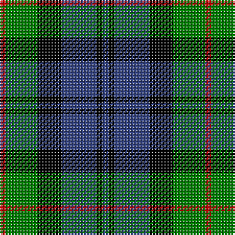

In pattern [BKBKGR](/stripes/bkbkgr/).

This was sourced from weddslist.  It is a [6 stripe tartan](/stripes/stripes6/).

Original link http://www.weddslist.com/cgi-bin/tartans/pg.pl?source=sts

## Also known as

This cloth is also recorded under:

- Murray #3

## Attestations

This cloth appears in 2 source records; the oldest owns this page.

- undated — Murray (weddslist, [record](http://www.weddslist.com/cgi-bin/tartans/pg.pl?source=sts))
- undated — Murray (Variation) Clan Tartan Tartan Number: 271. Earliest known date: 1810-15 A simplified version of the Murray of Atholl. The Cockburn collection housed in the Mitchell Library in Glasgow, is one of the earliest references for clan tartans. James Logan, in his book, The Scottish Gael (1831), wrote concerning the Black Watch, that "...a red stripe is often introduced", and this by Lord Murray who commanded the regiment. See products available Copyright © Blair Urquhart, Comrie, 2015 (house-of-tartan, [record](http://www.house-of-tartan.scotland.net/house/TartanViewjs.asp?colr=Def&tnam=271))

## Thread count
R/4 G22 K16 B24 K4 B/4

## Palette
Each colour and the base-6 reference it is a variant of.

| Colour | Shade | Base |
|---|---|---|
| B | <code style="background-color:#304080;">#304080</code> `oklch(39.4% 0.109 270.2)` <small>#304080</small> | B <code style="background-color:#2A418A;">#2A418A</code> |
| G | <code style="background-color:#008000;">#008000</code> `oklch(52.0% 0.177 142.5)` <small>#008000</small> | G <code style="background-color:#006100;">#006100</code> |
| K | <code style="background-color:#000000;">#000000</code> `oklch(0.0% 0.000 0.0)` <small>#000000</small> | K <code style="background-color:#000000;">#000000</code> |
| R | <code style="background-color:#C00000;">#C00000</code> `oklch(50.7% 0.208 29.2)` <small>#C00000</small> | R <code style="background-color:#CC0000;">#CC0000</code> |

# Sample pattern

## Nearest tartans

The nearest existing variants by ΔTartan distance.

1. [Campbell, The White Stripe](/setts/s6/db2k2db12k11g12w2~x2/) — ΔT 0.48
1. [Morrison](/setts/s6/k3g14k14g2db14r3~x2/) — ΔT 0.56
1. [Forbes](/setts/s7/db1k1db6k6g6k1w1~x2/) — ΔT 0.63
1. [Scottish Airports](/setts/s6/dt4g18dt3k17dt18dp4~x2/) — ΔT 0.64
1. [Fletcher of Dunans](/setts/s7/db6k1db6k8r1g8r2~x2/) — ΔT 0.69
1. [Fletcher](/setts/s7/db6k1db6k8r1g8k2~x2/) — ΔT 0.71
1. [Lennie](/setts/s6/k2g10t2k9p8g2~x2/) — ΔT 0.73
1. [MacArthur of Milton, hunting](/setts/s6/g14db2g2k8p9k2~x2/) — ΔT 0.77
1. [Wellington, or Waterloo](/setts/s6/t3g12k14t11r3t3~x2/) — ΔT 0.82
1. [Unnamed, No 26](/setts/s6/w4db4g22k20db20w3/) — ΔT 0.82

## Neighbour map

Every grey dot is one of 14299 variants placed by the first two principal components of the ΔTartan feature space (44% of its variance). Red is this tartan; blue dots are its nearest — click one to open its page.

<svg viewBox="0 0 640 380" role="img" style="max-width:100%;height:auto;border:1px solid #e0e0e0;border-radius:4px;display:block" xmlns="http://www.w3.org/2000/svg"><image href="/nn/cloud.v1.png" width="640" height="380"/><a href="/setts/s6/db2k2db12k11g12w2~x2/"><circle cx="129.7" cy="236.0" r="4" fill="#3465a4"><title>Campbell, The White Stripe</title></circle></a><a href="/setts/s6/k3g14k14g2db14r3~x2/"><circle cx="137.1" cy="235.4" r="4" fill="#3465a4"><title>Morrison</title></circle></a><a href="/setts/s7/db1k1db6k6g6k1w1~x2/"><circle cx="142.8" cy="223.0" r="4" fill="#3465a4"><title>Forbes</title></circle></a><a href="/setts/s6/dt4g18dt3k17dt18dp4~x2/"><circle cx="162.3" cy="252.7" r="4" fill="#3465a4"><title>Scottish Airports</title></circle></a><a href="/setts/s7/db6k1db6k8r1g8r2~x2/"><circle cx="147.3" cy="227.6" r="4" fill="#3465a4"><title>Fletcher of Dunans</title></circle></a><a href="/setts/s7/db6k1db6k8r1g8k2~x2/"><circle cx="158.3" cy="232.2" r="4" fill="#3465a4"><title>Fletcher</title></circle></a><a href="/setts/s6/k2g10t2k9p8g2~x2/"><circle cx="127.0" cy="244.2" r="4" fill="#3465a4"><title>Lennie</title></circle></a><a href="/setts/s6/g14db2g2k8p9k2~x2/"><circle cx="177.9" cy="224.5" r="4" fill="#3465a4"><title>MacArthur of Milton, hunting</title></circle></a><a href="/setts/s6/t3g12k14t11r3t3~x2/"><circle cx="115.7" cy="248.1" r="4" fill="#3465a4"><title>Wellington, or Waterloo</title></circle></a><a href="/setts/s6/w4db4g22k20db20w3/"><circle cx="118.2" cy="224.4" r="4" fill="#3465a4"><title>Unnamed, No 26</title></circle></a><circle cx="152.4" cy="240.0" r="5" fill="#c00000"/></svg>

ID: /setts/s6/db2k2db12k8g11r2~x2/
